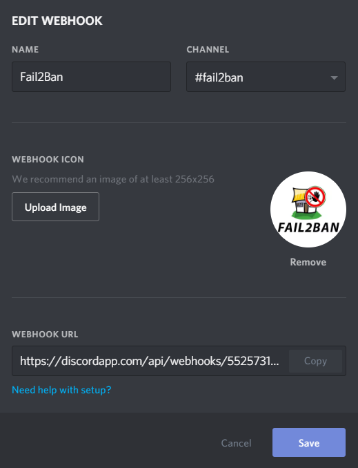
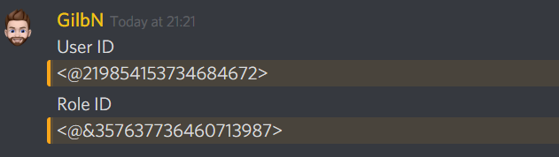
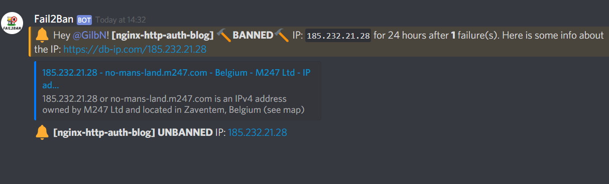

# {{ title }}

<small>Written: {{ date }}</small>

<small>Tags</small>

<p style="display:inline">
<a style="padding: .125em 1em; border-radius: 25px; margin-top:5px;" class="md-button md-button--primary" href="#">{{ tag }}</a>
</p>


<small>Category</small>

<p style="display:inline;">
<a style="padding: .125em 1em; border-radius: 25px; margin-top:5px;" class="md-button md-button--primary" href="#">{{ cat }}</a>
</p>


</img>

I thought I would follow up on the [Fail2Ban Pushover post](https://technicalramblings.com/blog/adding-ban-unban-notifications-from-fail2ban-with-pushover/) with a Fail2Ban Discord post!

!!! info "Docker Mods"
    If you use the linuxserver/letsencrypt container, scroll down to the bottom for a short tutorial on how to use that instead.

## Creating the Webhook

In this guide you will be using a Discord webhook to post Fail2Ban notifications to the server of your choice. If you don't have a discord server yet you need to create one. Head over to the **`Server Settings`** and select **`Webhooks`**. Click on **`Create Webhook`** and add the name and channel you want the webhook to post to. At the bottom you will find the webhook url, save that for later.

[](images/Discord_XQpGbcuY1u.png)

## Adding the Discord action

Head over to your Fail2Ban **`action.d`** folder and create a file called **`discord_notifications.conf`** and add the following:

```py
# Author: Gilbn from https://technicalramblings.com
# Adapted Source: https://gist.github.com/sander1/075736a42db2c66bc6ce0fab159ca683
# Create the Discord Webhook in: Server settings -> Webhooks -> Create Webhooks

[Definition]

# Notify on Startup
actionstart = curl -X POST "<webhook>" \
            -H "Content-Type: application/json" \
            -d '{"username": "Fail2Ban", "content":":white_check_mark: The **[<name>]** jail has started"}'

# Notify on Shutdown
actionstop = curl -X POST "<webhook>" \
            -H "Content-Type: application/json" \
            -d '{"username": "Fail2Ban", "content":":no_entry: The **[<name>]** jail has been stopped"}'
            
#
actioncheck =

# Notify on Banned 
actionban = curl -X POST "<webhook>" \
            -H "Content-Type: application/json" \
            -d '{"username":"Fail2Ban", "content":":bell: Hey <discord_userid>! **[<name>]** :hammer:**BANNED**:hammer: IP: `<ip>` for <bantime> hours after **<failures>** failure(s). Here is some info about the IP: https://db-ip.com/<ip>"}' 
            curl -X POST "<webhook>" \
            -H "Content-Type: application/json" \
            -d '{"username":"Fail2Ban", "content":"If you want to unban the IP run: `fail2ban-client unban <ip>`"}'

# Notify on Unbanned
actionunban = curl -X POST "<webhook>" \
            -H "Content-Type: application/json" \
            -d '{"username":"Fail2Ban", "content":":bell: **[<name>]** **UNBANNED** IP: [<ip>](https://db-ip.com/<ip>)"}'
[Init]

# Name of the jail in your jail.local file. default = [your-jail-name]
name = default

# Discord Webhook URL
webhook = https://discordapp.com/api/webhooks/XXXXXXXXXXXXXXX/XXXXXXXXXXXXXXXXXXXXXXXXXXXXXXXXXXXXXXXX
```

Replace the webhook URL with the one from your webhook

!!! warning
    If you dont want it to notify you on startup/shutdown/unban you can just comment that line with a #.

```py
#actionstart = curl -X POST "<webhook>" \
#            -H "Content-Type: application/json" \
#            -d '{"username": "Fail2Ban", "content":":white_check_mark: The **[<name>]** jail has started"}'
```

## Updating jail.local

Next edit you jail.local file and add the action. You will have to add to all the jails you want notifications on or you can add it below the **`[DEFAULT]`** line . Since I use **[Cloudflare](https://technicalramblings.com/blog/cloudflare-fail2ban-integration-with-automated-set_real_ip_from-in-nginx/)** and already have an action in all my jails, I've added it on the line below. If you don't have another action there already you can just add the line **`action = discord_notifications`**

!!! error "Default action!"
    If you only have the **discord** action in the jail it will not update the iptables as it replaces the default action. You can add the action **iptables-allports**and it will then run both actions when banning

### Example

```bash
[nginx-http-auth]

enabled  = true
filter   = nginx-http-auth
action   = cloudflare-apiv4
           discord_notifications[bantime=24, discord_userid=<@!xxxxxxxxxxxxxxxxxxxx>]
           iptables-allports
port     = http,https
logpath  = /config/log/nginx/error.log
ignoreip = 192.168.1.0/24
```

**Note:**  The **`[bantime=24]`** is just a tag that the action uses. It does not control how long the ban lasts. I default all bans to 24 hours.

**Note2:** The **`discord_userid=<@!USER-ID-NUMBER>`** is for mentioning yourself in the server so you can get a ping. To find your user **ID-number** just type **`@<username>`** or **`@<role>`**, like so **`@GilbN#1337`**

Don't forget the **!** after **@** when adding it to the action tag in the jail. The result should look like this:

[](images/Discord_mrvq68FDwT.png)

If you want to ping a role you need to edit the tag to say **`<@&ROLE-ID-NUMBER>`** instead.

**Note3:** The ignore IP is so that fail2ban won't ban your local IP. Check out [https://www.aelius.com/njh/subnet\_sheet.html](https://www.aelius.com/njh/subnet_sheet.html) if you are wondering what your
**[CIDRnotation](https://www.digitalocean.com/community/tutorials/understanding-ip-addresses-subnets-and-cidr-notation-for-networking)**
is. Most often it will be **/24** (netmask 255.255.255.0) To find your netmask run **`ipconfig /all`** on windows or **`ifconfig | grep netmask`** on linux.

After you have added the action to all your jails you need to restart fail2ban. For me that will be to restart the letsencrypt container as I'm using Docker.

## Discord

The notifications will look like this: You can change the text by editing the **`discord_notifications.conf`** file

[](images/fail2discord.png)

## Docker Mods

If you use the linuxserver/letsencrypt container, Roxedus has made a docker mod that will send pretty embedded notifications to discord on bans!

https://github.com/linuxserver/docker-mods/tree/swag-f2bdiscord

Simply add these environment variables to the container, and update the jail.local file.

`-e DOCKER_MODS=linuxserver/mods:swag-f2bdiscord`

`-e DISC_HOOK=40832456738934/7DcEpWr5V24OIEIELjg-KkHky86SrOgTqA` This is the last two parts of the webhook url. Scroll up to see how to create a webhook.

`-e DISC_ME=120970603556503552` This is the userID that will get mentions on the server. Scroll up for how to find your userid.

Add this in your action: `discordEmbed[bantime=24]`, bantime(hour) is optional, but defaults to 24 when not set. Just reflects in the message, does not change the ban time

`action = cloudflare-apiv4 discordEmbed iptables-allports`

### For any questions you can find me here

#### [](https://discord.gg/HSPa4cz)
