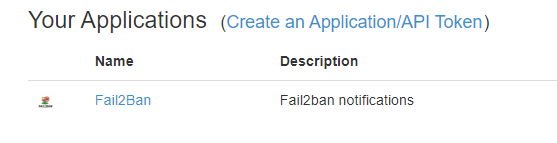
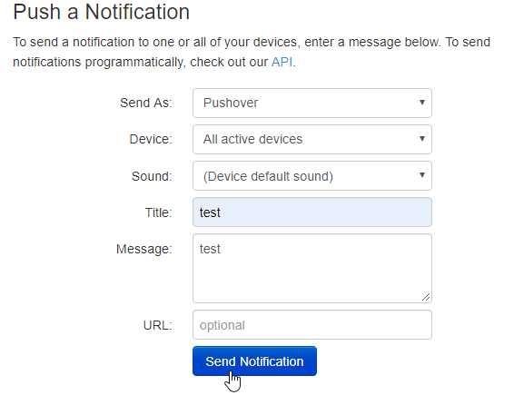
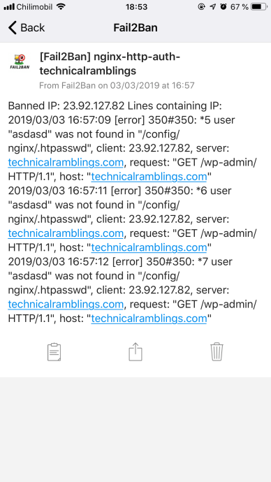
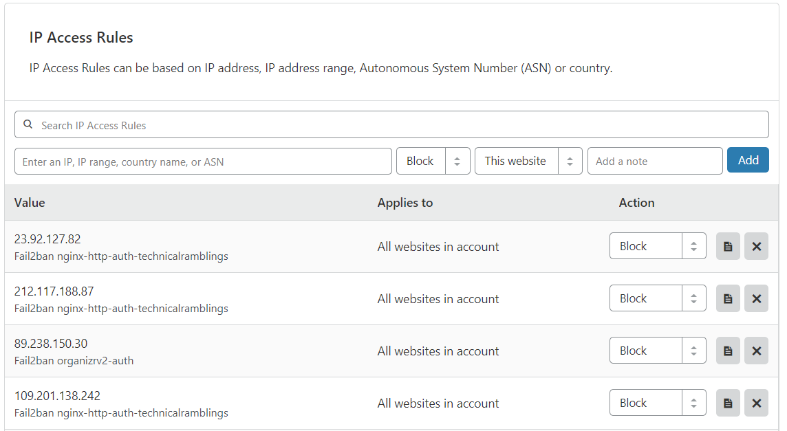

# {{ title }}

<small>Written: {{ date }}</small>

<small>Tags</small>

<p style="display:inline">
<a style="padding: .125em 1em; border-radius: 25px; margin-top:5px;" class="md-button md-button--primary" href="#">{{ tag }}</a>
</p>


<small>Category</small>

<p style="display:inline;">
<a style="padding: .125em 1em; border-radius: 25px; margin-top:5px;" class="md-button md-button--primary" href="#">{{ cat }}</a>
</p>


</img>

If you're like me and think [Fail2Ban](https://technicalramblings.com/?s=fail2ban) is an awesome tool for intrusion protection, getting a notification when someone has been banned is the bee's knees! And using [Pushover](https://pushover.net/) makes it very simple!

## Setting up Pushover

Head over to [https://pushover.net/](https://pushover.net/) and create a user account and add the devices you want to receive notifications. I'm using the iOS app, and that works great for me. The app has a 7 day trail period that lets you try it out without paying for it.

On your user page you will see you **`user key`**. Save that as we will need that for later. At the bottom you can add your new Fail2Ban application.

[](images/brave_sfwU5K7mjL.png)

After you've added the new application it will display it's API token. Save that as we will use that for later. You can also test Pushover by sending a notification manually on the user page.

[](images/brave_7dpeT7uVoh.png)

## Adding the Pushover action

Head over to your Fail2Ban **`action.d`** folder and create a file called **`pushover.local`** and add the following

```bash
# Fail2Ban Pushover configuration file
# Adapted Source: https://gist.github.com/sander1/075736a42db2c66bc6ce0fab159ca683

[Definition]

# Notify on Startup
actionstart = /usr/bin/curl -s -F "token=<token>" -F "user=<user>" -F "title=[Fail2Ban] <name>" -F "message=Jail <name> has been started successfully." https://api.pushover.net/1/messages

# Notify on Shutdown
actionstop = /usr/bin/curl -s -F "token=<token>" -F "user=<user>" -F "title=[Fail2Ban] <name>" -F "message=Jail <name> has been stopped." https://api.pushover.net/1/messages

#
actioncheck =

# Notify on Banned
actionban = /usr/bin/curl -s -F "token=<token>" -F "user=<user>" -F "title=[Fail2Ban] <name>" -F "message=Banned IP: <ip> Lines containing IP: `grep '<ip>' <logpath>`" https://api.pushover.net/1/messages

# Notify on Unbanned
actionunban = /usr/bin/curl -s -F "token=<token>" -F "user=<user>" -F "title=[Fail2Ban] <name>" -F "message=Unbanned IP: <ip> Lines containing IP: `grep '<ip>' <logpath>`" https://api.pushover.net/1/messages

[Init]

# Name of the jail in your jail.local file. default = [your-jail-name]
name = default

# Application token key
token = YOUR-APPLICATION-TOKEN
# User API key
user = YOUR-USER-KEY
```

!!! info "Note"
    If you dont want it to notify you on startup/shutdown/unban you can just comment that line with a #.

```bash
#actionstart = /usr/bin/curl -s -F "token=<token>" -F "user=<user>" -F "title=[Fail2Ban] <name>" -F "message=Jail <name> has been started successfully." https://api.pushover.net/1/messages
```

## Updating jail.local

Next edit you jail.local file and add the action. You will have to add to all the jails you want notifications on or you can add it below the `[DEFAULT]` line. Since I use **[Cloudflare](https://technicalramblings.com/blog/cloudflare-fail2ban-integration-with-automated-set_real_ip_from-in-nginx/)** and already have an action in all my jails, I've added it on the line below. If you don't have another action there already you can just add the line **`action = pushover`**

!!! error "Default action!"
    If you only have the **`pushover`** action in the jail it will not update the iptables as it replaces the default action. You can add the action **`iptables-allports`** and it will then run both actions when banning

### Example

```bash
[nginx-http-auth]

enabled  = true
filter   = nginx-http-auth
action   = cloudflare-apiv4
           pushover
           iptables-allports
port     = http,https
logpath  = /config/log/nginx/error.log
ignoreip = 192.168.1.0/24
```

**Note:** The ignore IP is so that fail2ban won't ban your local IP. Check out [https://www.aelius.com/njh/subnet\_sheet.html](https://www.aelius.com/njh/subnet_sheet.html) if you are wondering what your **[CIDRnotation](https://www.digitalocean.com/community/tutorials/understanding-ip-addresses-subnets-and-cidr-notation-for-networking)** is. Most often it will be **/24** (netmask 255.255.255.0) To find your netmask run **`ipconfig /all`** on windows or **`ifconfig | grep netmask`** on linux.

After you have added the action to all your jails you need to restart fail2ban. For me that will be to restart the swag container as I'm using Docker.

## Banning

A successful ban will look like this:

```py
2019-03-03 16:57:09,608 fail2ban.filter         [329]: INFO    [nginx-http-auth-technicalramblings] Found 23.92.127.82 - 2019-03-03 16:57:09
2019-03-03 16:57:11,612 fail2ban.filter         [329]: INFO    [nginx-http-auth-technicalramblings] Found 23.92.127.82 - 2019-03-03 16:57:11
2019-03-03 16:57:12,816 fail2ban.filter         [329]: INFO    [nginx-http-auth-technicalramblings] Found 23.92.127.82 - 2019-03-03 16:57:12
2019-03-03 16:57:12,900 fail2ban.actions        [329]: NOTICE  [nginx-http-auth-technicalramblings] Ban 23.92.127.82
```

 [](images/IMG_0900.png)
 
 [](images/brave_lBokWdHUuv.png)

Source: https://gist.github.com/sander1/075736a42db2c66bc6ce0fab159ca683

### For any questions you can find me here

#### [](https://discordapp.com/invite/TrNtY7N)
