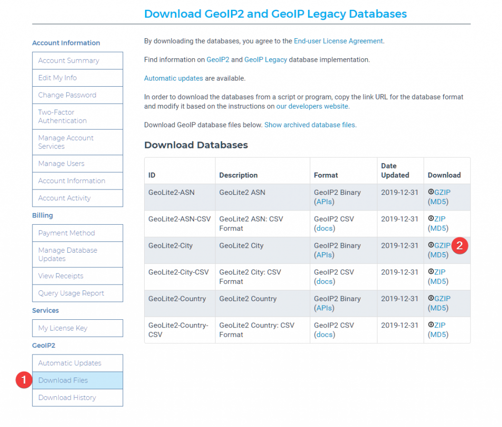
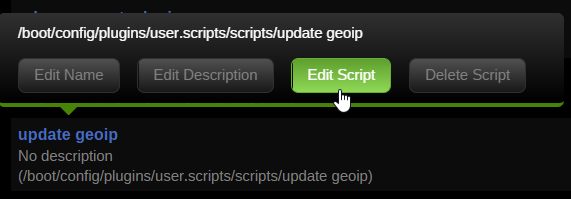
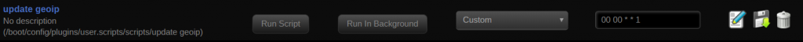

# {{ title }}

</img>

Since the GeoLite legacy database has been [discontinued](https://blog.maxmind.com/2018/01/02/discontinuation-of-the-geolite-legacy-databases/), we now have to use the GeoLite2 database to get new updates to the database. This will be a followup article from the [post](https://technicalramblings.com/blog/blocking-countries-with-geoip2-using-the-letsencrypt-docker-container/) i made about the legacy database. As the new GeoLite2 database uses a new format ([maxminddb](https://github.com/maxmind/libmaxminddb)) we couldn't just switch to the new database. Nginx also needed to be compiled with the [geoip2 modul.](https://github.com/leev/ngx_http_geoip2_module) And with Aptalca's [pull request](https://github.com/alpinelinux/aports/pull/6762) on the alpine repo added it will just be a matter of a minor update to the `**nginx.conf**` file!

## GeoLite2 database

\[eckosc\_status\_message title="Update" icon="fa-exclamation-triangle" type="info" message="As of 15.05.20 you can add the variable -e **MAXMINDDB\_LICENSE\_KEY** = <lisencekey> to have the container download the database and update it weekly!"\]

**As of 12/30/19 you have to sign up to Maxmind to be able to download the database.** [https://blog.maxmind.com/2019/12/18/significant-changes-to-accessing-and-using-geolite2-databases/](https://blog.maxmind.com/2019/12/18/significant-changes-to-accessing-and-using-geolite2-databases/)

Create an account and go to your account page to download the database.

[](https://technicalramblings.com/wp-content/uploads/2019/07/chrome_HGOgG8aZM9.png)

Download the database and extract the .mmdb file to the folder of you choice. I'll be using `/config/geoip2db/` for my setup.

### NGINX

In the latest version of **nginx.conf** there is now a line that says `#include /config/nginx/geoip2.conf;` Uncomment that line. If you dont have that line, you can just add it.

Open the `geoip2.conf` file and find the line that says `map $geoip2_data_country_iso_code $allowed_country {` As it says `default` must be either yes or no. To block everything set it **no**. Add the country codes you want to allow accessfrom **[this](http://dev.maxmind.com/geoip/legacy/codes/iso3166/)** list. e.g. **`US yes;`** This will block all other countries than the one you choose. You can also add more than one country if you want. Like this:

```
# GEOIP2 COUNTRY CONFIG
map $geoip2_data_country_iso_code $allowed_country {
    default no;
    US yes;
}
```

Now since we have set default to no, you will need to add the local ip ranges that you want to allow access in the `$allow_list` variable below. Like this:

```
# ALLOW LOCAL ACCESS
geo $allow_list {
    default no;
    192.168.1.0/24 yes;
}
```

Remember to also set default to `**no**` in in the `$allow_list`

Check out [https://www.aelius.com/njh/subnet\_sheet.html](https://www.aelius.com/njh/subnet_sheet.html)if you are wondering what your **[CIDRnotation](https://www.digitalocean.com/community/tutorials/understanding-ip-addresses-subnets-and-cidr-notation-for-networking)** is. Most often it will be **/24** (netmask 255.255.255.0) To find your netmask run `**ipconfig /all**` on windows or**`ifconfig | grep netmask`** on linux.

> Note: The `ALLOW LOCAL ACCESS` part is only needed if you set default to no in the `map $geoip2_data_country_iso_code`config.

Setting default to `no` means that it will block any IP addresses from the database not set to `yes`, even local ones.

For it to actually block you need to add this in your **`server blocks`** inside the `proxy-confs` and `site-confs` folder:

```
if ($allow_list = yes) {
set $allowed_country yes;
}
if ($allowed_country = no) {
return 444;
}
```

Here is an example using the `unifi-controller.subdomain.conf` in `proxy-confs`:

```
server {
    listen 443 ssl;
    listen [::]:443 ssl;

    server_name unifi.*;

    include /config/nginx/ssl.conf;

#COUNTRY GEO BLOCK 
    if ($allow_list = yes) { 
    set $allowed_country yes; 
    }    
    if ($allowed_country = no) {
    return 444;
    }

    client_max_body_size 0;

    # enable for ldap auth, fill in ldap details in ldap.conf
    #include /config/nginx/ldap.conf;

    # enable for Authelia
    #include /config/nginx/authelia-server.conf;

    location / {
        # enable the next two lines for http auth
        #auth_basic "Restricted";
        #auth_basic_user_file /config/nginx/.htpasswd;

        # enable the next two lines for ldap auth
        #auth_request /auth;
        #error_page 401 =200 /ldaplogin;

        # enable for Authelia
        #include /config/nginx/authelia-location.conf;

        include /config/nginx/proxy.conf;
        resolver 127.0.0.11 valid=30s;
        set $upstream_app unifi-controller;
        set $upstream_port 8443;
        set $upstream_proto https;
        proxy_pass $upstream_proto://$upstream_app:$upstream_port;

        proxy_buffering off;
    }
}
```

### Multiple geo blocks

If you host several websites and want a different country block just add another with a different variable name. e.g. **`$allowed_country2`**:

```
 # GEO IP BLOCK DOMAIN 2
  map $geoip2_data_country_iso_code $allowed_country2 {
   default yes;
    CN no; #China
    RU no; #Russia
    HK no; #Hong Kong
    IN no; #India
    IR no; #Iran
    VN no; #Vietnam
    TR no; #Turkey
    EG no; #Egypt
    MX no; #Mexico
    JP no; #Japan
    KR no; #South Korea
    KP no; #North Korea :)
    PE no; #Peru
    BR no; #Brazil
    UA no; #Ukraine
    ID no; #Indonesia
    TH no; #Thailand
 }
```

As `**default**`is set to **`yes`**it will allow every country except the country codes set to **`no`**

And in the server block add this

```
# COUNTRY GEO BLOCK 2
    if ($allowed_country2 = no) {
    return 444;
    }
```

I made this list based on the [Spamhaus](https://www.spamhaus.org/statistics/botnet-cc/) statistics and [Aakamai's](https://www.akamai.com/us/en/multimedia/documents/state-of-the-internet/q3-2017-state-of-the-internet-security-report.pdf) state of the internet report.

## Blocked

You can test if it worked with a VPN or do a performance test from a location that is blocked here[https://www.webpagetest.org/](https://www.webpagetest.org/)

#### **TIP! This database gets updated!**

\[eckosc\_status\_message title="Update" icon="fa-exclamation-triangle" type="info" message="As of 15.05.20 you can add the variable -e MAXMINDDB\_LICENSE\_KEY = <lisencekey> to have the container download the database and update it weekly!"\]

By setting up a cronjob you can easily automate the update process. I use the Unraid User Scripts plugin and set a cronjob to run every day but the GeoLite2 Country and City databases are updated on the first Tuesday of each month, so choose whatever suits your needs. Click on **`Add New Script`**→ Enter the name→ Click on the name of the script and then `**Edit** **Script**`

[](https://technicalramblings.com/wp-content/uploads/2017/12/update-geoip.png)

\[eckosc\_status\_message title="Warning" icon="fa-exclamation-triangle" type="error" message="Since you need to sign up to Maxmind.com to download you need to create a licence key to be able to directly download the database"\]

Go to the licence keys page and create a license key. Select **`no`** when asked if you want to use the key with geoupdate.

Replace XXXXXXXXXX with your license key.

```
#!/usr/bin/env bash
licensekey="XXXXXXXXXXXXX"
wget -O /tmp/GeoLite2-City.tar.gz "https://download.maxmind.com/app/geoip_download?edition_id=GeoLite2-City&license_key=${licensekey}&suffix=tar.gz"
tar -xvf /tmp/GeoLite2-City.tar.gz -C /tmp/ --wildcards "*.mmdb" --strip 1
mv /tmp/GeoLite2-City.mmdb /mnt/user/appdata/swag/geolite2/
chown 911:911 /mnt/user/appdata/letsencrypt/geolite2/GeoLite2-City.mmdb
```

Set the schedule to **Schedule Daily**or whenever you'd like.

[](https://technicalramblings.com/wp-content/uploads/2017/12/geoip-1.png)

Click **`Run In Background`** and then**`Apply`**


## Cloudflare

\[eckosc\_status\_message title="Update: cloudflare\_real-ip - Docker mod for SWAG" icon="fa-exclamation-triangle" type="info" message="Check out the docker mod https://github.com/linuxserver/docker-mods/tree/swag-cloudflare-real-ip This mod adds a startup scipt that gets the IP's from Cloudflares edge servers, and formats them in a format Nginx can use with set\_real\_ip\_from."\]

If you use Cloudflare you will need to add the following in nginx so that it won't block the Cloudflare IP but the actual IP of the visitor. If you don't do this you will get false positives.

Add the following section to your`nginx.conf` file found in`**appdata/swag/nginx/**`

```
set_real_ip_from 103.21.244.0/22;
set_real_ip_from 103.22.200.0/22;
set_real_ip_from 103.31.4.0/22;
set_real_ip_from 104.16.0.0/13;
set_real_ip_from 104.24.0.0/14;
set_real_ip_from 108.162.192.0/18;
set_real_ip_from 131.0.72.0/22;
set_real_ip_from 141.101.64.0/18;
set_real_ip_from 162.158.0.0/15;
set_real_ip_from 172.64.0.0/13;
set_real_ip_from 173.245.48.0/20;
set_real_ip_from 188.114.96.0/20;
set_real_ip_from 190.93.240.0/20;
set_real_ip_from 197.234.240.0/22;
set_real_ip_from 198.41.128.0/17;
set_real_ip_from 2400:cb00::/32;
set_real_ip_from 2606:4700::/32;
set_real_ip_from 2803:f800::/32;
set_real_ip_from 2405:b500::/32;
set_real_ip_from 2405:8100::/32;
set_real_ip_from 2c0f:f248::/32;
set_real_ip_from 2a06:98c0::/29;

real_ip_header X-Forwarded-For;
```

You can set it up as an include like this too:

```
##
# CF Real IP
##
include /config/nginx/cf_real-ip.conf;
real_ip_header X-Forwarded-For;
```

After that you need to restart the swag container for the changes to take effect.

## Automatically updating thecf\_real-ip.conf

Tronyx over at the discord forums graciously shared his script for updating the Cloudflare ip list. This list is not static and Cloudflare updates it once in a while.

The script below will update the list with any changes in the list of IPs from CF

```
#!/usr/bin/env bash

curl -s 'https://www.cloudflare.com/ips-v4' > /tmp/cf.txt
curl -s 'https://www.cloudflare.com/ips-v6' >> /tmp/cf.txt

sed 's/^/set_real_ip_from /' /tmp/cf.txt > /tmp/cf2.txt

sed -e 's/$/;/' /tmp/cf2.txt > /home/swag/config/nginx/cf_real-ip.conf
```

I use unraid so I will use the User Scripts plugin to setup a cronjob that will run once a week.

1. Go to Settings > User Scripts and click **`Add New Script`** 
2. Give it a name and a description if you want
3. Click edit script and add it inside the box.
4. You will need to update the path in the last line to you nginx appdata folder
5. Set the schedule to weekly and click apply and done.

```
#!/bin/bash
curl -s 'https://www.cloudflare.com/ips-v4' > /tmp/cf.txt
curl -s 'https://www.cloudflare.com/ips-v6' >> /tmp/cf.txt

sed 's/^/set_real_ip_from /' /tmp/cf.txt > /tmp/cf2.txt

sed -e 's/$/;/' /tmp/cf2.txt > /mnt/user/appdata/swag/nginx/cf_real-ip.conf
```

### If you need any extra help join the Discord server!

#### [](https://discord.gg/HM5uUKU)

Souce: https://github.com/leev/ngx\_http\_geoip2\_module [https://dev.maxmind.com/geoip/legacy/install/country/](https://dev.maxmind.com/geoip/legacy/install/country/) [http://dev.maxmind.com/geoip/legacy/codes/iso3166/](http://dev.maxmind.com/geoip/legacy/codes/iso3166/) [https://www.howtoforge.com/nginx-how-to-block-visitors-by-country-with-the-geoip-module-debian-ubuntu](https://www.howtoforge.com/nginx-how-to-block-visitors-by-country-with-the-geoip-module-debian-ubuntu) [https://www.spamhaus.org/statistics/botnet-cc/](https://www.spamhaus.org/statistics/botnet-cc/) [https://www.akamai.com/us/en/multimedia/documents/state-of-the-internet/q3-2017-state-of-the-internet-security-report.pdf](https://www.akamai.com/us/en/multimedia/documents/state-of-the-internet/q3-2017-state-of-the-internet-security-report.pdf)
