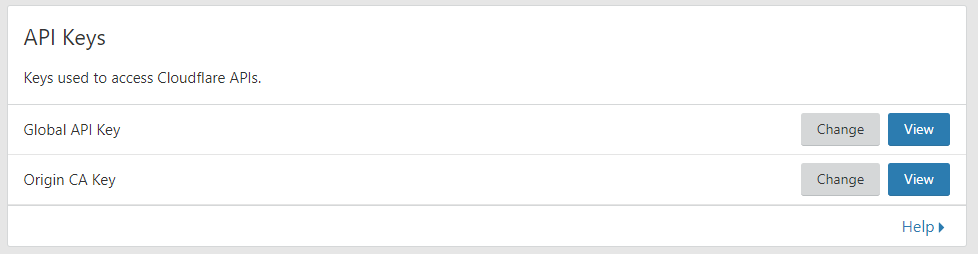
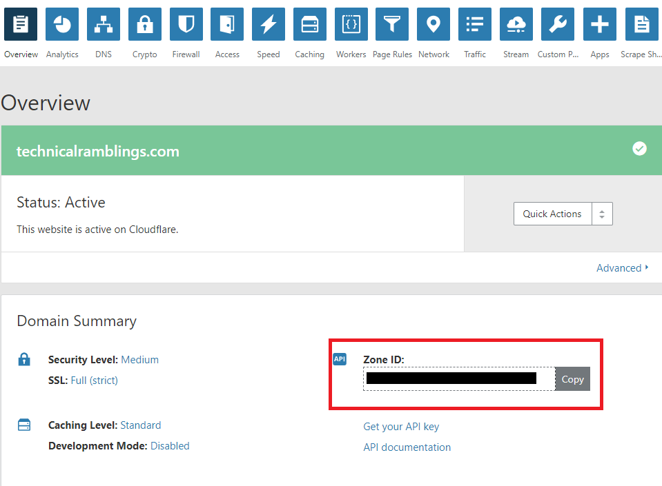
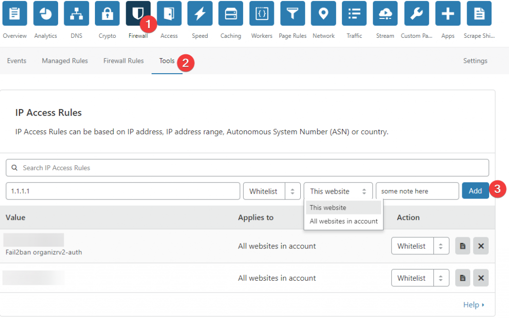
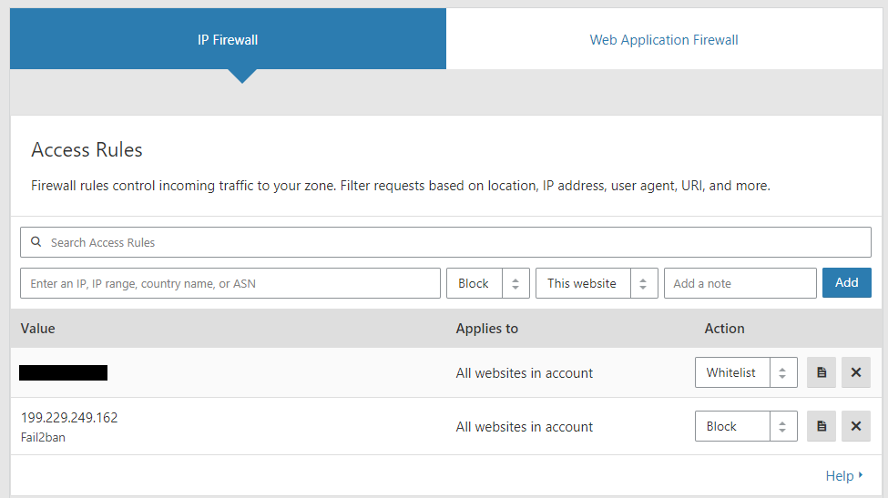

# {{ title }}

</img>

If you've decided to use cloudflare as a CDN you've might have noticed that fail2ban isn't working as expected. The fail2ban.log file will say that it has banned an IP, but since the connection is going through Cloudflare it will still let the banned IP browse your website. But luckily Cloudflare has an API we can use to update the Cloudflare firewall on the fly.

## Adding the action

If you've read my other **[fail2ban](https://technicalramblings.com/?s=fail2ban)** guides you already know I'm using linuxservers swag container. So there won't be any walkthrough of installing fail2ban. I will only go through the cloudflare configuration.

Go to your appdata location and find the **`action.d`** folder `**appdata/swag/fail2ban/action.d**`

In that folder there already is an action for cloudflare (**cloudflare.conf**) but that is using the deprecated API. Create a new file called **`cloudflare-apiv4.conf`** and add the following:

```
#
# Author: Gilbn from https://technicalramblings.com
# Adapted Source: https://github.com/fail2ban/fail2ban/blob/master/config/action.d/cloudflare.conf and https://guides.wp-bullet.com/integrate-fail2ban-cloudflare-api-v4-guide/
#
# To get your Cloudflare API key: https://dash.cloudflare.com/profile use the Global API Key
#

[Definition]

# Option:  actionstart
# Notes.:  command executed once at the start of Fail2Ban.
# Values:  CMD
#
actionstart =

# Option:  actionstop
# Notes.:  command executed once at the end of Fail2Ban
# Values:  CMD
#
actionstop =

# Option:  actioncheck
# Notes.:  command executed once before each actionban command
# Values:  CMD
#
actioncheck =

# Option:  actionban
# Notes.:  command executed when banning an IP. Take care that the
#          command is executed with Fail2Ban user rights.
# Tags:      IP address
#            number of failures
#            unix timestamp of the ban time
# Values:  CMD

actionban = curl -s -X POST "https://api.cloudflare.com/client/v4/user/firewall/access_rules/rules" \
            -H "X-Auth-Email: <cfuser>" \
            -H "X-Auth-Key: <cftoken>" \
            -H "Content-Type: application/json" \
            --data '{"mode":"block","configuration":{"target":"ip","value":"<ip>"},"notes":"Fail2ban <name>"}'

# Option:  actionunban
# Notes.:  command executed when unbanning an IP. Take care that the
#          command is executed with Fail2Ban user rights.
# Tags:      IP address
#            number of failures
#            unix timestamp of the ban time
# Values:  CMD
#

actionunban = curl -s -X DELETE "https://api.cloudflare.com/client/v4/user/firewall/access_rules/rules/$( \
              curl -s -X GET "https://api.cloudflare.com/client/v4/user/firewall/access_rules/rules?mode=block&configuration_target=ip&configuration_value=<ip>&page=1&per_page=1&match=all" \
             -H "X-Auth-Email: <cfuser>" \
             -H "X-Auth-Key: <cftoken>" \
             -H "Content-Type: application/json" | awk -F"[,:}]" '{for(i=1;i<=NF;i++){if($i~/'id'\042/){print $(i+1);}}}' | tr -d '"' | sed -e 's/^[ \t]*//' | head -n 1)" \
             -H "X-Auth-Email: <cfuser>" \
             -H "X-Auth-Key: <cftoken>" \
             -H "Content-Type: application/json"

[Init]

# Name of the jail in your jail.local file. default = [jail name]
name = default

# Option: cfuser
# Notes.: Replaces <cfuser> in actionban and actionunban with cfuser value below
# Values: Your CloudFlare user account

cfuser = user@mail.com

# Option: cftoken (Global API Key)
# Notes.: Replaces <cftoken> in actionban and actionunban with cftoken value below
# Values: Your CloudFlare API key 
cftoken = YOUR-API-KEY
```

The unban curl command from [https://guides.wp-bullet.com/integrate-fail2ban-cloudflare-api-v4-guide/](https://guides.wp-bullet.com/integrate-fail2ban-cloudflare-api-v4-guide/) did not work for me but changing it to what this user on serverfault shared did[https://serverfault.com/a/912547](https://serverfault.com/a/912547)

At the end of the config file add your cloudflare email on the "**cfuser**" line and add your Cloudflare token on the "**cftoken**" line.

Your Cloudflare token can be found on your profile page. Use the "**Global API Key**"

## [](https://i.imgur.com/TqNz3ky.png)

## Updating jail.local

Next is updating or adding your jails in the jail.local file. Go to your appdata location`**appdata/swag/fail2ban/**`and edit the file called jail.local. The only thing you really need to add is the action fail2ban will run after it has banned an IP.

Add`action = cloudflare-apiv4`in the jails you want to use it on. For me that would be all the jails.

**Example:** \[eckosc\_status\_message title="Default action!" icon="" type="error" message="If you only have the **cloudflare**action in the jail it will not update the iptables as it replaces the default action. You can add the action **iptables-allports**and it will then run both actions when banning"\]

```
[nginx-http-auth]

enabled  = true
filter   = nginx-http-auth
action   = cloudflare-apiv4
           iptables-allports
port     = http,https
logpath  = /config/log/nginx/error.log
ignoreip = 192.168.1.0/24
```

```
[organizrv2-auth]

enabled  = true
filter   = organizrv2-auth
action   = cloudflare-apiv4
           iptables-allports
port     = http,https
logpath  = /fail2ban/organizrLoginLog.json
ignoreip = 192.168.1.0/24
```

#### Optional: Specifying which site the ban works on

If you have several sites on your Cloudflare account and you want to specify which one the action should work on, you need to change the URL on the **actionban** line. Instead of **user** it needs to say /**zones**/ and then your **zone ID**. **`actionban = curl -s -X POST "https://api.cloudflare.com/client/v4/zones/YOUR-CLOUDFLARE-ZONE-ID/firewall/access_rules/rules" \`**

And the same on the **actionunban** line: **`actionunban = curl -s -X DELETE "https://api.cloudflare.com/client/v4/zones/YOUR-CLOUDFLARE-ZONE-ID/firewall/access_rules/rules/$( \ curl -s -X GET "https://api.cloudflare.com/client/v4/zones/YOUR-CLOUDFLARE-ZONE-ID/firewall/access_rules/rules?mode=block&configuration_target=ip&configuration_value=1.2.3.4&page=1&per_page=1&match=all" \`**

Your zone ID can be found on the overview page on Cloudflare.

#### [](https://i.imgur.com/AMj7LuX.png)

**I recommend adding a whitelist on your WAN IP so you don't accidently ban yourself!**

You can add the whitelist on Cloudflare by going to **Firewall** and then **Tools.** There you can add the access rule. [](https://technicalramblings.com/wp-content/uploads/2018/10/chrome_qckOhsyCxK.png)

## Nginx

Next up is configuring nginx so that it won't just ban the Cloudflare CDN IP but the actual IP of the visitor.

Add the following section to your **http block** in the `nginx.conf` file found in`**appdata/swag/nginx/**`

```
set_real_ip_from 103.21.244.0/22;
set_real_ip_from 103.22.200.0/22;
set_real_ip_from 103.31.4.0/22;
set_real_ip_from 104.16.0.0/12;
set_real_ip_from 108.162.192.0/18;
set_real_ip_from 131.0.72.0/22;
set_real_ip_from 141.101.64.0/18;
set_real_ip_from 162.158.0.0/15;
set_real_ip_from 172.64.0.0/13;
set_real_ip_from 173.245.48.0/20;
set_real_ip_from 188.114.96.0/20;
set_real_ip_from 190.93.240.0/20;
set_real_ip_from 197.234.240.0/22;
set_real_ip_from 198.41.128.0/17;
set_real_ip_from 2400:cb00::/32;
set_real_ip_from 2606:4700::/32;
set_real_ip_from 2803:f800::/32;
set_real_ip_from 2405:b500::/32;
set_real_ip_from 2405:8100::/32;
set_real_ip_from 2c0f:f248::/32;
set_real_ip_from 2a06:98c0::/29;

real_ip_header X-Forwarded-For;
```

The IP's are from these URLS: [https://www.cloudflare.com/ips-v4](https://www.cloudflare.com/ips-v4)

[https://www.cloudflare.com/ips-v6](https://www.cloudflare.com/ips-v6)

You can set it up as an include like this too:

```
##
# CF Real IP
##
include /config/nginx/cf_real-ip.conf;
real_ip_header X-Forwarded-For;
```

After that you need to restart the swag container for the changes to take effect.

Next you can test that it actually works by using a vpn ect and ban yourself. Set bantime to 60 for it to only ban the IP for 1 minute. After the IP is banned you can see the new firewall rule on cloudflare dashboard.

[](https://i.imgur.com/CHewDQu.png)

I've noticed that with the new API it is much faster in banning and unbanning IP's! When using the old API it could sometimes take up to 2 minutes for the rule to show in Cloudflare. Now it's there in a matter of seconds.

## Automatically updating thecf\_real-ip.conf

Tronyx over at the discord forums graciously shared his script for updating the Cloudflare ip list. This list is not static and Cloudflare updates it once in a while.

The script below will update the list with any changes in the list of IPs from CF

```
#!/bin/bash
printf "set_real_ip_from %b;\n" $({
  curl -s -w '\n' "https://www.cloudflare.com/ips-v4" &
  curl -s -w '\n' "https://www.cloudflare.com/ips-v6" &
  ip route | grep -v default | awk '{print $1}'
}) > /mnt/nvme/docker/swag/nginx/cf_real-ip.conf
```

I use unraid so I will use the User Scripts plugin to setup a cronjob that will run once a week.

1. Go to Settings > User Scripts and click **`Add New Script`** 
2. Give it a name and a description if you want
3. Click edit script and add it inside the box.
4. You will need to update the path in the last line to you nginx appdata folder
5. Set the schedule to weekly and click apply and done.
    
    ```
    #!/bin/bash
    printf "set_real_ip_from %b;\n" $({
      curl -s -w '\n' "https://www.cloudflare.com/ips-v4" &
      curl -s -w '\n' "https://www.cloudflare.com/ips-v6" &
      ip route | grep -v default | awk '{print $1}'
    }) > /mnt/user/docker/swag/nginx/cf_real-ip.conf
    ```
    

#### For any questions you can find me here:

####  [](https://discordapp.com/invite/TrNtY7N) 

Sources:

**Tronyx** 😘 Thank you Tronyx for creating the first draft of the guide.

**[https://guides.wp-bullet.com/integrate-fail2ban-cloudflare-api-v4-guide](https://guides.wp-bullet.com/integrate-fail2ban-cloudflare-api-v4-guide)**

**[https://serverfault.com/a/912547](https://serverfault.com/a/912547)**
