# {{ title }}

<small>Written: {{ date }}</small>

<small>Tags</small>

<p style="display:inline">
<a style="padding: .125em 1em; border-radius: 25px; margin-top:5px;" class="md-button md-button--primary" href="#">{{ tag }}</a>
</p>


<small>Category</small>

<p style="display:inline;">
<a style="padding: .125em 1em; border-radius: 25px; margin-top:5px;" class="md-button md-button--primary" href="#">{{ cat }}</a>
</p>

</img>

As I said in my previous post, I have for some time now been creating **[css themes/skins](https://github.com/gilbN/theme.park)** for different applications that reside in the “media server/selfhosting” category.  
That also included the Unraid webUI, but up until recently only the login page. Last week I added the rest of the WebUI to the theme suite.

## Custom login page

The custom login page have 3 types with different sub themes.  
Retro Terminal, Alien and Fallout

```bash
   ├── Retro Terminal
   │   ├── amber.css
   │   ├── red.css
   │   ├── green.css
   │   ├── blue.css
   │   ├── white.css
   │   └── custom.css /* Make it your own */
   ├── Alien
   │   ├── hallway.css
   │   ├── hallway2.css
   │   ├── hallway3.css
   │   ├── hallway4.css
   │   ├── isolation.css
   │   ├── isolation_video.css
   │   ├── scanner.css
   │   ├── nightmare.css
   │   └── custom.css /* Make it your own */
   └── Fallout
       ├── terminal.css
       ├── terminal2.css
       ├── dirty_terminal.css
       ├── dirty_terminal2.css
       ├── fallout_video.css
       └── custom.css /* Make it your own */
```

### Retro Terminal

[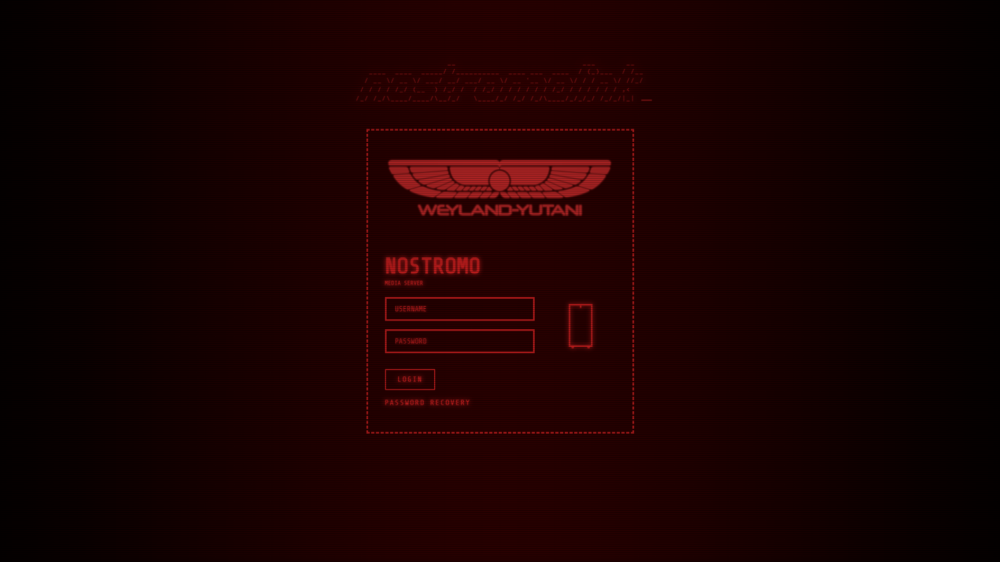](https://docs.theme-park.dev/themes/addons/unraid/login-page/retro-terminal/screenshots/red.png)

[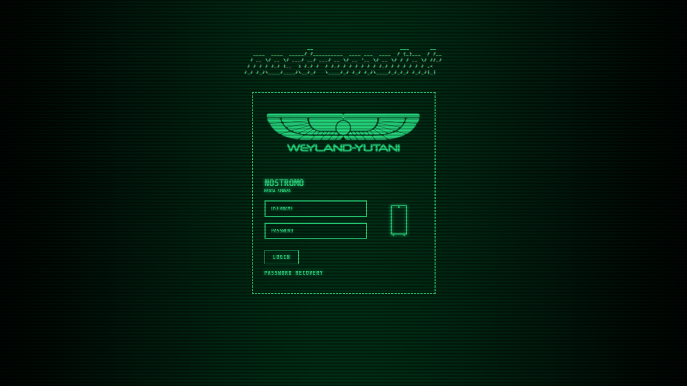](https://docs.theme-park.dev/themes/addons/unraid/login-page/retro-terminal/screenshots/green.png)

[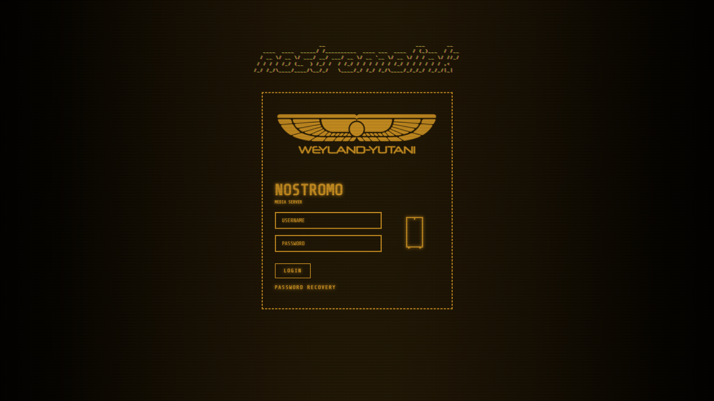](https://docs.theme-park.dev/themes/addons/unraid/login-page/retro-terminal/screenshots/amber.png)

[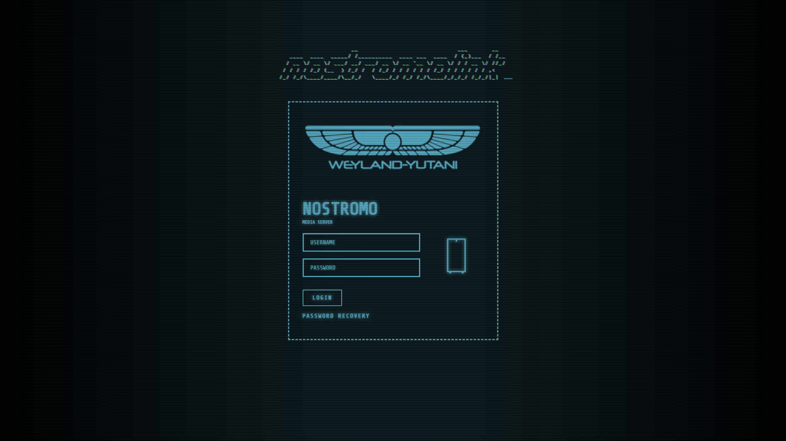](https://docs.theme-park.dev/themes/addons/unraid/login-page/retro-terminal/screenshots/blue.png)

[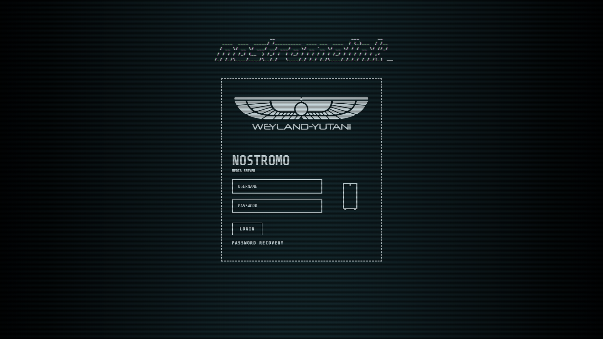](https://docs.theme-park.dev/themes/addons/unraid/login-page/retro-terminal/screenshots/white.png)

### Alien

[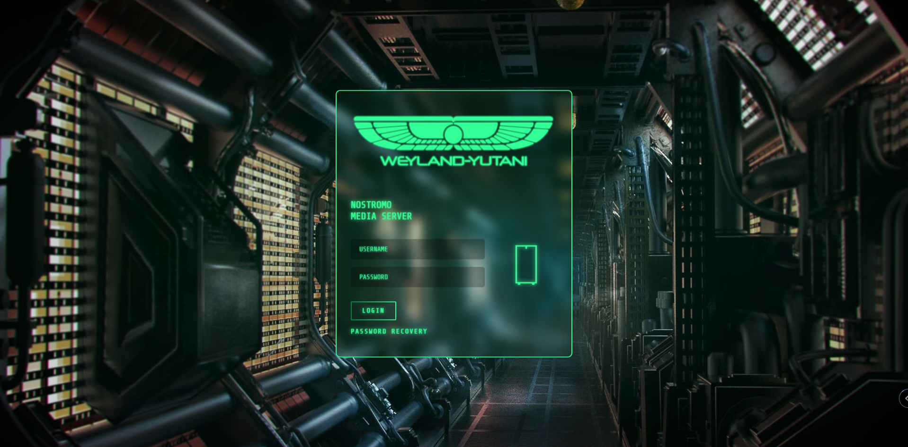](https://docs.theme-park.dev/themes/addons/unraid/login-page/alien/screenshots/hallway.png)

[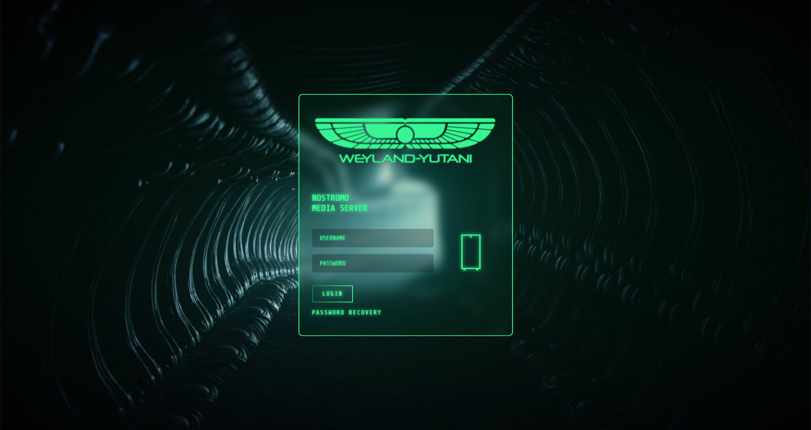](https://docs.theme-park.dev/themes/addons/unraid/login-page/alien/screenshots/hallway2.png)

[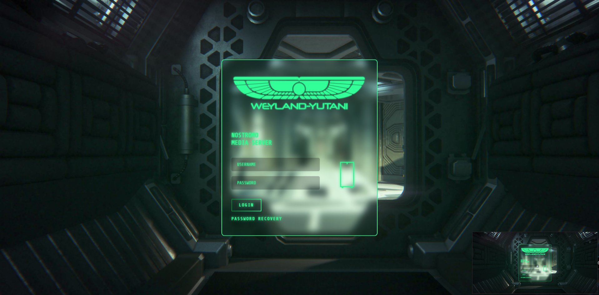](https://docs.theme-park.dev/themes/addons/unraid/login-page/alien/screenshots/hallway3.png)

[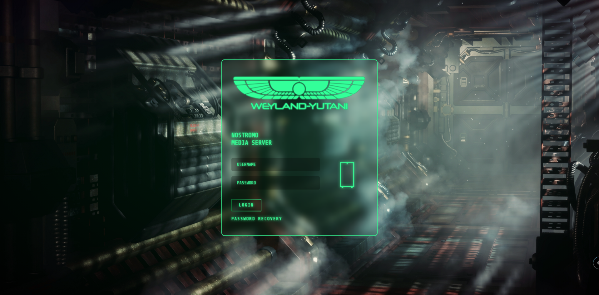](https://docs.theme-park.dev/themes/addons/unraid/login-page/alien/screenshots/hallway4.png)

[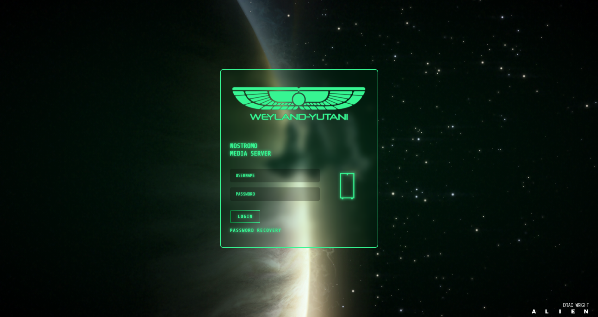](https://docs.theme-park.dev/themes/addons/unraid/login-page/alien/screenshots/isolation.png)

### Fallout

[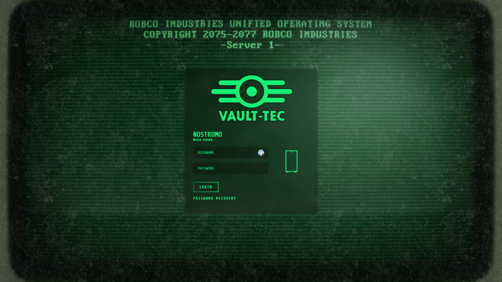](https://docs.theme-park.dev/themes/addons/unraid/login-page/fallout/screenshots/dirty_terminal.png)

[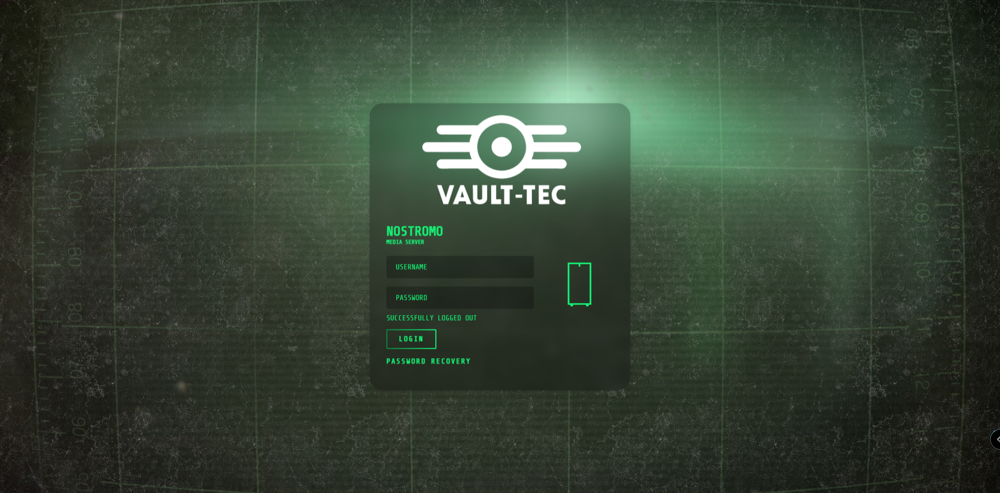](https://docs.theme-park.dev/themes/addons/unraid/login-page/fallout/screenshots/dirty_terminal2.png)

[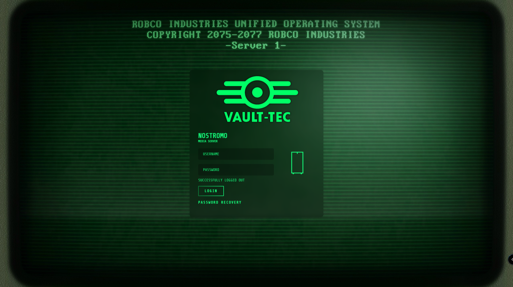](https://docs.theme-park.dev/themes/addons/unraid/login-page/fallout/screenshots/terminal.png)

[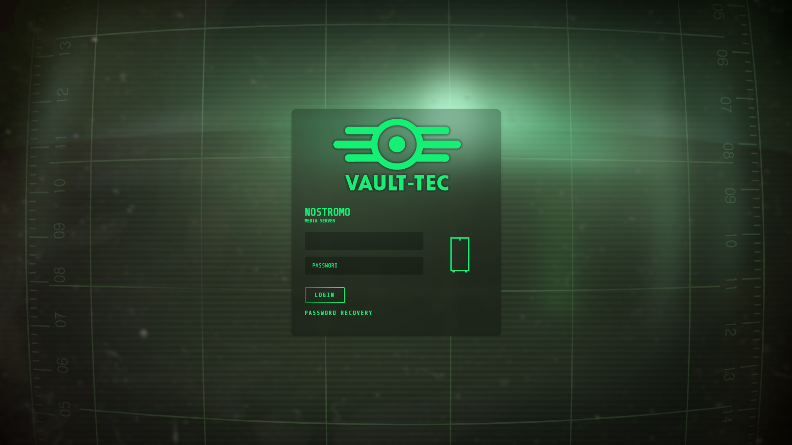](https://docs.theme-park.dev/themes/addons/unraid/login-page/fallout/screenshots/terminal2.png)

### Installation

To install the custom css and javascript(optional) we must edit the html in the `login.php` file located at `/usr/local/emhttp/login.php`  
To do that , I've created a **[bash script](https://github.com/gilbN/theme.park/blob/master/css/addons/unraid/login-page/custom_login.sh)** that uses **[sed](https://www.gnu.org/software/sed/manual/sed.html)** to inject an **[html link tag](https://www.w3schools.com/tags/tag_link.asp)** for our custom css stylesheet.  
  
If you're unfamiliar with running scripts, the easiest way to run would be to use the plugin**[CA User Scripts](https://forums.unraid.net/topic/48286-plugin-ca-user-scripts/).**  
Install the plugin and add a new user script by clicking `Add new script`  
Give it a name and click OK


Click or hover over the gear icon and click `Edit Script`


Paste the contents of the bash script:**[custom_login.sh](https://raw.githubusercontent.com/gilbN/theme.park/master/css/addons/unraid/login-page/custom_login.sh)**  

Below the shebang(`#!/bin/bash`) are the variables you need to change for the different themes.


The default values are the ones below

```bash
TYPE="retro-terminal"
THEME="green.css"
DOMAIN="theme-park.dev"
ADD_JS="true"
JS="custom_text_header.js"
DISABLE_THEME="false"
```

Set the values to what you like, and click `Save Changes`  
To have the script applied at every boot, set the schedule to `At Startup of Array`  
Now just click `Run Script`and it will print some text in the window.

Thats it.. logout and have a look at your new theme :)

### Javascript

The javascript variable will add some custom html tags into the login page. The **Retro Terminal** javascript adds an animated `<pre>` tag that says _nostromolink._ It's inspired by a [blog post](https://brennan.io/2017/06/14/alien-computer-card/) by Stephen Brennan. If you want something else, there are a ton of ACSII generators out there.

#### Retro Terminal Javascript

1. Set`ADD_JS`to`"true"` to enable.
2. Set `JS` to `custom_text_header.js`

[custom_text_header.js](https://github.com/gilbN/theme.park/blob/master/css/addons/unraid/login-page/retro-terminal/js/custom_text_header.js)  


#### Alien Theme Javascript

**[isolation.js](https://github.com/gilbN/theme.park/blob/master/css/addons/unraid/login-page/alien/js/isolation.js)**  
Injects an animated video wallpaper from the Alien: Isolation game.

1. Set`THEME`to`isolation_video.css`
2. Set`ADD_JS`to`"true"`
3. Set `JS` to `isolation.js`


#### Fallout Theme Javascript

[please_stand_by.js](https://github.com/gilbN/theme.park/blob/master/css/addons/unraid/login-page/fallout/js/please_stand_by.js)  
[vault-tec-crt.js](https://github.com/gilbN/theme.park/blob/master/css/addons/unraid/login-page/fallout/js/vault-tec-crt.js)  
[vault-tec-crt_no-scanline.js](https://github.com/gilbN/theme.park/blob/master/css/addons/unraid/login-page/fallout/js/vault-tec-crt_no-scanline.js)

1. Set`THEME`to`fallout_video.css`
2. Set`ADD_JS`to`"true"`to enable.
3. Choose the video you want. See:[videos](https://github.com/gilbN/theme.park/tree/master/css/addons/unraid/login-page/fallout/video)
    - Available js:`please_stand_by.js`,`vault-tec-crt.js`,`vault-tec-crt_no-scanline.js`
4. Set`JS`to the one you want.

vault-tec-crt.js


vault-tec-crt_no-scanline.js


please_stand_by.js


### FAQ

#### [](https://github.com/gilbN/theme.park/wiki/Retro-Terminal#backups)Backups

The script will create a backup of the login.php file if one does not exist.

#### [](https://github.com/gilbN/theme.park/wiki/Retro-Terminal#uninstallrestore-the-original)Uninstall/Restore the original

To uninstall the theme set the variable `DISABLE_THEME` to `"true"`

#### [](https://github.com/gilbN/theme.park/wiki/Retro-Terminal#can-i-selfhost-this)Can I selfhost this?

Of course! Just clone the repo into your webserver. Remember to change the `DOMAIN` variable in the bash script.

#### [](https://github.com/gilbN/theme.park/wiki/Retro-Terminal#my-server-is-not-connected-to-the-internet-how-can-i-add-this)My server is not connected to the internet! How can I add this?

With the current version of the bash script, that is not possible as it injects the stylesheet using the a URL and not a file path. However, nothing is stopping you from just doing some small changes to the script and replace the `href` urls to the path you stored the files. I will try and create a version of the script that is made for local hosting in the future.

#### I hate the flickering

To remove the background flickering you need to edit the css file. Now since you don't have any control over those files, you'll need to fork it and setup Github pages or selfhost them. You can't use the raw link from Github, as they don't pass the mime types.

The background flickering can be disabled by setting the`--body-animation` root variable to `none`

The `<pre>` tag flicker can be disabled by setting `--custom-text-header-animation` to `none`.

#### I hate the CRT lines

Set the `--body-before` and `--body-after` root variables to `none`

#### I want my own logo

Fork it and change the `--logo` variable or if you're using stylus ect, just add a new `--logo` root variable below the import line.

#### I don't like XYZ

To change the colors,background, logo ect you need to edit the css file. Now since you don't have any control over those files, you'll need to fork it and setup Github pages or selfhost the files. You can't use the raw link from Github, as they don't pass the mime types. Each css file have a bunch of variables you can change to your linking.  
All CSS and javascript files can be found here: **[https://github.com/gilbN/theme.park/tree/master/css/addons/unraid/login-page](https://github.com/gilbN/theme.park/tree/master/css/addons/unraid/login-page)**

Example:

```css
:root {
--main-bg-color:black;
--body-before:#00ff771a;
--body-after: #00ff7733;
--body-animation: flicker;
--logo: url(https://theme-park.dev/css/addons/unraid/login-page/alien/logo/wings_green.png) center no-repeat;
--text-color: #37f592;
--input-color: #37f592;
--link-color: #37f592;
--link-color-hover: #68ffff;
--case-color: #37f592;
--button-text-color: #37f592;
--button-text-color-hover: #000;
--button-color: #37f592;
--button-color-hover: #68ffff;
--selection-color: #68ffff;
--custom-text-header:#37f592;
--custom-text-header-shadow:#37f592;
--custom-text-header-animation: textflicker;
--input-font: 'Share Tech Mono', monospace;
--text-font: 'Share Tech Mono', monospace;
--loginbox-background-color: transparent;
--text-shadow: 0 0 8px;
--text-shadow-color: #37f592;
--box-shadow: 0 0 15px;
}
```

## Custom Unraid Themes

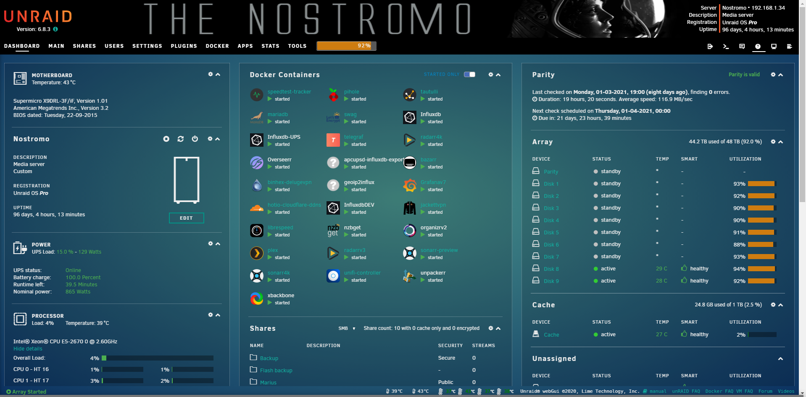

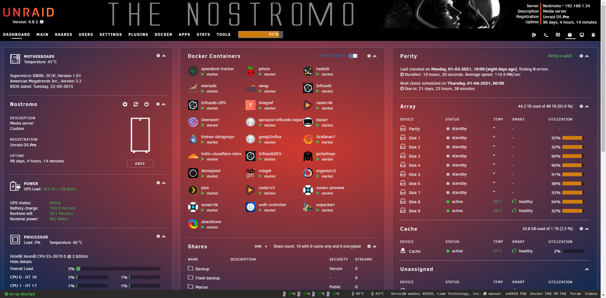

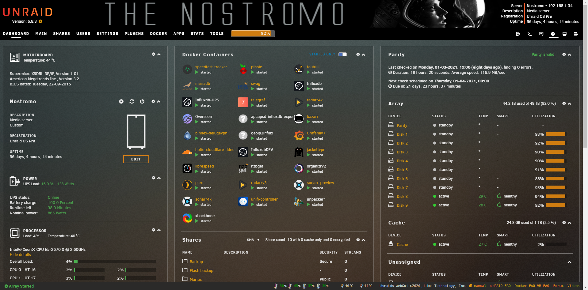

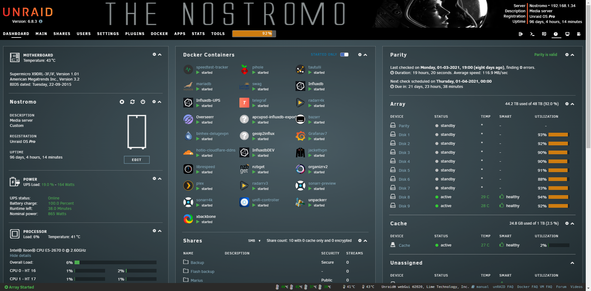

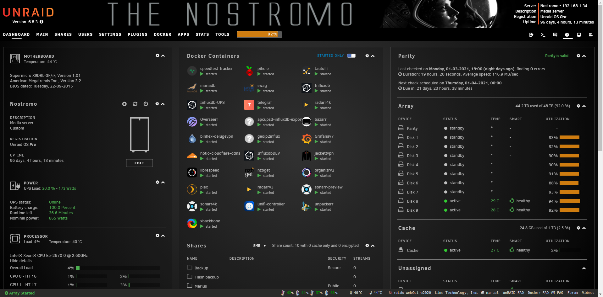

### Installation

The custom themes for the Unraid WebUI are the same as the ones in my **[theme.park repository](https://github.com/gilbN/theme.park)**.

Aquamarine, Hotline, Plex, Space-gray, Dark, and Organizr-dark.

The easiest way to add them is to use the **[Theme Engine](https://forums.unraid.net/topic/87126-plugin-theme-engine-a-webgui-styler/)** plugin.

1. Install the[Theme Engine](https://forums.unraid.net/topic/87126-plugin-theme-engine-a-webgui-styler/)plugin from the CA appstore and open it.
2. Set `Base Theme` to black
3. Enable`Advanced View`
4. Scroll down and set `Enable custom styling (below):` to `Yes`
5. Add the HTML below in the `Custom styling (advanced):` textarea. Remember to change`<THEME>` to the theme you want.

```html
</style><link type="text/css" rel="Stylesheet" href="https://theme-park.dev/css/themes/unraid/<THEME>.css" />
```

Example:

```html
</style><link type="text/css" rel="Stylesheet" href="https://theme-park.dev/css/themes/unraid/plex.css" />
```


**[Installation](https://docs.theme-park.dev/setup/)**
