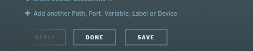

# {{ title }}

<small>Written: {{ date }}</small>

<small>Tags</small>

<p style="display:inline">
<a style="padding: .125em 1em; border-radius: 25px; margin-top:5px;" class="md-button md-button--primary" href="#">{{ tag }}</a>
</p>


<small>Category</small>

<p style="display:inline;">
<a style="padding: .125em 1em; border-radius: 25px; margin-top:5px;" class="md-button md-button--primary" href="#">{{ cat }}</a>
</p>


</img>

Developers hate me for sharing this one weird trick!

Yes..the title is clickbait, and **no** this does not work on any app/container ;)

I have for some time now been creating **[css themes/skins](https://github.com/themepark-dev/theme.park)** for different applications that reside in the "media server/selfhosting" category. Normally you would add the themes using a "subfilter" module like [http://nginx.org/en/docs/http/ngx_http_sub_module.html](http://nginx.org/en/docs/http/ngx_http_sub_module.html) or [https://httpd.apache.org/docs/2.4/mod/mod_filter.html](https://httpd.apache.org/docs/2.4/mod/mod_filter.html). This means that you would have to reverse proxy the application to be able to add the theme. Doing that would only apply the theme when accessing the application though the proxy and not locally.

So, to fix that I've created a bunch of [docker mods](https://blog.linuxserver.io/2019/09/14/customizing-our-containers/) for all the applications that have a **[linuxserver](https://www.linuxserver.io/)** container. The docker mod, will run a script at startup to inject the stylesheet into the html file using [sed](https://www.gnu.org/software/sed/manual/sed.html). The script does the exact same thing as the subfiltering module except it does it on the backend instead of on the proxy side. You can find all the mods here: [https://github.com/themepark-dev/theme.park/tree/master/docker-mods](https://github.com/themepark-dev/theme.park/tree/master/docker-mods)

The scripts are quite simple and only has a couple of variables. `TP_DOMAIN` and `TP_THEME` Both these variable have a default value if not set. `TP_DOMAIN` is set to `theme-park.dev` and `TP_THEME` is set to `organizr`

Example:

```bash
#!/usr/bin/with-contenv bash

echo '---------------------------'
echo '|  Sonarr theme.park Mod  |'
echo '---------------------------'

# Display variables for troubleshooting 
echo -e "Variables set:\\n\
'TP_DOMAIN'=${TP_DOMAIN}\\n\
'TP_COMMUNITY_THEME'=${TP_COMMUNITY_THEME}\\n\
'TP_ADDON'=${TP_ADDON}\\n\
'TP_THEME'=${TP_THEME}\\n"

APP_FILEPATH='/app/sonarr/bin/UI/index.html'
LOGIN_FILEPATH='/app/sonarr/bin/UI/login.html'
if [ "${TP_HOTIO}" = true ]; then
    echo 'Changing to Hotio file path!'
    APP_FILEPATH='/app/bin/UI/index.html'
    LOGIN_FILEPATH='/app/bin/UI/login.html'
fi

# Set default
if [[ -z ${TP_DOMAIN} ]]; then
    echo 'No domain set, defaulting to theme-park.dev'
    TP_DOMAIN='theme-park.dev'
fi

THEME_TYPE='theme-options'
if [ "${TP_COMMUNITY_THEME}" = true ]; then
    THEME_TYPE='community-theme-options'
fi

case ${TP_DOMAIN} in
  *"github.io"*)
  echo "Switching to github.io URL style"
    TP_DOMAIN="${TP_DOMAIN}\/theme.park"
    ;;
esac

if [[ -z ${TP_THEME} ]]; then
    echo 'No theme set, defaulting to organizr'
    TP_THEME='organizr'
fi

# Adding stylesheets
if ! grep -q "${TP_DOMAIN}/css/base" "${APP_FILEPATH}"; then
    echo '---------------------------'
    echo '|  Adding the stylesheet  |'
    echo '---------------------------'
    sed -i "s/<\/head>/<link rel='stylesheet' href='https:\/\/${TP_DOMAIN}\/css\/base\/sonarr\/sonarr-base.css'><\/head> /g" "${APP_FILEPATH}"
    sed -i "s/<\/head>/<link rel='stylesheet' href='https:\/\/${TP_DOMAIN}\/css\/${THEME_TYPE}\/${TP_THEME}.css'><\/head> /g" "${APP_FILEPATH}"
    sed -i "s/<\/head>/<link rel='stylesheet' href='https:\/\/${TP_DOMAIN}\/css\/base\/sonarr\/sonarr-base.css'><\/head> /g" "${LOGIN_FILEPATH}"
    sed -i "s/<\/head>/<link rel='stylesheet' href='https:\/\/${TP_DOMAIN}\/css\/${THEME_TYPE}\/${TP_THEME}.css'><\/head> /g" "${LOGIN_FILEPATH}"
    printf 'Stylesheet set to %s\n' "${TP_THEME}"
    if [[ -n ${TP_ADDON} ]]; then
        for addon in $(echo "$TP_ADDON" | tr "|" " "); do
        sed -i "s/<\/head>/<link rel='stylesheet' href='https:\/\/${TP_DOMAIN}\/css\/addons\/sonarr\/${addon}\/${addon}.css'><\/head> /g" "${APP_FILEPATH}"
        sed -i "s/<\/head>/<link rel='stylesheet' href='https:\/\/${TP_DOMAIN}\/css\/addons\/sonarr\/${addon}\/${addon}.css'><\/head> /g" "${LOGIN_FILEPATH}"
        printf 'Added custom addon: %s\n\n' "${addon}"
        done
    fi
fi
```

## Adding the theme

Adding the mod, is quite simple. Add the variable `DOCKER_MODS=https://github.com/themepark-dev/theme.park:<app>` e.g. `https://github.com/themepark-dev/theme.park:sonarr` to your docker run command or compose file.

On Unraid simply click on `+ Add another Path, Port, Variable, label or Device`

[](images/chrome_FjpV8pDRDU.png)

And fill out the fields.

[](images/chrome_bcil72yAkv.png)

As noted earlier it will default to the **[organizr](https://docs.theme-park.dev/theme-options/organizr/)** theme and the `theme-park.dev` domain. So if you want a different theme, you must add the `TP_THEME` variable with the value you want. The available themes are: `aquamarine`, `hotline`, `space-gray`,`dark`, `plex` and `organizr`

Click the banners here for screenshots of the different themes: [https://docs.theme-park.dev/#themes](https://docs.theme-park.dev/#themes)

You can find applications that support Docker Mods installation here: [https://github.com/themepark-dev/theme.park/tree/master/docker-mods](https://github.com/themepark-dev/theme.park/tree/master/docker-mods) For other installation methods check the wiki [https://docs.theme-park.dev/setup/](https://docs.theme-park.dev/setup/)
