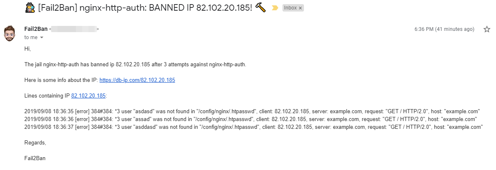
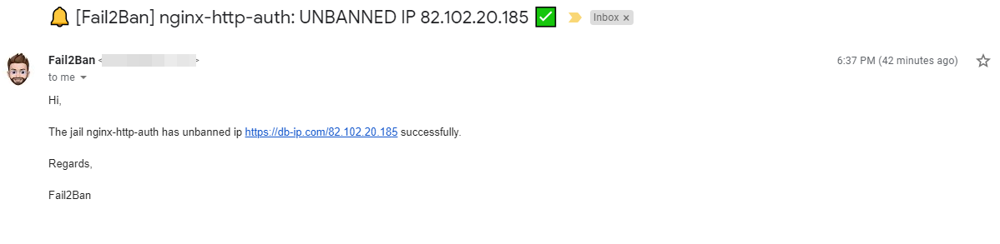

# {{ title }}

<small>Written: {{ date }}</small>

<small>Tags</small>

<p style="display:inline">
<a style="padding: .125em 1em; border-radius: 25px; margin-top:5px;" class="md-button md-button--primary" href="#">{{ tag }}</a>
</p>


<small>Category</small>

<p style="display:inline;">
<a style="padding: .125em 1em; border-radius: 25px; margin-top:5px;" class="md-button md-button--primary" href="#">{{ cat }}</a>
</p>


</img>

Following up an my other two post about Fail2ban notifications, that you can read here: [Adding ban/unban notifications from Fail2Ban to Discord!](https://technicalramblings.com/blog/adding-ban-unban-notifications-from-fail2ban-to-discord/) and here[Adding ban/unban notifications from Fail2Ban to Pushover!](https://technicalramblings.com/blog/adding-ban-unban-notifications-from-fail2ban-with-pushover/) I recently got email notifications working (Thank you _count_confucius_) and thought I'd share how to get that working!

## Adding the action

!!! note "Note"
    I am using the linuxserver swag container in this guide. https://github.com/linuxserver/docker-swag

Go into your `/action.d` folder and copy and rename `sendmail-whois.conf` to `sendmail-whois.local`. Edit the file and replace the `actionban` and add the `actionunban` with the code below:

```bash
actionban =   printf %%b "Subject:🕵️ [Fail2Ban] <name>: BANNED IP <ip>! 🔨
              Date: `LC_ALL=C date +"%%a, %%d %%h %%Y %%T %%z"`
              From: <sendername> <<sender>>
              To: <destination>\n
              Hi,\n
              The jail <name> has banned ip <ip> after <failures> attempts against <name>.\n
              Here is some info about the IP: https://db-ip.com/<ip> \n
              Lines containing IP <ip>: \n
              `grep '<ip>' <logpath>` \n
              Regards,\n
              Fail2Ban" | /usr/sbin/sendmail -t -v -H 'exec openssl s_client -quiet -tls1 -connect smtp.gmail.com:465' -au<from> -ap<password> <destination>

actionunban = printf %%b "Subject:🔔 [Fail2Ban] <name>: UNBANNED IP <ip> ✅
              Date: `LC_ALL=C date +"%%a, %%d %%h %%Y %%T %%z"`
              From: <sendername> <<sender>>
              To: <destination>\n
              Hi,\n
              Fail2ban has unbanned ip https://db-ip.com/<ip> successfully. \n
              Regards,\n
              Fail2Ban" | /usr/sbin/sendmail -t -v -H 'exec openssl s_client -quiet -tls1 -connect smtp.gmail.com:465' -au<from> -ap<password> <destination>
```

NOTE: If you don't use gmail you need to update the smtp address in the code!

Next save the file and copy and rename the `sendmail-common.conf` file to `sendmail-common.local` We have to edit this file or else we'll get a lot of errors in the Fail2ban log about failing to send jail startup and shutdown emails.

In the `sendmail-common.local` file remove everything after `actionstart =` and `actionstop =`

If you want emails on start and stop, add the code above and just change the subject and body of the email.

## jail.local

In your jail.local file add the following in the `[DEFAULT]` section:

```bash
banaction = iptables-allports
action = %(action_mw)s[from=example@gmail.com, password=secretpassword, destination=example@gmail.com, sendername=Fail2Ban]
```

Let's break down the mail action. **from** = The email account it sends from. **password** = The password to the sender account. **destination** = Where you want to send the notification. **sendername** = Name of the sender.

The action `iptables-allports` is needed because if you only have the send mail action it will override the action that updates the iptables! So it won't ban the IP without it.

If you only want to add the mail notification to a specific jail you can add it to just that specific jail. On `[DEFAULT]` it will be default on every jail in `jail.local`.

Lastly you need to restart fail2ban and try and ban yourself.

## Email

The email will look like this:

[](https://technicalramblings.com/wp-content/uploads/2019/09/chrome_OCklWr02MT.png)

[](https://technicalramblings.com/wp-content/uploads/2019/09/chrome_WTM61hydPD.png)

### If you need any extra help join the Discord server

#### [](https://discord.gg/HM5uUKU)
