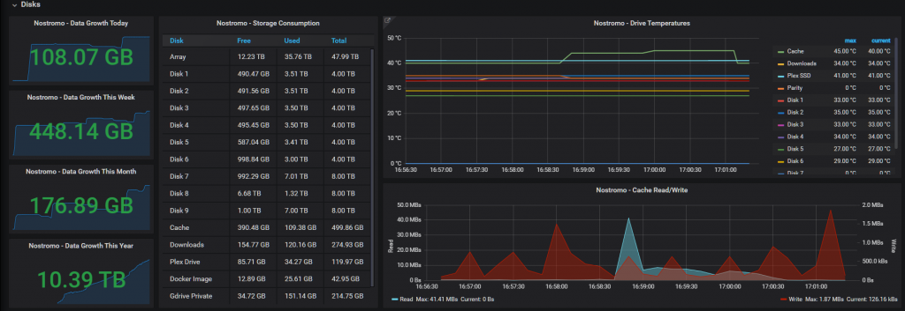
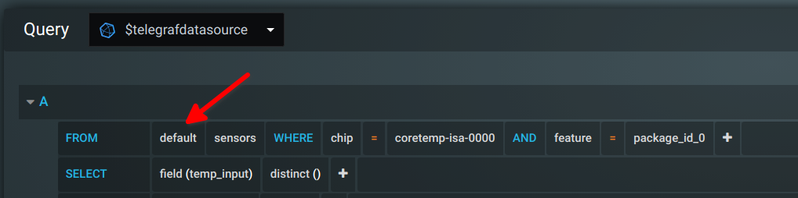
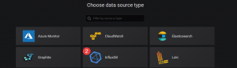
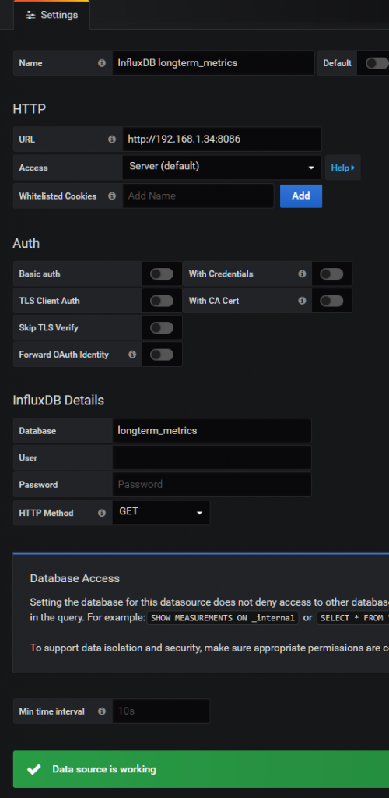
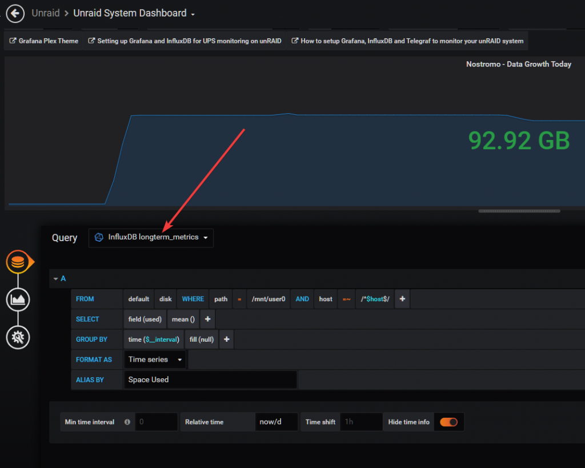
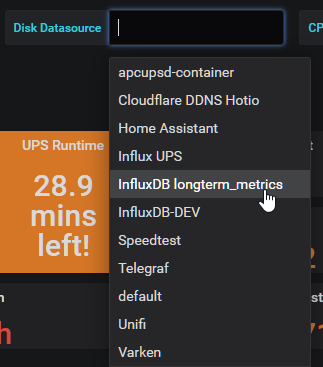

So, at the beginning of the last couple of years I have dropped my Influx Telegraf database containing all the host metrics gathered from the previous year. I did this because it was getting too big, and my container appdata backups where getting too big and taking too long to backup. Yes I know I could have just set a retention policy on the database and have it cleared every week, but I wanted some long term metrics like disk usage, so I could see the growth over the year.

My Influxdb container appdata folder is currently 40GB so lets fix that.

\[eckosc\_full\_width\_block\]

\[caption id="attachment\_2077" align="alignnone" width="1024"\][](https://technicalramblings.com/wp-content/uploads/2020/01/chrome_FBHcvdXttX.png) Disk usage shown in Grafana\[/caption\]

\[/eckosc\_full\_width\_block\]

## Creating the long term database

Log into your Influxdb instance. If you use docker you can exec in like so: `docker exec -it Influxdb influx` where `Influxdb` is the name of the container.

Create the database with the following command: `CREATE DATABASE longterm_metrics` This creates the database `longterm_metrics` without any retention policy. If you want a retention policy on the long term metrics, say for example 1 year, you can run this:

`CREATE DATABASE longterm_metrics WITH DURATION 365d REPLICATION 1 SHARD DURATION 1w NAME RP_longterm_365d`

This will create the database and set the 365d retention policy to default for that database. If you want you can read more about replication and shards here:  [https://docs.influxdata.com/influxdb/v1.7/concepts/glossary/#replication-factor](https://docs.influxdata.com/influxdb/v1.7/concepts/glossary/#replication-factor) and [https://docs.influxdata.com/influxdb/v1.7/concepts/glossary/#shard](https://docs.influxdata.com/influxdb/v1.7/concepts/glossary/#shard)

You can also look up retention policies with the `show retention policies` command. First select which database to use with the `use <database>` command and then run the `show retention policies` command like so:

```
> use longterm_metrics
Using database longterm_metrics
> show retention policies
name             duration  shardGroupDuration replicaN default
---- -------- ------------------ -------- -------
RP_longterm_365d 8760h0m0s 168h0m0s           1        true
>
```

## Adding a new default retention policy on the Telegraf database

Run the following command to create a new default retention policy on the `telegraf` database:

\[eckosc\_status\_message title="Warning!" icon="" type="error" message="Note: This will ''reset'' the whole database!"\]

The data won't be gone, it's still accessible using the autogen retention policy. But the command below sets the new one as `default`, and that's what the panels normally use in Grafana.

[](https://technicalramblings.com/wp-content/uploads/2020/01/snip_20200607-140301.png)

If you want to migrate some data after you can check out this post [https://community.influxdata.com/t/applying-retention-policies-to-existing-measurments/802/2](https://community.influxdata.com/t/applying-retention-policies-to-existing-measurments/802/2)

`CREATE RETENTION POLICY "7_day_retention" ON "telegraf" DURATION 1w REPLICATION 1 SHARD DURATION 1w DEFAULT`

This will create the retention policy called `7_day_retention` and set it as the default policy.

After I set the new default retention policy my Influxdb appdata folder went from 40GB to 225MB :)

Read more here: [https://docs.influxdata.com/influxdb/v1.7/query\_language/database\_management/#retention-policy-management](https://docs.influxdata.com/influxdb/v1.7/query_language/database_management/#retention-policy-management)

## Sending the metrics to a different database

Now in Telegraf we simply need to add an extra output that tells Telegraf to also route the metrics we want to another database.

\[eckosc\_status\_message title="Note" icon="" type="info" message="This won't stop telegraf from writing the metrics to the OG telegraf database,  it will write to both"\]

Add the following to the telegraf.conf file. Note add, not replace.

```
[[outputs.influxdb]]
  urls = ["http://192.168.1.34:8086"] # required
  database = "longterm_metrics" # required
  retention_policy = ""
  write_consistency = "any"
  timeout = "5s"
  namepass = ["apcupsd","disk","diskio"]
```

As I didn't add a retention policy for my long term database I have set it to use an empty string as that will use the default retention policy (autogen) of that database. If you first created the database, and then added a retention policy to that database that you want to use, you must set `retention_policy = "<retention_policy>"` to the retention policy you want. If not it will use the `autogen` retention policy as that is set to default when just running `create <database>`

The `namepass = ["apcupsd","disk","diskio"]` is what tells Telegraf which metrics to send to that specific database.

After you've added the lines restart Telegraf.

## Adding a new datasource in Grafana

Since my Telegraf datasource uses the `telegraf` database, we need to add a new data source that uses our new database.

Click on **`Add data source`** and select InfluxDB. 

[](https://technicalramblings.com/wp-content/uploads/2019/07/chrome_DujTbaihqK.png)

[](https://technicalramblings.com/wp-content/uploads/2019/07/chrome_nO1OWoDMt8.png)

Next give the data source a name, add the URL to InfluxDB, set the database to use the new database you created and click **Save & Test**

[](https://technicalramblings.com/wp-content/uploads/2020/01/chrome_AReQRhFqrB.png)

## Updating the Grafana panels

Next it's just a matter of updating the Grafana panels to use the new data source. [](https://technicalramblings.com/wp-content/uploads/2020/01/chrome_Pda5MjQFo9.png)

If you use my Unraid System Dashboard [https://grafana.com/grafana/dashboards/7233](https://grafana.com/grafana/dashboards/7233) you can just download the latest version and select the disk data source in the drop down. [](https://technicalramblings.com/wp-content/uploads/2020/01/chrome_2kJVPFkmoX.png)

Sources:

[https://docs.influxdata.com/influxdb/v1.7/query\_language/database\_management](https://docs.influxdata.com/influxdb/v1.7/query_language/database_management)

[https://docs.influxdata.com/telegraf/v1.13/administration/configuration/](https://docs.influxdata.com/telegraf/v1.13/administration/configuration/)

### If you need any extra help join the Discord server!

#### [](https://discord.gg/HM5uUKU)
