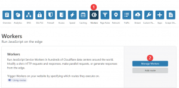
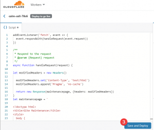
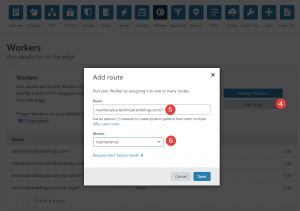
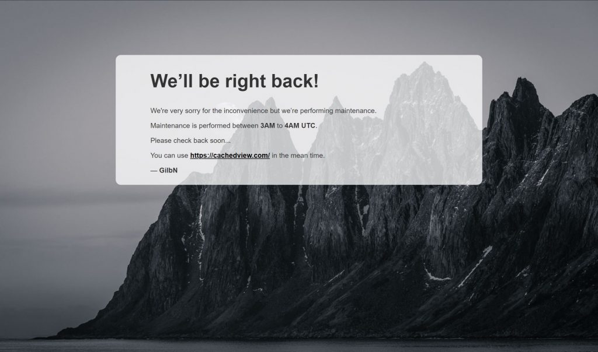
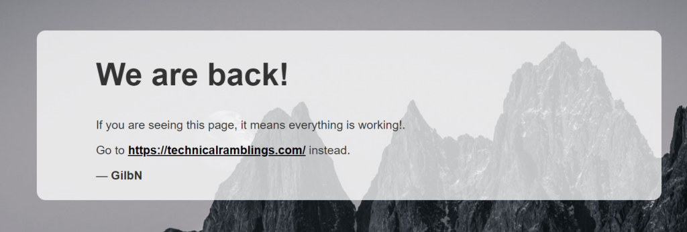
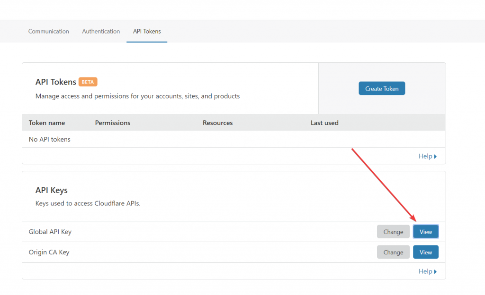
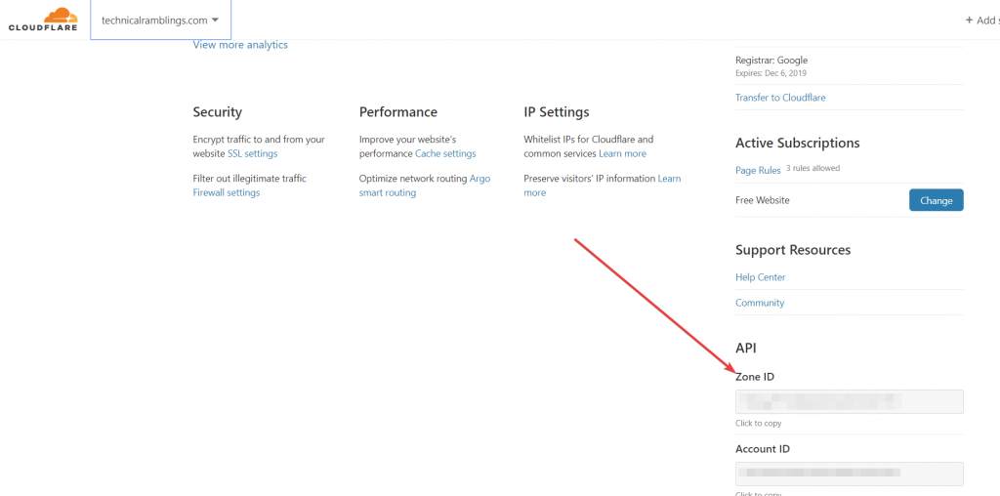
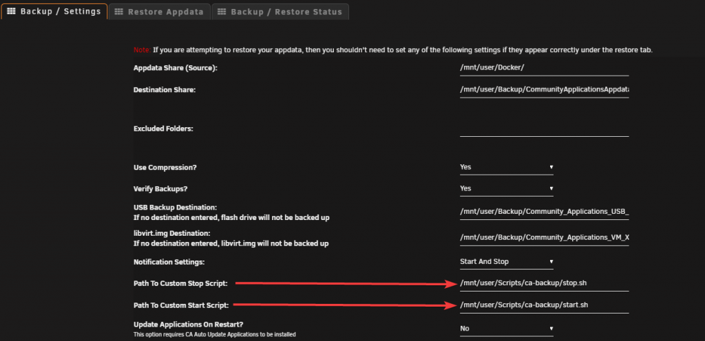

# {{ title }}

</img>

Since I use the CA Backup/Restore plugin every night my blog site will some times show the Cloudflare 523 error: origin is unreachable for around 1 hour before the plugin finishes and starts all my docker containers up again. So since that has been a minor annoyance for some time, I decided to look into how I could set up a maintenance page automatically when the backup starts.

Note: This wouldn't have been an issue if the "Always Online" fuctionality worked on my site

So after some googling I found [this](https://www.resdevops.com/2018/03/20/cloudflare-workers-maintenance-mode-static-page/) great resource on how to route people to their maintenance page while they are doing maintenance. The javascript returns the maintenance page if you are not calling from a trusted IP. Now Since that is something I don't need I have removed that function so you will be routed to the page regardless with the code below.

This is all made possible by using the Cloudflare API and Cloudflare workers. We will need to create a worker and setup a route for it.

## Creating a worker

On your Cloudflare dashboard click on Workers and go through the first time setup if you haven't done that yet. Next click on `Manage Workers` and `Create a Worker`

[](https://technicalramblings.com/wp-content/uploads/2019/08/chrome_fgJWpnVXDC.png) Give your worker a name and paste the code below. Edit the html part to say what you want. Click `Save and Deploy.` After a minute or so you should be able to visit the page the worker is deployed on.

[](https://technicalramblings.com/wp-content/uploads/2019/08/chrome_8MjGm07luY.png) After you've created the worker, go back to the main page and click on `Add route`

[](https://technicalramblings.com/wp-content/uploads/2019/08/chrome_4bdWottWlo.png)

Set the route to a subdomain that doesnt point to your site. I'm using `maintenance.technicalramblings.com` Remember to add the DNS record before you create the route. The subdomain you choose shouldn't be something you use as that will disrupt that domain. So I just added something that made sense to me. The subdomains only purpose is to be a placeholder for the maintenance page when the nightly backups aren't running.

The way I have this setup is that I am using the API to update the "route pattern" that the worker is using. So when the backup starts it will run a script that updates the route pattern to `technicalramblings.com/*` and sets the route to use the `maintenance` worker. This will display the page in the screenshot below when someone is trying to access my blog.

\[eckosc\_full\_width\_block\]

[](https://technicalramblings.com/wp-content/uploads/2019/08/chrome_xMDgnog4Hj.jpg)

\[/eckosc\_full\_width\_block\]

When the backup is finished a script will run and it will change the "route pattern" back to `maintenance.technicalramblings.com/*` I have also added another worker that I called `up` So when everything is back up the maintenance subdomain will display this:

[](https://technicalramblings.com/wp-content/uploads/2019/08/chrome_mV8coRRhml.png)

The `up` script is identical with only the html part changed. Its not really needed, but I wanted the maintenance page to display something different when the backup was not running in case someone stumbled over the subdomain.

```
addEventListener('fetch', event => {
  event.respondWith(handleRequest(event.request))
})

/**
 * Respond to the request
 * @param {Request} request
 */
async function handleRequest(request) {

let modifiedHeaders = new Headers()
 
  modifiedHeaders.set('Content-Type', 'text/html')
  modifiedHeaders.append('Pragma', 'no-cache')

  return new Response(maintenancepage, {headers: modifiedHeaders})
}
let maintenancepage = `
 
<!doctype html>
<title>Site Maintenance</title>
<style>
  body { 
        text-align: center; 
        padding: 150px; 
        background: url('https://raw.githubusercontent.com/gilbN/Nostromo/master/blog/Senja-death-star.jpg') no-repeat center center fixed; 
        background-size: cover;
        -webkit-background-size: cover;
        -moz-background-size: cover;
        -o-background-size: cover;
      }
 
    .content {
        background-color: rgba(255, 255, 255, 0.75); 
        background-size: 100%;      
        color: inherit;
        padding: 1px 100px 10px 100px;
        border-radius: 15px;        
    }
 
  h1 { font-size: 40pt;}
  body { font: 20px Helvetica, sans-serif; color: #333; }
  article { display: block; text-align: left; width: 75%; margin: 0 auto; }
  a:hover { color: #333; text-decoration: none; }
</style>
 
<article> 
  <div class="background">
    <div class="content">
      <h1>We&rsquo;ll be right back!</h1>
        <p>We're very sorry for the inconvenience but we&rsquo;re performing maintenance.</p>
        <p>Maintenance is performed between <strong>3AM</strong> to <strong>4AM</strong> <strong>UTC</strong>.</p>
        <p>Please check back soon...</p>
        <p>You can use <span style="color: #000000;"><strong><a style="color: #000000;" href="https://cachedview.com/">https://cachedview.com/</a></strong></span> in the mean time.</p>
        <p>&mdash; <B>GilbN</B></p>
    </div>
  </div>
</article>
`;
```

## CA Backup Scripts

So, for this to all work automatically we need to add a couple of start/stop scripts to the CA Backup plugin. But before we can do that we need to get the ID of the route we just created.

We can only get the ID by using the Cloudflare API. So run the curl command below to get the route ID you created. Remember to change the zone, API key and email.

```
curl -X GET "https://api.cloudflare.com/client/v4/zones/YOUR-ZONE-ID/workers/routes/" \
-H "X-Auth-Email: YOUR@CLOUDFLARE-EMAIL.com" \
-H "X-Auth-Key: YOUR-API-KEY"
```

The Zone ID is found on the overview page of the domain you want to use, and the API Key is found on the api tokens page [https://dash.cloudflare.com/profile/api-tokens](https://dash.cloudflare.com/profile/api-tokens) Use the global token.[](https://technicalramblings.com/wp-content/uploads/2019/08/chrome_ha6T98Kigw.png) [](https://technicalramblings.com/wp-content/uploads/2019/08/chrome_V3J4cdYb29.png)

The command should output something like this:

```
{
  "result": [
    {
      "id": "8998sfd23sd48ds0g5jk3s5sdhd098",
      "pattern": "maintenance.technicalramblings.com/*",
      "script": "maintenance"
    }
  ],
  "success": true,
  "errors": [],
  "messages": []
}
```

The id is the `route id` we need to use in the start/stop scripts, so save that.

#### Stop script:

(Runs when CA Backup **starts**. It's called stop script because it runs when stopping the containers)

```
#!/bin/bash
email='EXAMPLE@DOMAIN.COM'
apikey='XXXXXXXXXXXXXXXXXXXXXXXXXXXXXX'
zone_id='XXXXXXXXXXXXXXXXXXXXXXXXXXXXXXXX'
route_id='XXXXXXXXXXXXXXXXXXXXXXXXXXXXXXX'
route_pattern='technicalramblings.com/*'
worker='maintenance'

curl -X PUT "https://api.cloudflare.com/client/v4/zones/"$zone_id"/workers/routes/"$route_id"" \
-H "X-Auth-Email: "$email"" \
-H "X-Auth-Key: "$apikey"" \
-H "Content-Type: application/json" \
--data '{"pattern":"'"$route_pattern"'","script":"'"$worker"'"}'
```

Update the scripts to use your api key, route id and zone id ect. You can try the script by setting the domain variable to a test domain (Must be the same domain as the zone ID ). Note: the pattern I use has a `wildcard` at the end so it will match any url from my blog. You can read more about the matching behavior here [https://workers.cloudflare.com/docs/reference/workers-concepts/routes/](https://workers.cloudflare.com/docs/reference/workers-concepts/routes/)

#### Start script

(Runs when CA Backup is **finished** and the containers have been started):

```
#!/bin/bash
email='EXAMPLE@DOMAIN.COM'
apikey='XXXXXXXXXXXXXXXXXXXXXXXXXXXXXX'
zone_id='XXXXXXXXXXXXXXXXXXXXXXXXXXXXXXXX'
route_id='XXXXXXXXXXXXXXXXXXXXXXXXXXXXXXX'
route_pattern='maintenance.technicalramblings.com/*'
worker='up'

curl -X PUT "https://api.cloudflare.com/client/v4/zones/"$zone_id"/workers/routes/"$route_id"" \
-H "X-Auth-Email: "$email"" \
-H "X-Auth-Key: "$apikey"" \
-H "Content-Type: application/json" \
--data '{"pattern":"'"$route_pattern"'","script":"'"$worker"'"}'
```

Next create the scripts at your desired location. `nano start.sh` paste the contents, save and run `chmod +x start.sh` Test the script with `./start.sh` Do the same for the stop script

Add the paths in the CA Backup plugin settings. [](https://technicalramblings.com/wp-content/uploads/2019/08/chrome_3YVtlnhG89.png)

### If you need any extra help join the Discord server!

#### [](https://discord.gg/HM5uUKU)

Sources:

[https://www.resdevops.com/2018/03/20/cloudflare-workers-maintenance-mode-static-page/](https://www.resdevops.com/2018/03/20/cloudflare-workers-maintenance-mode-static-page/)

[https://api.cloudflare.com/#worker-routes-update-route](https://api.cloudflare.com/#worker-routes-update-route)
