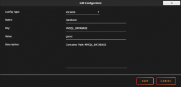
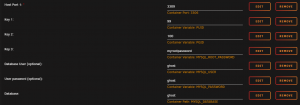
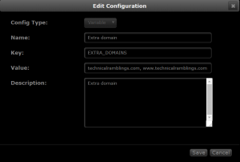
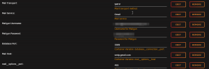
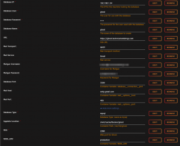
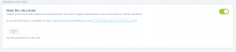

# {{ title }}

</img>

Now, I don't really have any issues with Wordpress, I like it. But It's always fun to try something new to see if you're missing out. The setup process is fairly similar to Wordpress except I will be using the Ghost docker container this time. There is also some custom setup you might have to do with the Ghost template to make it work.

## What is Ghost

!!! info
    Ghost is a free and open source blogging platform written in JavaScript and distributed under the MIT License, designed to simplify the process of online publishing for individual bloggers as well as online publications.

### MariaDB Installation

Installing MariaDB is very straight forward. Go to the "Apps" tab and search for mariadb and click install. If you already have mariadb installed and are using it with another application you can scroll down to the `Create the ghost database manually` part.

1. Choose your host port and your `MYSQL Root` password.
2. Add the database name variable. `MYSQL_DATABASE`
3. Add the database user variable. `MYSQL_USER`
4. Add the user password variable. `MYSQL_PASSWORD`

[](https://technicalramblings.com/wp-content/uploads/2020/02/chrome_28HMhdICdd.png)

[](https://technicalramblings.com/wp-content/uploads/2020/02/chrome_tTfSFWWBQF.png)

### Optional: Create the ghost database manually

1. Open terminal and exec into the container with **`docker exec -it mariadb bash`**or use the console shortcut on the Dashboard page.
2. Log into mysql with user root and the password you chose. **`mysql -uroot -p`**enter your password.

The output will look like this:

```bash
root@Nostromo:~# docker exec -it mariadb bash
root@ac436a71f4be:/# mysql -uroot -p
Enter password:
Welcome to the MariaDB monitor. Commands end with ; or g.
Your MariaDB connection id is 3
Server version: 10.1.30-MariaDB-1~xenial mariadb.org binary distribution

Copyright (c) 2000, 2017, Oracle, MariaDB Corporation Ab and others.

Type 'help;' or 'h' for help. Type 'c' to clear the current input statement.

MariaDB [(none)]
```

Next up is creating the database. (Remember to end all queries with a semicolon)

1. Start with creating a user for the database.`CREATE USER 'user' IDENTIFIED by 'password';`Where 'user' is your username and 'password' is the password you want for the new user. The ouput will be like this.

```bash
MariaDB [(none)]> CREATE USER 'ghost' IDENTIFIED by 'ghost';
Query OK, 0 rows affected (0.01 sec)
```

2. Create the database with `CREATE DATABASE IF NOT EXISTS ghost;`

```bash
MariaDB [(none)]> CREATE DATABASE IF NOT EXISTS ghost;
Query OK, 1 row affected (0.00 sec)
```

3. Give the user permissions to the database with `GRANT ALL PRIVILEGES ON ghost.* TO 'ghost' IDENTIFIED BY 'ghost';`

```bash
MariaDB [(none)]> GRANT ALL PRIVILEGES ON ghost.* TO 'ghost' IDENTIFIED BY 'ghost';
Query OK, 0 rows affected (0.00 sec)
```

Then quit mysql with `quit` and exit from the container by issuing the command `exit`

## swag/Letsencrypt

If you already have swag setup you can just skip down to the nginx part.

For first time installation I strongly recommend reading this excellent guide by aptalca [https://blog.linuxserver.io/2019/04/25/letsencrypt-nginx-starter-guide/](https://blog.linuxserver.io/2019/04/25/letsencrypt-nginx-starter-guide/)

It covers all the basics on setting up this container. There's no point for me invent the wheel again. For troubleshooting the container have a look at this [https://blog.linuxserver.io/2019/07/10/troubleshooting-letsencrypt-image-port-mapping-and-forwarding/](https://blog.linuxserver.io/2019/07/10/troubleshooting-letsencrypt-image-port-mapping-and-forwarding/).

!!! warning
    [TTL](https://en.wikipedia.org/wiki/Time_to_live) differs from each provider, some has a minimum 60 minutes before DNS propagates and others have 1 minute. So it might take a while before https://yourdomain.com works.

If you already have swag setup and working with a domain and want to use another domain for your ghost site you can do that by using the **`EXTRA_DOMAINS`** variable.

1. Click on **Add another Path, Port or Variable**
2. Add these values. Config Type: **Variable** Name:**Extra domain** Key:**EXTRA_DOMAINS** Value:**yourotherdomain.com, ghost.yourotherdomain.com**

[](https://technicalramblings.com/wp-content/uploads/2017/12/chrome_2017-12-25_17-57-18.png)

## Nginx

Go to the swag appdata location. Find the nginx folder and either create a new `ghost.conf` file in the "site-conf" folder(domains and subdomains only) or use the proxy-confs folder and create a file with the correct naming scheme(`ghost.subdomain.conf` or `ghost.subfolder.conf`). I recommend using [notepad++](https://notepad-plus-plus.org/download/v7.5.1.html) if you are editing the files on a windows machine.

I've made a PR on the linuxserver/reverse-proxy-confs repo, so the files might already be there depending on when you read this. [https://github.com/linuxserver/reverse-proxy-confs/pull/118](https://github.com/linuxserver/reverse-proxy-confs/pull/118)

If you want to Geo block your site [read more here](https://technicalramblings.com/blog/blocking-countries-with-geolite2-using-the-letsencrypt-docker-container/)

Select the config you want below:

!!! info
    If you are using docker dns in you reverse proxy remember to change the Ghost container name to `ghost` lower case! Docker DNS does not like Uppercase letters.

Subdomain

```nginx
server {
    listen 443 ssl;
    listen [::]:443 ssl;

    server_name ghost.*;

    include /config/nginx/ssl.conf;

    client_max_body_size 0;

    # enable for ldap auth, fill in ldap details in ldap.conf
    #include /config/nginx/ldap.conf;

    location / {
        #enable the next two lines for http auth
        #auth_basic "Restricted";
        #auth_basic_user_file /config/nginx/.htpasswd;

        # enable the next two lines for ldap auth
        #auth_request /auth;
        #error_page 401 =200 /login;

        include /config/nginx/proxy.conf;
        resolver 127.0.0.11 valid=30s;
        set $upstream_ghost ghost;
        proxy_pass http://$upstream_ghost:2368;
        proxy_redirect off;
    }
}
```

Subfolder

```nginx
location /blog {
        resolver 127.0.0.11 valid=30s;
        set $upstream_ghost ghost;
        proxy_pass http://$upstream_ghost:2368;
	    include /config/nginx/proxy.conf;
	    proxy_redirect off;
}
```

!!! note
    Make sure you are using a subdirectory in your ghost config file. **https://ghost.org/docs/concepts/config/#url** And the subdirectory `/ghost/` is by default used for the admin page. See **https://ghost.org/docs/concepts/config/#admin-url**

## Ghost

Ghost was fairly simple to install, but I had to do some modifications to the Unraid container template.

**Database Port**: The template does not specify a database port for your SQL server. So I had to add the `database__connection__port` variable as I don't use the default 3306 port.

**Mail Host:** The template does not have the `mail__options__host` variable needed for Mailgun EU or custom mail setup i.e. Gmail. For example: `smtp.eu.mailgun.org` or `smtp.gmail.com`

**Mail Port:** The template does not have the `mail__options__port` variable. This is needed if you are using Gmail for example. Set it to `465`

So for a Gmail setup you need only to set the Mail service to `Gmail` and add the necessary variables. Note: The `Username and Password for Mailgun` is just the mail username and password variables. Doesn't really have anything to do with Mailgun.

[](https://technicalramblings.com/wp-content/uploads/2020/02/raw.png)

For a Mailgun setup see the Ghost docs: [https://ghost.org/docs/concepts/config/#configure-mail-with-mailgun](https://ghost.org/docs/concepts/config/#configure-mail-with-mailgun)

The rest is just filling out the different variables.

Remember to a subdirectory in the URL field if you hare using that. For example: `https://technicalramblings.com/blog` or `https://ghost.technicalramblings.com/blog`

[](https://technicalramblings.com/wp-content/uploads/2020/02/chrome_iZ4gDBn8f2.png)

## Make the site private

A nice feature Ghost has is a setting which can make the site private with password protection. Just go into the general settings and enable it under advanced settings.

[](https://technicalramblings.com/wp-content/uploads/2020/02/chrome_aqMtfXUWj9.png)

### If you need any extra help join the Discord server!

#### [](https://discord.gg/HM5uUKU)
