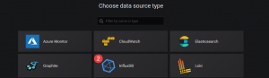
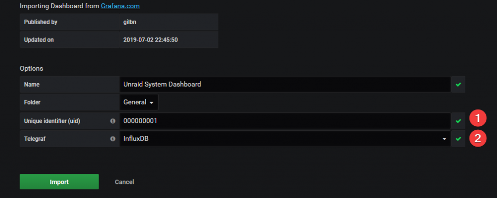

# {{ title }}

</img>

I have for some time shared my **[Unraid System](https://grafana.com/grafana/dashboards/7233)** dashboard over at Grafana.com but never really had the time to make a quick write up on how to set it all up. So this will try to do just that. This guide will make it so you will be able to monitor cpu usage, cpu temps, network stats, ram usage and much more by simply importing a dashboard.

## How it works

In getting all this setup, there are 3 main moving parts. **Telegraf**, **InfluxDB** and **Grafana**. Telegraf is what collects all the different system metrics and outputs it to an InfluxDB database that Grafana uses to visualize everything with pretty graphs and bars.[](https://technicalramblings.com/wp-content/uploads/2019/07/TIG2.png) This is a pretty simplified explanation and you can read more here: **[Telegraf](https://www.influxdata.com/time-series-platform/telegraf/), [InfluxDB](https://www.influxdata.com/time-series-platform/), [Grafana](https://grafana.com/docs/v4.3/)**

## Installing Influxdb

Search for **`influxdb`** in Community Apps and install it using the default template. Select your appdata path and host ports if the default ones are taken. There is no other setup than just installing the container.

\[eckosc\_status\_message title="Don't use the latest tag" icon="fa-exclamation-triangle" type="warn" message="The `:latest` tag will run InfluxDB V2! This guide was written for v1.8. Change the tag to `:1.8.4` for it to work!"\]

[](https://technicalramblings.com/wp-content/uploads/2019/07/chrome_EZLftLwtMU.png)

## Installing Telegraf

Do the same here, just search for the container in Community Apps and use the default template settings. Set the appdata location to where you want it, **but don't click install just yet!**

\[eckosc\_status\_message title="Network" icon="fa-exclamation-triangle" type="info" message="Make sure the container uses **Host** networking!"\]

\[eckosc\_status\_message title="Warning" icon="fa-exclamation-triangle" type="error" message="This container wont start unless the `telegraf.conf` file already exists on the host. (Host path 7) Do not install the container before you follow the steps below!"\]

\[eckosc\_status\_message title="Troubleshooting" icon="fa-exclamation-triangle" type="warn" message="If you happened to start the container without doing the steps below first you will need to delete the folder it created instead of mounting the file. Go to the location you selected for the appdata and delete the `telegraf.conf` folder. Next follow the steps below."\]

1. Download the file and place it in the location you want the telegraf appdata to be. e.g. `/mnt/cache/appdata/telegraf/telegraf.conf` The default config file can be downloaded here: **[https://raw.githubusercontent.com/influxdata/telegraf/master/etc/telegraf.conf](https://raw.githubusercontent.com/influxdata/telegraf/master/etc/telegraf.conf)**
2. Next you need to edit the **`telegraf.conf`** file. Go to the location you saved the file and scroll down to **`OUTPUT PLUGINS`** which should be around line 90-120.Uncomment (Remove #) the http url line for InfluxDB and the "database" line, like so:
    
    ```
    # urls = ["unix:///var/run/influxdb.sock"]
    # urls = ["udp://127.0.0.1:8089"]
    urls = ["http://192.168.1.34:8086"]
    ```
    
    **192.168.1.34** is the IP address to my Unraid server and **8086** is the default InfluxDB port that runs the InfluxDB HTTP service.
3. Next we need to setup the input plugins. A lot of these are already enabled but we need to add a couple so that all the panels on the Grafana dashboard will work.
4. Uncomment the following plugins and lines:
    1. HDD temps/stats: **`[[inputs.smart]]`**
    2. CPU temps: **`[[inputs.sensors]]`** and **`attributes = true`**(This is default set to false)
    3. Network: **`[[inputs.net]]`** and **`interfaces = ["eth0"]` ect**
    4. Netstat: **`[[inputs.netstat]]`**
    5. Docker: **`[[inputs.docker]]`** and **`endpoint = "unix:///var/run/docker.sock"`**
    6. UPS: **`[[inputs.apcupsd]]`**
5. Now go back to the install page of telegraf and add the following into the `Post Arguments` input field:`/bin/sh -c 'apt update && apt install -y smartmontools && apt install -y lm-sensors && telegraf' --user 0` To be able to see this field we need to click on the `Advanced View` button. This will install `smartmontools` and without it you won't be able to get the S.M.A.R.T statistics. **Note:** If you also want to add IPMI and nvme stats you can add the following: `/bin/sh -c 'apt update && apt install -y smartmontools && apt install -y lm-sensors && apt install -y nvme-cli && apt install -y ipmitool && telegraf' --user 0`

\[eckosc\_status\_message title="Alpine" icon="fa-exclamation-triangle" type="info" message="If you use the alpine tag use these commands instead."\] [](https://technicalramblings.com/wp-content/uploads/2019/07/chrome_5DgrBfXwwD.png)

`/bin/sh -c 'apk update && apk add smartmontools && apk add lm-sensors lm-sensors-detect perl && telegraf' --user 0`

With IPMI and nvme: `/bin/sh -c 'apk update && apk add smartmontools && apk add lm-sensors lm-sensors-detect perl && apk add nvme-cli && apk add ipmitool && telegraf' --user 0`


\[eckosc\_full\_width\_block\] [](https://technicalramblings.com/wp-content/uploads/2019/07/chrome_EG2uIi89cA.png) [](https://technicalramblings.com/wp-content/uploads/2019/07/chrome_dfweKP6rAl.png)

\[/eckosc\_full\_width\_block\]

After editing the **telegraf.conf** and adding the post arguments you can start the Telegraf container. Telegraf will automatically create a database called **`telegraf`** when started for the first time with the influxdb plugin activated.

## Installing Grafana

Installing Grafana is also quite simple. Chose your host port for the webUI and add your unraid URL and admin password to the container settings.

[](https://technicalramblings.com/wp-content/uploads/2019/07/chrome_0BgSvod5Ll.png)

### Configuring Grafana

After the installation is finished go to the WebUI. (http://unraidIP:3000) and log in with username **`admin`** and the password you chose. You should then see this on you screen:

Click on **`Add data source`** and select InfluxDB. 

[](https://technicalramblings.com/wp-content/uploads/2019/07/chrome_DujTbaihqK.png)

[](https://technicalramblings.com/wp-content/uploads/2019/07/chrome_nO1OWoDMt8.png)

Next give the data source a name(I named it Telegraf), add the URL to InfluxDB, enter the database to use (**telegraf**) and set the HTTP Method to POST. This is helpful on some of the more heavy queries. Grafana will use the default username and password for Influxdb (root root), if you have added a user you will need to add that too. Next click **Save & Test**

[](https://technicalramblings.com/wp-content/uploads/2019/07/chrome_l8t110r5RU.png) If all your settings are correct you should see this message. [](https://technicalramblings.com/wp-content/uploads/2019/07/chrome_yi4pfKoSeY.png)

Next import the dashboard by hovering over the + icon and selecting **Import [](https://technicalramblings.com/wp-content/uploads/2019/07/chrome_1wVIhfBOHN.png)** Paste the dashboard ID **[7233](https://grafana.com/grafana/dashboards/7233)**and click **Load** Give it a name and UID, select the database in the drop down and click **Import**. [](https://technicalramblings.com/wp-content/uploads/2019/07/chrome_HIrfp5yDZO.png) 

Next, select the correct values on the menu at the top.

## [](https://technicalramblings.com/wp-content/uploads/2019/07/chrome_orQDVMIGYZ.png)

## Some assembly needed

You should now already see most of the panels working and displaying stats. But there will be some panels where you need to select some values in the dropdowns at the top. Like Cache Devices. On the **Cache Devices (diskio)** dropdown you can select multiple devices, and it will add them to the **Cache Read/Write** panel.

[](https://technicalramblings.com/wp-content/uploads/2019/07/chrome_WjO8BH5DtB.png) The Interval text box is the interval that is set in **`telegraf.conf`** The default value is 10 seconds, but if you changed this you can update it here.

To update the drive names on the **Storage Consumption** panel, edit the panel and go to the **Field** menu. There you will can add the different **Value Mappings** for the different drive paths. See the video below.

\[video width="1904" height="1006" mp4="https://technicalramblings.com/wp-content/uploads/2019/07/Yiz3iZBsFb.mp4"\]\[/video\]

And that's about it! This should get you going on adding or creating awesome dashboards for you Unraid system. There are tons of different dashboards on **[grafana.com](https://grafana.com/grafana/dashboards)** to get inspiration from. My dashboard is far from the best one out there, so please share your awesome dashboards in the comment section or on **[Discord](https://discord.gg/HM5uUKU)**!

\[eckosc\_status\_message title="Not UUD" icon="fa-exclamation-triangle" type="error" message="The dashboard used in this guide is not the **Ultimate Unraid Dashboard**seen from the offical unraid blog post. You can find that dashboard and the extra instructions in the link below!"\]

**UUD: [https://forums.unraid.net/topic/96895-ultimate-unraid-dashboard-uud/](https://forums.unraid.net/topic/96895-ultimate-unraid-dashboard-uud/)** 

And if you're wondering why my Grafana page looks different from the stock theme you can take a look here: **[https://github.com/gilbN/theme.park](https://github.com/gilbN/theme.park)**

### Optional: Adding UPS stats

On the top of my dashboard I have UPS stats, now if you don't have a UPS (You should by the way) you can just delete those panel. But if you have a UPS that's compatible with Unraid you can check out this awesome guide:

<iframe class="wp-embedded-content" title="Monitoring your UPS stats and cost with InfluxDB and Grafana on Unraid – Telegraf Edition" src="https://technicalramblings.com/blog/monitoring-your-ups-stats-and-cost-with-influxdb-and-grafana-on-unraid-telegraf-edition/embed" width="600" height="600" frameborder="0" marginwidth="0" marginheight="0" scrolling="no" sandbox="allow-scripts"><span data-mce-type="bookmark" style="display: inline-block; width: 0px; overflow: hidden; line-height: 0;" class="mce_SELRES_start"></span><span data-mce-type="bookmark" style="display: inline-block; width: 0px; overflow: hidden; line-height: 0;" class="mce_SELRES_start"></span><span data-mce-type="bookmark" style="display: inline-block; width: 0px; overflow: hidden; line-height: 0;" class="mce_SELRES_start"></span><span data-mce-type="bookmark" style="display: inline-block; width: 0px; overflow: hidden; line-height: 0;" class="mce_SELRES_start"></span><span data-mce-type="bookmark" style="display: inline-block; width: 0px; overflow: hidden; line-height: 0;" class="mce_SELRES_start"></span></iframe>

<iframe class="wp-embedded-content" title="Monitoring your UPS stats and cost with InfluxDB and Grafana on Unraid – NUT Edition" src="https://technicalramblings.com/blog/monitoring-your-ups-stats-and-cost-with-influxdb-and-grafana-on-unraid-nut-edition/embed" width="600" height="600" frameborder="0" marginwidth="0" marginheight="0" scrolling="no" sandbox="allow-scripts"><span data-mce-type="bookmark" style="display: inline-block; width: 0px; overflow: hidden; line-height: 0;" class="mce_SELRES_start"></span><span data-mce-type="bookmark" style="display: inline-block; width: 0px; overflow: hidden; line-height: 0;" class="mce_SELRES_start"></span><span data-mce-type="bookmark" style="display: inline-block; width: 0px; overflow: hidden; line-height: 0;" class="mce_SELRES_start"></span><span data-mce-type="bookmark" style="display: inline-block; width: 0px; overflow: hidden; line-height: 0;" class="mce_SELRES_start"></span><span data-mce-type="bookmark" style="display: inline-block; width: 0px; overflow: hidden; line-height: 0;" class="mce_SELRES_start"></span></iframe>

<iframe class="wp-embedded-content" title="Monitoring your UPS stats and cost with InfluxDB and Grafana on Unraid – Apcupsd Container Edition" src="https://technicalramblings.com/blog/monitoring-your-ups-stats-and-cost-with-influxdb-and-grafana-on-unraid-2019-edition/embed" width="600" height="600" frameborder="0" marginwidth="0" marginheight="0" scrolling="no" sandbox="allow-scripts"><span data-mce-type="bookmark" style="display: inline-block; width: 0px; overflow: hidden; line-height: 0;" class="mce_SELRES_start"></span><span data-mce-type="bookmark" style="display: inline-block; width: 0px; overflow: hidden; line-height: 0;" class="mce_SELRES_start"></span><span data-mce-type="bookmark" style="display: inline-block; width: 0px; overflow: hidden; line-height: 0;" class="mce_SELRES_start"></span><span data-mce-type="bookmark" style="display: inline-block; width: 0px; overflow: hidden; line-height: 0;" class="mce_SELRES_start"></span><span data-mce-type="bookmark" style="display: inline-block; width: 0px; overflow: hidden; line-height: 0;" class="mce_SELRES_start"></span><span data-mce-type="bookmark" style="display: inline-block; width: 0px; overflow: hidden; line-height: 0;" class="mce_SELRES_start"></span></iframe>

### If you need any extra help join the Discord server!

#### [](https://discord.gg/HM5uUKU)
