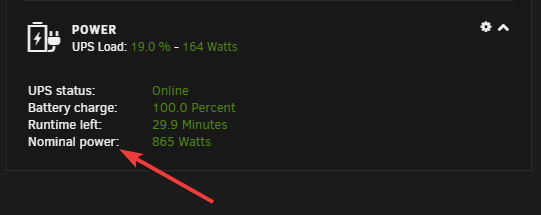
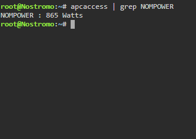
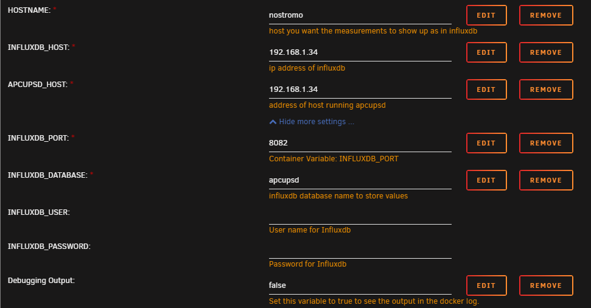
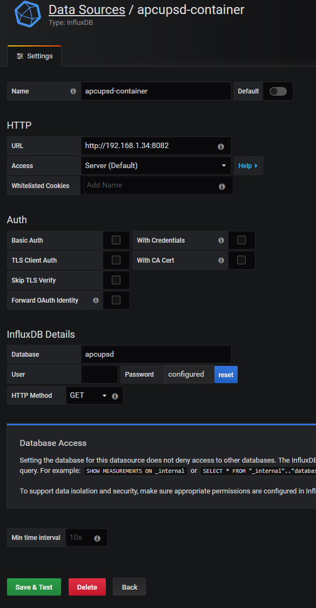
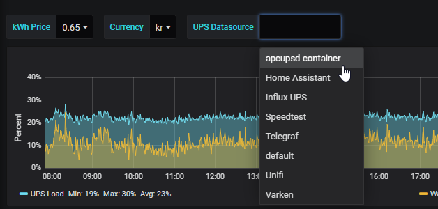
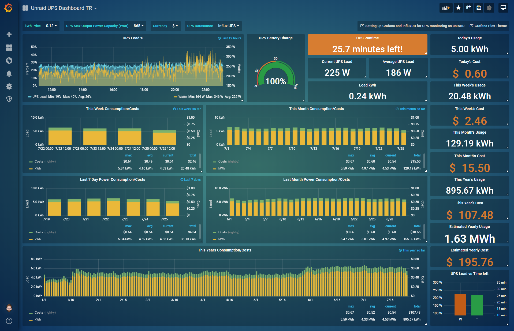

# {{ title }}

<small>Written: {{ date }}</small>

<small>Tags</small>


<a style="padding: .125em 1em; border-radius: 25px; margin-top:5px;" class="md-button md-button--primary" href="#">{{ tag }}</a>



<small>Category</small>


<a style="padding: .125em 1em; border-radius: 25px; margin-top:5px;" class="md-button md-button--primary" href="#">{{ cat }}</a>



</img>

I recently discovered the **[atribe/apcupsd-influxdb-exporter](https://github.com/atribe/apcupsd-influxdb-exporter)** container on the CA plugin page and immediately thought it would be a great replacement for the script that I run, described in [this post.](https://technicalramblings.com/blog/setting-grafana-influxdb-telegraf-ups-monitoring-unraid/) But time got in the way and I forgot about it. But now the summer is here, the days are longer and free time is no longer a rarity :) So this will be a quick follow up post on how to switch to this container and get even more accurate readings!

## Grafana

If you haven't installed or used Grafana and InfluxDB, I recommend reading **[this post](https://technicalramblings.com/blog/how-to-setup-grafana-influxdb-and-telegraf-to-monitor-your-unraid-system/)** first. You can skip the Telegraf part but that's no fun :)

### InfluxDB

!!! error "Dont' use the latest tag"
    The `:latest` tag will run InfluxDB V2! This guide was written for v1.8. Change the tag to `:1.8.x` for it to work!

## Installing the container

!!! note "Note"
    You need to activate the apcupsd daemon to be able to show any statistics. Go to Settings -> UPS Settings and set Start APC UPS daemon: to Yes. Then Click `Apply`

Search for `apcupsd` in CA and click install. Fill out the different container variables to match your setup. Remember to click on `Show more settings...` to see the rest of the variables. 

!!! warning "Warning"
    If your UPS has the NOMPOWER metric you need to remove this variable as it may interfere with how it reports the watts usage

You can see if it reports it by going to the dashboard and look at the stats or run the `apcaccess` command. `apcaccess | grep NOMPOWER`

The `INFLUXDB_HOST` and `APCUPSD_HOST` will most likely be your Unraid IP and `INFLUXDB_PORT` is the port for your InfluxDB http service. Default it will be `8086`. You can leave user and password blank if you don't have a specific user you want to use in your InfluxDB instance. The database will be created at the launch of the apcupsd container, so you don't need to create it manually. If you're using the php script from my previous post I recommend using a different database as the intervals are not the same and the queries in the first dashboard wont work.

If you want to change the interval you can add the `INTERVAL` variable set your desired value. Default is 10(seconds)

!!! info "Note"
    If you change the interval you need to update the queries on the dashboard to reflect the change. The default is 360 values per hour (6 intervals per minute * 60 minutes)

## UPS Dashboard

After you have installed the apcupsd container add the datasource in Grafana and use the database name you chose above.

Next import my new UPS dashboard and select the correct datasource in the drop down menu at the top. **Link to dashboard: [https://grafana.com/grafana/dashboards/10615](https://grafana.com/grafana/dashboards/10615)**

And that's it! Enjoy your new and improved UPS stats!

The custom theme for Grafana can be found here: [https://github.com/gilbN/theme.park](https://github.com/gilbN/theme.park)

### If you need any extra help join the Discord server!

#### 
