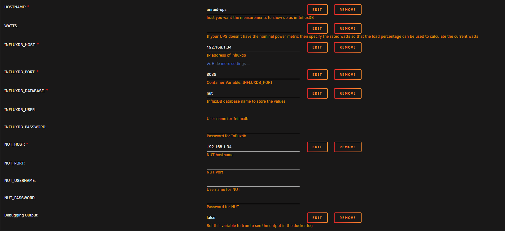
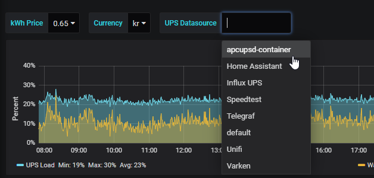

# {{ title }}

</img>

This quick guide will explain how to setup Grafana and InfluxDB to monitor your UPS power usage using the NUT plugin and [maihai/nut-influxdb-exporter](https://hub.docker.com/r/maihai/nut-influxdb-exporter) docker container on Unraid. This pretty much just a rewrite of [this](https://technicalramblings.com/blog/monitoring-your-ups-stats-and-cost-with-influxdb-and-grafana-on-unraid-2019-edition/) article but for the NUT plugin.

## Grafana

If you haven't installed or used Grafana and InfluxDB, I recommend reading **[this post](https://technicalramblings.com/blog/how-to-setup-grafana-influxdb-and-telegraf-to-monitor-your-unraid-system/)** first. You can skip the Telegraf part but that's no fun :)

### InfluxDB

!!! error "Dont' use the latest tag"
    The `:latest` tag will run InfluxDB V2! This guide was written for v1.8. Change the tag to `:1.8.4` for it to work!

## Installing the container

Search for `nut influx exporter`in CA and click install. Fill out the different container variables to match your setup. Remember to click on `Show more settings...` to see the rest of the variables. If your UPS reports the `WATTS/Nominal Power`metric you can remove this variable. You can see if it reports it by going to the dashboard and look at the stats or run the `upsc ups` command.

 

The `INFLUXDB_HOST` and `NUT_HOST` will most likely be your Unraid IP and `INFLUXDB_PORT` is the port for your InfluxDB http service. Default it will be `8086`. You can leave user and password blank if you don't have a specific user you want to use in your InfluxDB instance. And the same for the NUT port, username and password.

The database will be created at the launch of the container, so you don't need to create it manually.

The default interval is set to 20 seconds, and if I recall correctly that is the max for NUT. I tried setting it to 10 seconds using the INTERVAL variable but when I did that it reported the same metric twice all the time.

\[eckosc\_full\_width\_block\]

\[/eckosc\_full\_width\_block\]

## UPS Dashboard

After you have installed the apcupsd container add the datasource in Grafana and use the database name you chose above.

Next import my new UPS dashboard and select the correct datasource in the drop down menu at the top. **Link to dashboard: [https://grafana.com/grafana/dashboards/10914](https://grafana.com/grafana/dashboards/10914)** 

And that's it! Enjoy your new and improved UPS stats!

[\[eckosc\_full\_width\_block\]](https://technicalramblings.com/wp-content/uploads/2019/07/chrome_Z69ocJp2IO.png)

\[/eckosc\_full\_width\_block\]

The custom theme for Grafana can be found here: [https://github.com/gilbN/theme.park](https://github.com/gilbN/theme.park)

### If you need any extra help join the Discord server!

#### 
