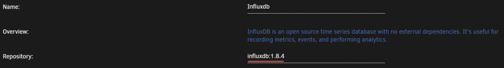
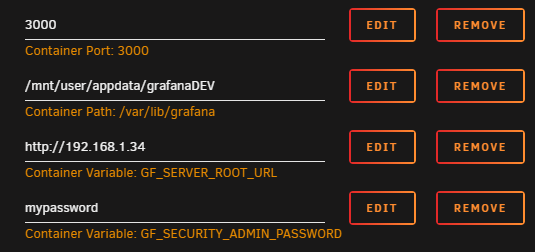
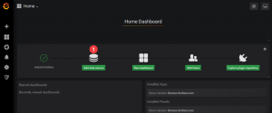
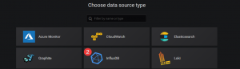
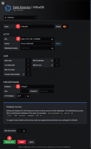
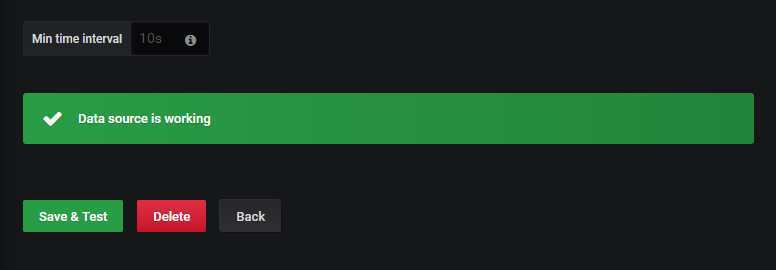
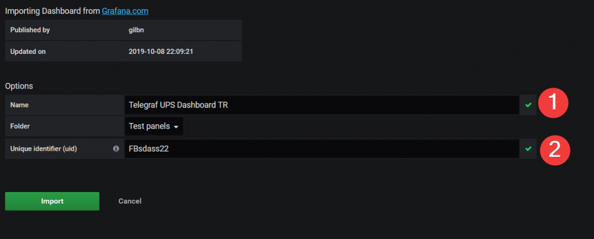
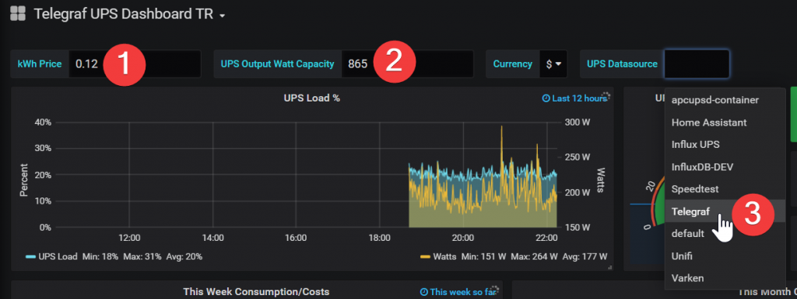

# {{ title }}

<small>Written: {{ date }}</small>

<small>Tags</small>

<p style="display:inline">
<a style="padding: .125em 1em; border-radius: 25px; margin-top:5px;" class="md-button md-button--primary" href="#">{{ tag }}</a>
</p>


<small>Category</small>

<p style="display:inline;">
<a style="padding: .125em 1em; border-radius: 25px; margin-top:5px;" class="md-button md-button--primary" href="#">{{ cat }}</a>
</p>


</img>

So.. I just found out that Telegraf recently added Apcupsd as a [plugin](https://github.com/influxdata/telegraf/tree/master/plugins/inputs/apcupsd). So naturally I created a dashboard for it :) I promise, this is the last UPS stats blog post for a while!

## Installing InfluxDB

Just skip down to the plugin part if you're already up and running.

Search for **`influxdb`** in Community Apps and install it using the default template. Select your appdata path and host ports if the default ones are taken. There is no other setup than just installing the container.

!!! error "Note"
    Dont' use the latest tag" icon="fa-exclamation-triangle" type="warn" message="The `:latest` tag will run InfluxDB V2! This guide was written for v1.8. Change the tag to `:1.8.x` for it to work!

[](images/chrome_EZLftLwtMU-1024x140.png)

## Installing Telegraf

Again, you can just skip this step if telegraf is already setup :)

!!! warning
    This container wont start unless the telegraf.conf file already exists on the host. (Host path 7) Do not install the container before you follow the steps below!

1. Download the file and place it in the location you want the telegraf appdata to be. e.g. `/mnt/cache/appdata/telegraf/telegraf.conf` The default config file can be downloaded here: **[https://github.com/influxdata/telegraf/blob/master/etc/telegraf.conf](https://github.com/influxdata/telegraf/blob/master/etc/telegraf.conf)**

2. Next you need to edit the **`telegraf.conf`** file. Go to the location you saved the file and scroll down to **`OUTPUT PLUGINS`** which should be around line 90-103.Uncomment (Remove #) the http url line for InfluxDB like so:

```bash
  # urls = ["unix:///var/run/influxdb.sock"]
  # urls = ["udp://127.0.0.1:8089"]
  urls = ["http://192.168.1.34:8086"]
```

**192.168.1.34** is the IP address to my Unraid server and **8086** is the default InfluxDB port that runs the InfluxDB HTTP service.

## Adding the plugin

If you already have telegraf installed you can simply add or uncomment the plugin line `[[inputs.apcupsd]]` like so:

```bash
# # Monitor APC UPSes connected to apcupsd
 [[inputs.apcupsd]]
#   # A list of running apcupsd server to connect to.
#   # If not provided will default to tcp://127.0.0.1:3551
#   servers = ["tcp://127.0.0.1:3551"]
#
#   ## Timeout for dialing server.
#   timeout = "5s"
```

If the config file is up to date the it should be around line 1783. If it's not just add it to the config file.

If you want to add more plugins check out this post:[How to setup Grafana, InfluxDB and Telegraf to monitor your unRAID system.](https://technicalramblings.com/blog/how-to-setup-grafana-influxdb-and-telegraf-to-monitor-your-unraid-system/)

!!! info "Note"
    You need to activate the apcupsd daemon to be able to show any statistics. Go to Settings -> UPS Settings and setStart APC UPS daemon: to Yes. Then Click `Apply`

## Installing Grafana

Installing Grafana is also quite simple. Chose your host port for the webUI and add your unraid URL and admin password to the container settings.

[](images/chrome_0BgSvod5Ll.png)

### Configuring Grafana

After the installation is finished go to the WebUI. `http://unraidIP:3000` and log in with username **`admin`** and the password you chose. You should then see this on you screen:

Click on **`Add data source`** and select InfluxDB.

[](images/chrome_DujTbaihqK-300x125.png)

[](images/chrome_nO1OWoDMt8-300x87.png)

Next give the data source a name, add the URL to InfluxDB, enter the database to use (**telegraf**) and click **Save & Test**

[](images/chrome_CFYaSZRh2m.png)

If all your settings are correct you should see this message. 

[](images/chrome_yi4pfKoSeY.png)

## Adding the dashboard

Next import the dashboard by hovering over the + icon and selecting **Import**

[](images/chrome_1wVIhfBOHN.png)

Paste the dashboard ID **[10977](https://grafana.com/grafana/dashboards/10977)** and click **Load**

Give it a name and UID, and click **Import**.

[](images/chrome_ohPjZHJG1m-1024x412.png)

Next add your kWh price, max watt and select the Telegraf datasource.

[](images/chrome_5olVQTtQX2-1024x386.png)

You should now see the panels starting to populate!

The custom theme for Grafana can be found here: [https://github.com/gilbN/theme.park](https://github.com/gilbN/theme.park)

### If you need any extra help join the Discord server

#### [](https://discord.gg/HM5uUKU)

Sources:

https://github.com/influxdata/telegraf/tree/master/plugins/inputs/apcupsd https://github.com/influxdata/telegraf/blob/master/etc/telegraf.conf
