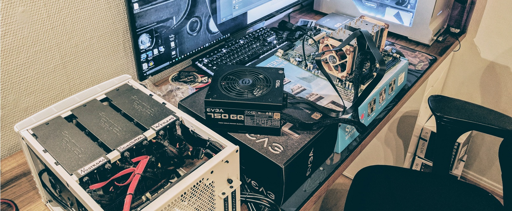

# {{ title }}

<small>Written: {{ date }}</small>

<small>Tags</small>


<a style="padding: .125em 1em; border-radius: 25px; margin-top:5px;" class="md-button md-button--primary" href="#">{{ tag }}</a>



<small>Category</small>


<a style="padding: .125em 1em; border-radius: 25px; margin-top:5px;" class="md-button md-button--primary" href="#">{{ cat }}</a>



</img>

Since this blog will mostly be for my own sake. Just me writing down some guides on different things so I don't forget. I think it's appropriate that my first post will be about my server..

My current server exists mainly for serving myself and my familiy/friends plex content. Now since this is it's main purpose it is somewhat over powered.

### Specs:

- CPU: [2 x XEON E5-2670v1](http://ark.intel.com/products/64595/Intel-Xeon-Processor-E5-2670-20M-Cache-2_60-GHz-8_00-GTs-Intel-QPI?target=_blank)- \[16 cores / 32 threads @ 2.60 GHz/3.30 GHz \]
- CPU cooler: 2 x [Noctua NH-U14S](https://noctua.at/en/nh-u14s)
- Motherboard: [Supermicro X9DRL-iF](http://www.supermicro.com.tw/products/motherboard/Xeon/C600/X9DRL-iF.cfm?target=_blank)
- RAM: Samsung ECC REG 64GB 8x8GB 1333mhz \[M393B1K70DH0-YH9\]
- PSU: [Corsair RM850x 850W](http://www.corsair.com/en-eu/rmx-series-rm850x-850-watt-80-plus-gold-certified-fully-modular-psu?target=_blank)
- Case: [Fractal Define R5](http://www.fractal-design.com/home/product/cases/define-series/define-r5-black?target=_blank)

- HDD's:
- 1 x [Seagate Ironwolf 8TB](http://www.seagate.com/gb/en/internal-hard-drives/hdd/ironwolf/?target=_blank) \[Parity drive\]
- 2 x [Seagate Ironwolf 4TB](http://www.seagate.com/gb/en/internal-hard-drives/hdd/ironwolf/?target=_blank)\[Data drives\]
- 4 x [WD Red 4TB NAS Harddrive](https://www.wdc.com/products/internal-storage/wd-red.html#WD40EFRX?target=_blank)\[Data drives\]
- 2 x [Crucial MX300 275GB SSD](http://www.crucial.com/usa/en/ct275mx300ssd1?target=_blank)\[Cache drives in RAID1\]
- 1 x [HyperX Fury 120GB 2.5" SSD](http://www.kingston.com/en/ssd/consumer/shfs37a?target=_blank)\[Plex drive\]
- OS drive: [Kingston Datatraveler SE9 16GB USB drive](http://www.kingston.com/us/usb/personal_business/dtse9h?target=_blank)

Now up until Feb 2017 my server was my old i5-3570K gaming rig and a low power freenas setup, and because I wanted to lower the overall power usage so I bought all the equipment above to do exactly that.. Makes sense right? Not exactly.. ¯_(ツ)_/¯

Well.. after hanging out in the Plex Discord channel, things got a little overboard. Now, my server is not nearly as powerful as some people over at r/plex or r/homelab but with a 18K passmark score it can easily transcode up to 14 1080P streams on plex. Not that it will ever have to..

 _The server on my "test bench" with my old NAS, and yes I'm an Alien fan :)_

### OS:

Should be no surprise, but if you haven't figured it out yet, I run all this on [LimeTech's unRAID OS 6](https://lime-technology.com/?target=_blank) And coming from windows it has mostly been an easy ride.

Now why unRAID?

Simply put; Docker.. Now there's more to unRAID than docker containers. A lot more. But I wanted an "all in one package" that I could easily manage and expand. And unRAID does just that. Before unRAID I was running my NAS on [Freenas 9.10](http://www.freenas.org/?target=_blank) Freenas is an awesome free storage OS that is great for both home and business use as it uses the ZFS filesystem. I won't go into detail what ZFS is why it's great, but my biggest gripe with Freenas was that the app support wasn't the greatest. For just a storage OS it worked great.

_The main page on the unRAID GUI_ 

### Use

As I have stated, the main purpose of my server is to serve content via plex. But adding a couple of drives, install Plex and call it a day is way too boring. Especially when there are so many good tools and services that integrate with Plex. And the ease of using all of them alongside unRAID is definitively a bonus.

Tools I run on my server to make my Plexperiance better:

[Organizr](https://github.com/causefx/Organizr?target=_blank) [Tautulli](https://tautulli.com/) [Sonarr](https://sonarr.tv/?target=_blank) [Radarr](https://radarr.video/?target=_blank) [Ombi](https://www.ombi.io/?target=_blank) [Letsencrypt container](https://hub.docker.com/r/linuxserver/letsencrypt/?target=_blank) [Jackett](https://github.com/Jackett/Jackett?target=_blank) [Deluge](http://deluge-torrent.org/?target=_blank) [Netdata](https://my-netdata.io/?target=_blank) [Sub-Zero](https://forums.plex.tv/discussion/186575/release-sub-zero-2-0-24-1565-subtitles-done-right?target=_blank) [UptimeRobot](https://uptimerobot.com/?target=_blank)  [Lidarr](https://github.com/lidarr/Lidarr)  [SabNZBd](https://github.com/sabnzbd/sabnzbd) [Grafana](https://grafana.com/) [InfluxDB](https://www.influxdata.com/) [Telegraf](https://www.influxdata.com/time-series-platform/telegraf/) [Varken](https://github.com/Boerderij/Varken) [ApacheGuacamole](https://forums.unraid.net/topic/54855-support-jasonbean-apache-guacamole/)

_The dashboard that shows all your running containers / VM's_ 

Most of these are Docker Containers from the guys over at linuxserver.io. Except Sub-Zero that is a Plex plugin and Uptimerobot that is an external downtime service.

My latest obsession has been getting Organizr to work with Letsencrypt/nginx and implementing all my services into that. For someone who didn't know what a web server even was a month ago, it has been quite a steep learning curve..

But that's what it's all about.

My next post will be about setting up the [letsencrypt docker](https://technicalramblings.com/blog/how-to-setup-organizr-with-letsencrypt-on-unraid/) and all the other services I run on you own domain. Stay tuned.

#### For any questions you can find me here:

####  
