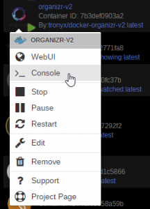
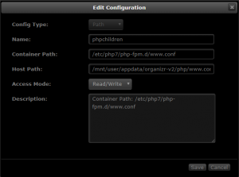
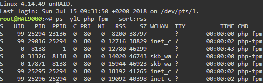

# {{ title }}

</img>

For me this all started when I was setting up [Logarr](https://github.com/Monitorr/logarr)and opened the Organizr(v1) container php error log `**/log/php/error.log**` and saw that this error was repeating on an hourly basis:

**`WARNING: [pool www] server reached pm.max_children setting (5), consider raising it[_timestamp_]`**

This means that there are not enough PHP-FPM processes. In Organizr v2 I did not get this error in the php error log, but optimizing the child processes still got me faster load times of tabs in Organizr.

_Note that for this guide, it does not matter if you use Organizr V1 or V2._

We need write-access to**`/etc/php7/php-fpm.d/www.conf`** in order to optimize the following settings:

**`pm pm.max_children pm.start_servers pm.min_spare_servers pm.max_spare_servers pm.max_requests`**

## Copying the www.conf file to /config/php

We need to perform this step because the file must 'exist' before it can be mapped.

First docker exec into your Organizr docker container. Assuming you are using a fairly new version of UnRaid, click your Organizr container icon and then click "Console".

[](https://technicalramblings.com/wp-content/uploads/2018/07/chrome_2018-07-15_12-26-18.png) If not _run_ **`docker exec -it [contrainername] bash`** in the console

In the console window, _run_ the command: **`cp /etc/php7/php-fpm.d/www.conf /config/php`** A copy of www.conf is now present in Organizr's php-folder.

### Linking the newly copied www.conf file to the original

Create the following new path for your Organizr docker container in UnRaid:

```
* Config Type: Path
* Name: phpchildren
* Container Path: /etc/php7/php-fpm.d/www.conf
* Host Path: /mnt/cache/appdata/organizr-v2/php/www.conf
* Access Mode: Read/Write
* Description: Container Path: /etc/php7/php-fpm.d/www.conf
```

The same is shown here:

[](https://technicalramblings.com/wp-content/uploads/2018/07/chrome_2018-07-15_12-37-31.png)

## Calculate and change settings in www.conf

Open the **www.conf** file with notepad++ or similar to edit the following values:

##### pm

`**pm = dynamic**` means that the number of servers specified in **`pm.start_servers`** will always be running in the PHP-FPM process, and more will be created if needed. **`pm = ondemand`** means that `**pm.start_servers**` is ignored and servers will be created if they are needed.

Personally, I have decided to use the default**`pm = dynamic`** because I have very much RAM compared how loaded my webserver is. If I always needed resources to be freed up, I would have chosen the ondemand setting.

##### pm.max\_children

Open the terminal in UnRaid. Run the command **`ps -ylC php-fpm --sort:rss`** You will likely get a bunch of php-fpm processes like I do:

[](https://technicalramblings.com/wp-content/uploads/2018/07/chrome_2018-07-15_12-51-17.png)

The RSS column shows non-swapped physical memory usage by PHP-FPM processes in kilobytes.

An appropriate value for pm.max\_children can be calculated as: **`pm.max_children =`** Total RAM dedicated to the web server / Max child process size

The max child process size for me is **19MB** and my server-rig has 32GB of RAM. I decide that I want to use a maximum of, say, 20GB on PHP-FPM processes. Evaluating the formula with these values yields pm.max\_children = 20000 / 19 = 1053 ~ 1000. Thus, Iset **`pm.max_children = 1000`**. This is ridiculously high. But I have the RAM for it. For reference, in myshell's guide linked below, he concludes an appropriate pm.max\_children = 72 with 8 GB ram installed, so the less RAM and more load you have on your server, the more important this calculation and setting becomes.

##### pm.min\_spare\_servers

Set **`pm.min_spare_servers = 1`**

##### pm.max\_spare\_servers

An appropriate value for **pm.max\_spare\_servers** can be calculated as: pm.max\_spare\_servers = 2 x number of cores OR 4 x number of cores

Personally I have 8 cores in my AMD Ryzen 1700 processor and start with using the 2x method. Evaluating the formula with these values yields pm.max\_spare\_servers = 2 x 8 = 16. Thus I set **`pm.max_spare_servers = 16`**.But I could also try with **`pm.max_spare_servers = 32`** and see if I get better performance with that.

##### pm.start\_servers

An appropriate value for **pm.start\_servers** can be calculated as: pm.start\_servers = pm.max\_spare\_servers / 2 Evaluating this gives pm.start\_servers = 16 / 2 = 8. Thus I set **`pm.start_servers = 8`**.

##### pm.max\_requests

Set **`pm.max_requests = 500`**

## Concluding remarks

Restart your Organizr docker container and enjoy an even faster Organizr experience. Of course **YMMV**, tweak the settings above to further optimize, as they depend very much on your server hardware, the PHP-FPM processes you are hosting, and the load on your webserver, i.e. the number of simultaneous users.

Sources: [https://myshell.co.uk/blog/2012/07/adjusting-child-processes-for-php-fpm-nginx/](https://myshell.co.uk/blog/2012/07/adjusting-child-processes-for-php-fpm-nginx/) [https://ma.ttias.be/a-better-way-to-run-php-fpm/](https://ma.ttias.be/a-better-way-to-run-php-fpm/) [https://stackoverflow.com/questions/25097179/warning-pool-www-seems-busy-you-may-need-to-increase-pm-start-servers-or-pm](https://stackoverflow.com/questions/25097179/warning-pool-www-seems-busy-you-may-need-to-increase-pm-start-servers-or-pm)

#### For any questions you can find me here:

####  [](https://discordapp.com/invite/TrNtY7N)
