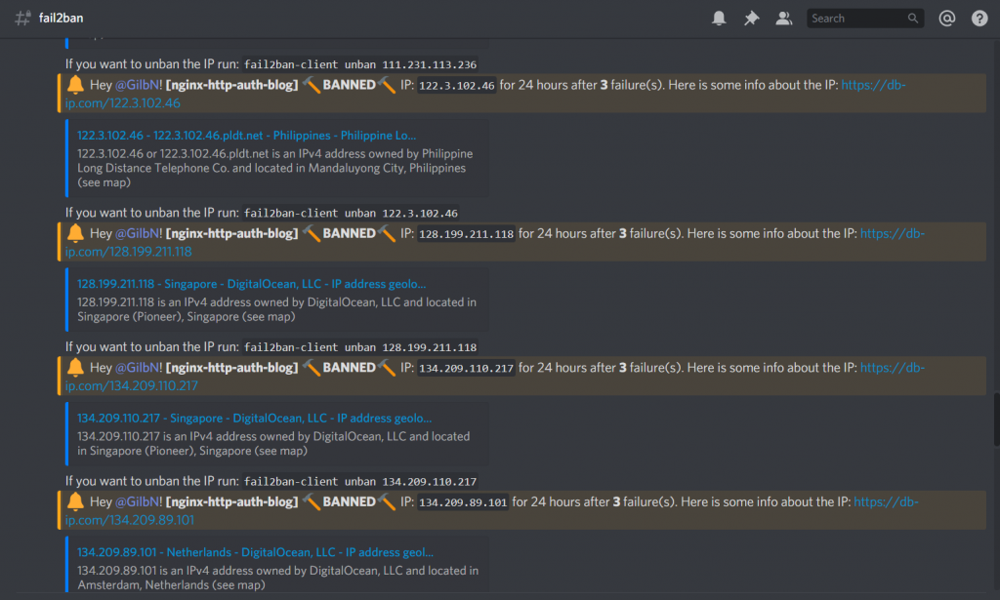
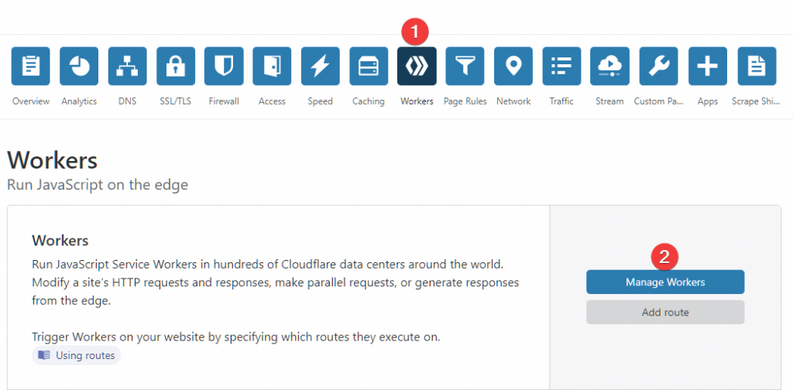
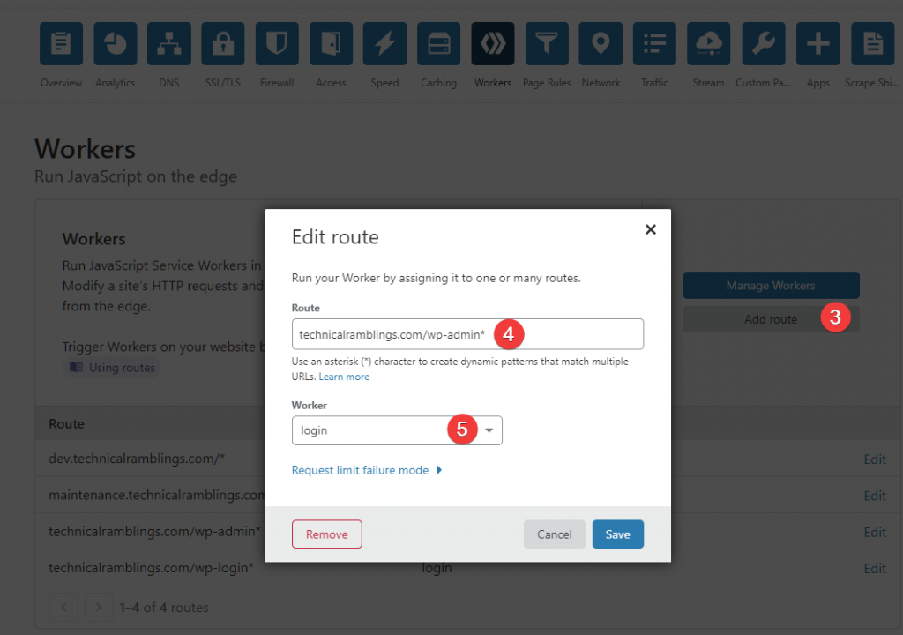

# {{ title }}

</img>

So after my last [post](https://technicalramblings.com/blog/how-to-setup-a-cloudflare-worker-to-show-a-maintenance-page-when-ca-backup-plugin-is-running/) I woke up to around 40+ and counting notifications on IP's that fail2ban had banned over the night. They were all failed attempts to get past the basic auth prompt I have on my Wordpress admin page. So with the last post fresh in my mind I knew it was possible to have a Cloudflare worker load a different page for visitors based on their IP.

This was my fail2ban channel on discord. If you want these kind of notifications check out my [fail2ban post!](https://technicalramblings.com/blog/adding-ban-unban-notifications-from-fail2ban-to-discord/)

[](https://technicalramblings.com/wp-content/uploads/2019/08/Discord_ZyHOqXgmhb.png)

So using the same [resource](https://www.resdevops.com/2018/03/20/cloudflare-workers-maintenance-mode-static-page/) as in the first Cloudflare worker post we can easily route visitors to a custom 403 Forbidden page. Now they can't even try to get passed the basic auth! Have a look here: [https://technicalramblings.com/wp-admin](https://technicalramblings.com/wp-admin/)

\[eckosc\_status\_message title="Note" icon="fa-exclamation-circle" type="info" message="If you have a dynamic ip that often changes, this might not be the best solution for you!"\]

## Creating a worker

On your Cloudflare dashboard click on Workers and go through the first time setup if you haven't done that yet. Next click on `Manage Workers` and `Create a Worker`

[](https://technicalramblings.com/wp-content/uploads/2019/08/chrome_fgJWpnVXDC.png)

Paste the script below.

```
addEventListener("fetch", event => {
  event.respondWith(fetchAndReplace(event.request));
});
 
async function fetchAndReplace(request) {
  let modifiedHeaders = new Headers();
 
  modifiedHeaders.set('Content-Type', 'text/html');
  modifiedHeaders.append('Pragma', 'no-cache');
 
//Return 403 page if you're not calling from a trusted IP
const white_list = [
'1.1.1.1',
'2.2.2.2'
];
if (white_list.indexOf(request.headers.get("cf-connecting-ip")) > -1)
//Fire all other requests directly to your WebServer
return fetch(request);

 else {
// Return modified response.
return new Response(forbiddenPage, {
headers: modifiedHeaders
});
}
}

let forbiddenPage = `
 
<!DOCTYPE html>
<title>nope...</title>
<style>
@import url('https://fonts.googleapis.com/css?family=Press+Start+2P');

html,body{
   width: 100%;
   height: 100%;
   margin: 0;
}

*{
   font-family: 'Press Start 2P', cursive;
   box-sizing: border-box;
}
#app{
   padding: 1rem;
   background: black;
   display: flex;
   height: 100%;
   justify-content: center; 
   align-items: center;
   color: #54FE55;
   text-shadow: 0px 0px 10px ;
   font-size: 6rem;
   flex-direction: column;
   .txt {
      font-size: 1.8rem;
   }
}
@keyframes blink {
    0%   {opacity: 0}
    49%  {opacity: 0}
    50%  {opacity: 1}
    100% {opacity: 1}
}

.blink {
   animation-name: blink;
    animation-duration: 1s;
   animation-iteration-count: infinite;
}
</style>
<body>
<div id="app">
   <div>403</div>
   <div class="txt">
      Forbidden<span class="blink">_</span>
   </div>
</div>
</body>

`;
```

Add your whitelisted IP's in this section:

```
//Return 403 page if you're not calling from a trusted IP
const white_list = [
'1.2.3.4',
'5.6.7.8'
];
```

Save and deploy the worker.

Go back to the main worker page and add your routes. The two routes I use are `domain.com/wp-login*` and `domain.com/wp-admin*`


[](https://technicalramblings.com/wp-content/uploads/2019/08/chrome_bnPghaQ6NZ.png)

The page should now look like this when accessing from another IP than the white listed ones.

\[eckosc\_full\_width\_block\]

[](https://technicalramblings.com/wp-content/uploads/2019/08/DitjZRghqs.gif)

\[/eckosc\_full\_width\_block\]

Neat right!

If you want a different page showing it's as simple as replacing the html. I just googled `403 forbidden template` and found the one above on codepen.

### If you need any extra help join the Discord server!

#### [](https://discord.gg/HM5uUKU)

Source:

[https://codepen.io/lsgrrd/pen/BObbYY](https://codepen.io/lsgrrd/pen/BObbYY) [https://www.resdevops.com/2018/03/20/cloudflare-workers-maintenance-mode-static-page/](https://www.resdevops.com/2018/03/20/cloudflare-workers-maintenance-mode-static-page/)
