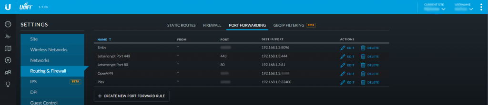

# {{ title }}

<small>Written: {{ date }}</small>

<small>Tags</small>

<p style="display:inline">
<a style="padding: .125em 1em; border-radius: 25px; margin-top:5px;" class="md-button md-button--primary" href="#">{{ tag }}</a>
</p>


<small>Category</small>

<p style="display:inline;">
<a style="padding: .125em 1em; border-radius: 25px; margin-top:5px;" class="md-button md-button--primary" href="#">{{ cat }}</a>
</p>


</img>

So.. you've finished installing and setting up all your docker containers, plugins ect. Radarr is doing its thing, Plex is chugging away... everything is just peachy! And now you want to be able to access the unraid GUI outside your network.

The **safest** method you can do this is by setting up a **VPN**. You can do that by [installing the OpenVPN container](https://www.youtube.com/watch?v=EfBvvilnasU) but that won't give you access if your server or the docker service crashes. So setting up the VPN on the router ect is **much more recommended**. **BUT** you're not always in a situation where you can connect to a VPN. For example your work computer. Be it you don't have the administrator rights to change your network settings or your company policy forbids it.. This is where Apache Guacamole is useful. By installing Apache Guacamole, centos-xfce-vncFirefox vnc and letsencrypt we can gain access to the unraid GUI externally. And by setting up fail2ban and geo-block we can protect our self from bruteforce attempts at gaining access!

## Guacamole Installation


### [Apache Guacamole](https://hub.docker.com/r/jasonbean/guacamole/)

I use the **[`jasonbean/guacamole`](https://hub.docker.com/r/jasonbean/guacamole/)** container. Nothing special you need to think about. Add your custom port and select your appdata location. The defaultusername and password is**guacadmin Note:** It isn't mentioned in the documentation but if you are installing the container using docker run or compose you need to add **`-e 'OPT_MYSQL'='Y'`**

* * *

#### [Firefox](https://github.com/jlesage/docker-firefox) [VNC Web Browser](https://hub.docker.com/r/consol/centos-xfce-vnc/)

Search for **`VNC Web Browser`** in community applications and you will find a template bycheesemarathon for the **[`consol/centos-xfce-vnc`](https://hub.docker.com/r/consol/centos-xfce-vnc/)** container. I have found that using the **VNC Web Browser Container** gives me constant connection errors and have switched to the **Firefox container (jlesage/firefox)** instead. Install the container and add your **VNC Password** if you want. Take note of the **VNC port** as you will need that later. Use the **VNC_PASSWORD** variable described [here](https://github.com/jlesage/docker-firefox/blob/master/README.md#environment-variables)  **Do not add SSL in the container settings as it looks like Guacamole doesn't support VNC with encryption.**

[](images/FFCA.png)

* * *


## [Let's Encrypt](https://hub.docker.com/r/linuxserver/letsencrypt/)

To access all this we'll use the **[`linuxserver/swag`](https://hub.docker.com/r/linuxserver/swag/)** container from linuxserver. _This container sets up an Nginx web serverand reverse proxy with php support and a built-in letsencrypt client that automates free SSL server certificate generation and renewal processes. It also contains fail2ban for intrusion prevention.

Before we start you need to acquire a domain. You can do that on[duckdns](https://www.duckdns.org/)or any other domain service.

I’m using[https://domains.google/](https://domains.google/)and I’m very happy with that.

> If you have a dynamic ip-address you can setup the[captinsano DDclient](https://lime-technology.com/forums/topic/36470-updated-ddclient-container-based-on-smdions/)container and have that update your[synthetic record](https://support.google.com/domains/answer/6147083?hl=en). If you don't want to pay for a custom domain, using the [duckdns](https://hub.docker.com/r/linuxserver/duckdns/) container will work just fine.

Forward your domain to your public IP address. After you've done that add your different **[ANAME/CNAME](https://support.dnsimple.com/articles/differences-between-a-cname-alias-url/)** records e.g guacamole.yourdomain.com or unraid.yourdomain.com

[](images/dns.png)

```bash
@ = root domain (technicalramblings.com) and points to my external ip
www = sub domain 
grafana = sub domain
TTL: (Time to Live) How often a copy of the record stored in cache must be updated or discarded.
```

### SWAG Installation

1. **_Container Port: 80_**- Choose your desired host port. e.g**81** (You can't set this to 80 as the unRAID web GUI uses that. )
2. **_Container Port: 443_**-Set this to 444 or something else (On update 6.4 unraid will use port 443 if you setup https and it’s better to be ahead of time so it won’t cause any issues)
3. Enter you email
4. Add your domain e.g yourdomain.com
5. Add your different sub domains e.g `**guacamole,guac**` ect
6. Validation: Select your validation type. **`http`** will work in most cases (Unless your ISP blocks port 80)
7. _Container Path: /config_Install the container config to your desired location. I recommend using an SSD.

[](images/letsencrypt.png)

Next is **port forwarding**. This is done on your router and you need to forward port **80** and **443** to the ports you chose in step 1 and 2. So if your servers IP is 192.168.1.2 and you have chosen that the container is on port 81, you need to forward all traffic on port 80 to port 81 on IP 192.168.1.2 And do the same for port 443 to 444. If you're unsure how to do this on your router check out: [Portforward.com](https://portforward.com/router.htm)

[](images/PW.png)

Next go to **https://yourserverip:444** or **http://yourserverip:81** If you now see the Nginx welcome page, it works. Also test if yourdomain.com redirects you to the nginx welcome page.

**Note: [TTL](https://dyn.com/blog/dyn-tech-everything-you-ever-wanted-to-know-about-ttls/)** differs from each provider, some has a minimum 60 minutes before DNS propagates and others have 1 minute. So it might take a while before **https://yourdomain.com** works.

* * *


## Configuring Apache Guacamole

Browse to the Apache guacamole container and login.You can add a new admin user if you want. The default **username** and **password** is **`guacadmin`**

[](images/guaclogin.png)

Go to **Settings** and click on **Connections** Click on **New Connection** Give the connection a name. I just called it Firefox. And Location is **`ROOT`** and Protocol is **`VNC`** Set your Maximum number of connections, I use **3**

[](images/connection.png)

Scroll down to **Parameters - Network.** Add your **Hostname:** Your Unraid IP Add your **Port:** This is the VNC port to the`**Firefox**` container (default is 7914) For Authentication input the password you set for the`**Firefox**`container. Click **Save**

[](images/parameters.png)

You can now test the connection you have created. Click on your user name and select the connection. You should now be presented with the desktop of the VNC Web Browser container.

[](images/testconnection.png)

[](images/firefox.png)

> **Tip:** If you want to go back to settings just press **_`ctrl + shift + alt`_** to open the side menu. Here you can also copy text that you have copied within the VNC connection!

Here you can open Firefox and go to your unraid IP and log in.

### **Windows 10 VM with RDP**

You can also easily add your Windows VM using RDP, this will also let you mount your shares so you can manage your files like you would at home.  This is how I added my Windows 10 Pro VM:

[](images/windowsguac.png)

The 3389 port is the RDP port.

* * *


## Configuring Nginx

Go to your letsencrypt appdata location.

Find the **`nginx`** folder and then edit the file called **`default`** or add a new `**.conf**` file in the **`site-conf`** folder.

I recommend using[notepad++](https://notepad-plus-plus.org/download/v7.5.1.html)

If you want to use this on a subdomain I recommend creating a `**guacamole.conf**` file instead and adding the nginx config to that.

Below is an nginx config that will giveyou A+ ratings on[securityheaders.io](https://securityheaders.io/) and [ssllabs.com](https://www.ssllabs.com/ssltest/)


`**server_name guacamole.domain.com;**`This is where you will add your domain name e.g **`guacamole.duckdns.org`** **`proxy_pass http://192.168.1.34:8089/;`**This is your IP and port to the**Apache Guacamole** container

> READ THE COMMENT ON add_header X-Frame-Options AND add_header Content-Security-Policy IF YOU USE THIS ON A SUBDOMAIN YOU WANT TO IFRAME!

```nginx
# GUACAMOLE CONTAINER
server {
listen 80;
server_name guacamole.domain.com;
return 301 https://$server_name$request_uri;
}

server {
listen 443 ssl http2;
server_name guacamole.domain.com;

##SSL SETTINGS
## READ THE COMMENT ON add_header X-Frame-Options AND add_header Content-Security-Policy IF YOU USE THIS ON A SUBDOMAIN YOU WANT TO IFRAME!

## Certificates from LE container placement
ssl_certificate /config/keys/letsencrypt/fullchain.pem;
ssl_certificate_key /config/keys/letsencrypt/privkey.pem;

## Strong Security recommended settings per cipherli.st
ssl_dhparam /config/nginx/dhparams.pem; # Bit value: 4096
ssl_ciphers ECDHE-RSA-AES256-GCM-SHA512:DHE-RSA-AES256-GCM-SHA512:ECDHE-RSA-AES256-GCM-SHA384:DHE-RSA-AES256-GCM-SHA384:ECDHE-RSA-AES256-SHA384;
ssl_ecdh_curve secp384r1; # Requires nginx >= 1.1.0
ssl_session_timeout  10m;

## NOTE: The add_header Content-Security-Policy won't work with duckdns since you don't own the root domain. Just buy a domain. It's cheap
## Settings to add strong security profile (A+ on securityheaders.io/ssllabs.com)

add_header Strict-Transport-Security "max-age=63072000; includeSubDomains; preload";
add_header X-Content-Type-Options nosniff;
add_header X-XSS-Protection "1; mode=block";
add_header X-Robots-Tag none; #SET THIS TO index IF YOU WANT GOOGLE TO INDEX YOU SITE!
add_header Content-Security-Policy "frame-ancestors https://*.DOMAIN.COM https://DOMAIN.COM https://$server_name"; #Add your domains you want to enable iframing on
add_header X-Frame-Options "allow-from https://DOMAIN.COM https://$server_name"; #Add your domains you want to enable iframing on. https://$server_name = sub.domain.com in this server block
add_header Referrer-Policy "strict-origin-when-cross-origin";

add_header Feature-Policy "geolocation none;midi none;notifications none;push none;sync-xhr none;microphone none;camera none;magnetometer none;gyroscope none;speaker self;vibrate none;fullscreen self;payment none;";
#FEATURE POLICY: READ MORE HERE: https://scotthelme.co.uk/a-new-security-header-feature-policy/

proxy_cookie_path / "/; HTTPOnly; Secure"; ##NOTE: This may cause issues with unifi. Remove HTTPOnly; or create another ssl config for unifi.
more_set_headers "Server: Classified";
more_clear_headers 'X-Powered-By';
##END SSL SETTINGS
    
location / {
    proxy_pass http://192.168.1.34:8089/;
    proxy_buffering off;
    proxy_set_header Upgrade $http_upgrade;
    proxy_set_header Connection $http_connection;
    proxy_set_header X-Real-IP $remote_addr;
    proxy_set_header X-Forwarded-For $proxy_add_x_forwarded_for;
    proxy_set_header X-Forwarded-Proto $scheme;
    proxy_http_version 1.1;
    proxy_no_cache $cookie_session;
                
    }
}
```

* * *


## Configuring fail2ban

**From github:** _Fail2Ban scans log files like`**/var/log/auth.log**`and **bans** IP addresses conducting too many failed login attempts. It does this by updating system firewall rules to reject new connections from those IP addresses, for a configurable amount of time. Fail2Ban comes out-of-the-box ready to read many standard log files, such as those for sshd and Apache, and is easily configured to read any log file of your choosing, for any error you wish._

Luckily Fail2ban comes preinstalled with your letsencrypt container, so you only need to add the filter and edit the **`jail.local`** file!

For this to work we need the **letsencrypt** container to be able to see the **`catalina.out`**file in the **Apache Guacamole** container.

- Open the letsencrypt container settings.
- Add a path from the letsencrypt container to the **Apache Guacamole** container.

  - - Name: guacamole fail2ban
      - Container path: /guacamole or whatever you prefer
      - Host path: Your path to the**Apache Guacamole `/log`** folder e.g `**/AppData/ApacheGuacamole/log/tomcat8**`
      - Access mode: Read only
      - Description: fail2ban path intoguacamole /log folder

[](images/f2b.png)

### jail.local

Go to thefail2ban folder inside the letsencrypt appdata folder and edit the **`jail.local`** file. For my config I have set the **bantime** to 86400 seconds (24h) The **findtime** is 600 seconds and **maxretry** is 3 At the end of the jail.local file add the following:

```bash
[guacamole-auth]

enabled = true
port = http,https
filter = guacamole-auth
logpath = /guacamole/catalina.out
ignoreip = 192.168.1.0/24
```

- The **ignore IP** is so that fail2ban won’t ban your local IP. Check out[https://www.aelius.com/njh/subnet_sheet.html](https://www.aelius.com/njh/subnet_sheet.html)if you are wondering what your **[CIDRnotation](https://www.digitalocean.com/community/tutorials/understanding-ip-addresses-subnets-and-cidr-notation-for-networking)** is. Most often it will be **/24** (netmask 255.255.255.0) To find your netmask run **`ipconfig /all`** on windows or **`ifconfig | grep netmask`** on linux.

- The logpath is the container path you created in step 2. And **`catalina.out`** the Guacamole log.

Now, there is already a filter(guacamole.conf) for Guacamole in the **`filter.d`** folder inside the fail2ban folder. But that filter won't work unless we make a change to it. Copy the **`guacamole.conf`** file and rename it **`guacamole-auth.conf`** In the **`guacamole-auth.conf`** file change:

```bash
failregex = ^.*\nWARNING: Authentication attempt from <HOST> for user "[^"]*" failed\.$
```

to

```bash
failregex = \bAuthentication attempt from \[<HOST>(?:,.*)?\] for user ".*" failed\.
```

**Restart the letsencrypt container.**

If you get the error below in the **`fail2ban.log`** file you can comment the 3 date pattern lines in the **`guacamole-auth.conf`** file.

```log
2018-06-12 21:36:49,121 fail2ban.filter \[351\]: ERROR Error during seek to start time in "/guacamole/catalina.out"
2018-06-12 21:36:49,121 fail2ban.filterpoll \[351\]: ERROR Caught unhandled exception in main cycle: TypeError('an integer is required',)
```

Comment these lines by adding # in front.

```bash
#datepattern = ^%%b %%d, %%ExY %%I:%%M:%%S %%p
#^WARNING:()\*\*
#{^LN-BEG}
```

Remember to restart the container anytime you make a change in the conf file.

#### Banned

The fail2ban.log file should output something like this:

```log
2018-06-12 21:39:07,529 fail2ban.jail \[350\]: INFO Jail 'guacamole-auth' started
2018-06-12 21:39:30,779 fail2ban.filter \[350\]: INFO \[guacamole-auth\] Ignore 192.168.1.1 by ip
2018-06-12 21:39:44,801 fail2ban.filter \[350\]: INFO \[guacamole-auth\] Found 77.16.72.179 - 2018-06-12 21:39:44
2018-06-12 21:39:57,420 fail2ban.filter \[350\]: INFO \[guacamole-auth\] Found 77.16.72.179 - 2018-06-12 21:39:57
2018-06-12 21:40:00,025 fail2ban.filter \[350\]: INFO \[guacamole-auth\] Found 77.16.72.179 - 2018-06-12 21:39:59
2018-06-12 21:40:00,196 fail2ban.actions \[350\]: NOTICE \[guacamole-auth\] Ban 77.16.72.179
```

#### Unbanning

If you managed to ban yourself or a friend banned themself you can do this to unban. Bash into the container with: **`docker exec -it letsencrypt bash`** Enter fail2ban interactive mode: **`fail2ban-client -i`** Check the status of the jail: **`status guacamole-auth`**

##### Output

```bash
fail2ban> status guacamole-auth
Status for the jail: guacamole-auth
|- Filter
| |- Currently failed: 0
| |- Total failed: 3
| `- File list: /guacamole/catalina.out
`- Actions
|- Currently banned: 1
|- Total banned: 1
`- Banned IP list: 77.16.72.179
```

unban with: **`set guacamole-auth unbanip 77.16.72.179`** If you already know the IP you want to unban you can just type this: **`docker exec -it letsencrypt fail2ban-client set guacamole-auth unbanip 77.16.72.179`**

## Adding geo-blocking

[Blocking countries with GeoLite2 in nginx using the swag/letsencrypt docker container](/blog/blocking-countries-with-geolite2-using-the-letsencrypt-docker-container/)

### Blocked

You can test if it worked with a VPN or do a performance test from a location that is blocked here[https://www.webpagetest.org/](https://www.webpagetest.org/)

## Optional: Organizr

Another security layer is using **Organizr** to block access to your guacamole.domain.com by having you to log into Organizr first! And you can even [add a fail2ban filter on the Organizr login form!](https://technicalramblings.com/blog/fail2ban-with-organizr-and-let-sencrypt/)By using [server authentication](https://docs.organizr.app/books/setup-features/page/serverauth) you will be shown a **401 Unauthorized** page unless you log in first.

## Optional: Basic http auth

Another security layer is using [basic http auth](https://en.wikipedia.org/wiki/Basic_access_authentication). Linuxservers swag container is already be pre configured to ban failed http auths with fail2ban!

Sources:[https://github.com/fail2ban/fail2ban/issues/1574](https://github.com/fail2ban/fail2ban/issues/1574)

### For any questions you can find me here

[](https://discordapp.com/invite/TrNtY7N)
