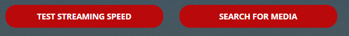

# {{ title }}

<small>Written: {{ date }}</small>

<small>Tags</small>

<p style="display:inline">
<a style="padding: .125em 1em; border-radius: 25px; margin-top:5px;" class="md-button md-button--primary" href="#">{{ tag }}</a>
</p>


<small>Category</small>

<p style="display:inline;">
<a style="padding: .125em 1em; border-radius: 25px; margin-top:5px;" class="md-button md-button--primary" href="#">{{ cat }}</a>
</p>


</img>

I thought I'd make a follow up to the **[first post](https://technicalramblings.com/blog/spice-up-your-homepage/)** on customizing your Organizr homepage. This will tell you how to add Grafana panels, a custom Monitorr dashboard, custom buttons and links to tabs inside Organizr.

## Using Grafana and Varken to add more Plex stats on your Organizr homepage

With Grafana, InfluxDB and Varken we can add some cool plex stats to the dashboard using html and css. And if you install telegraf you can get some great host metrics also.

Here is a screenshot of the stats I currently have on my Homepage.

[](images/GrafanaHP.png)

All the panels are data from InfluxDB sent by Varken. I'm running nightly so I can have Varken pull download and upload data from my [Ubiquiti Unifi Security Gateway](https://www.ubnt.com/unifi-routing/usg/). However, if you don't use Unifi you can setup [telegraf](https://www.influxdata.com/time-series-platform/telegraf/) and that will give you the same stats from the host machine.

### Installing InfluxDB

Installing influxdb from CA is dead simple. You only need to select the host path for /var/lib/influxdb and change the host port if its in use. Varken will automatically create the database for you.

### Installing [Varken](https://github.com/Boerderij/Varken)

I'm using the docker container from the devs, and since it's not currently on the CA Appstore you will have to add it manually.  
**EDIT 16.03.19: They have added it to the CA appstore!**

Search for Varken and click on **`Click Here To Get More Results From DockerHub`** If you can't see that link you need to enable additional dockerHub search results in CA Settings.

[](images/54353454gfdgfd.png)

[](images/1111.png)

[](images/123edwq2.png)

Select **`boerderij/varken`** and add the PGID and PUID and mount the appdata folder to /config. Varken doesn't need a port as "all" it does is feed influxdb with data it pulls from Tautulli, Ombi, Sonarr, Radarr ect.

Set **PGID** to 100 and **PUID** to 99

[](images/34343454gfdgfd.png)


Setting up Varken is quite simple. Head over to your appdata folder and copy paste the **`varken.example.ini`** file and rename it **`varken.ini`**

In that file you add the connection details to all the services you want it to pull data from. Read through the **[configuration wiki](https://wiki.cajun.pro/books/varken/page/breakdown)** for setup details.

> **Tip:** don't use the scheme(http://) when adding the different IPs. And if any of your services uses base url you need to add that.

### Installing Grafana

Follow the instructions and add your unraid/host ip and admin password.

**GF_SERVER_ROOT_URL:**The url to which you will be navigating to get to the grafana dashboard. Typically your ip or hostname  
**GF_SECURITY_ADMIN_PASSWORD**Your password to use with the admin user. The default is user admin with password the password you chose.

When Installing from CA you will need to add one variable to be able to view dashboards without logging in. Now you don't have to add it, but you will need to log into Grafana before you'll be able to see the stats of each panel on your Organizr homepage.

First install the container without the variable as we need to mount the`custom.ini` file in our appdata, and the file needs to exist before we can mount it.

After you've installed the container you **need** to add two plugins for the Varken dashboards. The dashboards **will** fail to load without them. Now, I'm only using the worldmap plugin on my homepage but you might as well install them both.

Open terminal and run:

`**docker exec -i -t Grafana grafana-cli plugins install grafana-piechart-panel**`  
and  
`**docker exec -i -t Grafana grafana-cli plugins install grafana-worldmap-panel**`

Next go to you appdata location for Grafana and create the custom.ini file with the contents below:

```conf
[auth.anonymous]
enabled=true
```

The variable you need to add is **GF_PATHS_CONFIG** and the value is **`/var/lib/grafana/custom.ini`**

Like so: **`-e "GF_PATHS_CONFIG=/var/lib/grafana/custom.ini"`**

[](images/customvariable.png)

> Note: Any new dashboard you create will be visible to anyone when you add this, so beware. Protect your reverse proxy with Organizr server auth. You can also choose which dashboards are open in dashboard settings. (Remove viewer role in permissions)

**Tip:** You can create different organizations in Grafana and set the organization that you want open without auth. Like this:

```conf
[auth.anonymous]
enabled=true
org_name=<organization_name>
```

**Update**: Grafana recently added iframe protection so you will need to disable that. It can be done in two ways. Editing the custom.ini or adding a header in your webserver.  
Add:

```conf
[security]
allow_embedding = true
```

in custom.ini  
Or **`proxy_hide_header X-Frame-Options;`** in your reverse proxy.

After you've added the variable log in to Grafana and add your datasource. Go to "Configuration" and click + Add data source. Choose type **`InfluxDB`**  
Call it Varken  
Add your URL to InfluxDB  
And add the database **`varken`** (lower case)  
Click Save & Test

[](images/datasourcevarken.png)

After you have finished setting it up you can head over here to find the Varken dashboards that you can import.  
  
Check the links below and paste in the dashboard ID and follow the steps on the screen.

[](images/import.png)

**[https://grafana.com/dashboards?search=Varken](https://grafana.com/dashboards?search=Varken)**

You can find the stream breakdown and daily play count panels here:**[https://grafana.com/dashboards/9684](https://grafana.com/dashboards/9684)**

[](images/chrome_MPJkSPVj9m.png)

Add the dashboards you want. If you're using my dashboards select the correct datasource in the drop down like below.

[https://grafana.com/grafana/dashboards/9558](https://grafana.com/grafana/dashboards/9558)

[](images/chrome_J8Hsl1hUxo.png)
After you've done that your should be able to see stats from the varken database.

The way I have my dashboards setup is the main Varken dash is closed for "visitors" and I have a separate one for my Organizr homepage that is open. But it's not really open as it's behind Organizr server auth.

So **grafana.domain.com** is only accessible to my Organizr users and me. Grafana will need to be reverse proxied as you can't access the local instance of Grafana when accessing Organizr through your domain.

For a reverse proxy example of Grafana look here:[https://github.com/gilbN/Nostromo/blob/master/Server/nginx/site-confs/grafana](https://github.com/gilbN/Nostromo/blob/master/Server/nginx/site-confs/grafana)

### Organizr Homepage

Below is the custom HTML that you can use add the different panels you want to the Organizr homepage.  
Replace the source of each HTML class on this line.

```html
src='https://grafana.domain.com/d-solo/bj0JnBMmz/org-dash?refresh=5s&orgId=1&panelId=22'/>
```

The first six are the small "widgets" and the last three are the bigger ones.

If you don't want the big widgets you can just delete everything between  
**`<!-- -------------------BIG WIDGET START------------------- -->`**  
and  
`**<!-- -------------------BIG WIDGET END------------------- -->**`

And if you want fewer small widgets just delete everything between:  
**`<!-- -------------------WIDGET------------------- -->`**

[](images/share.png)

To find the correct URL of each panel you just have to click on the name of the panel and select share, then select the Embed tab. **Remember to remove the "Current time range" as that will break the stats.  
**Don't copy it all, we just need the iframe source.

If you want to change the title of the custom html you can do so here:

```html
<!-- -------------------ADD TITLE HERE------------------- -->
<div id="announcementRow" class="row"><h4 class="pull-left">
    <span>YOUR-TITLE-HERE</span></h4><hr class="hidden-xs"></div>
```

Each panel can link directly to a tab inside Organizr. For that to work you need to edit this line:

```html
<div class="iframe-link" onclick="tabActions(event,'TAB-NAME-HERE',1);" href="#" title="TITLE-HERE"></div>
```

Replace**`TAB-NAME-HERE`**with the actual tab name in Organizr. For the hover title, replace**`TITLE-HERE`**or just remove it if you don't want the title attribute. If you don't want it to link to a tab simply remove the whole div.

```html
 `<style>
.flex {
    display: flex;
    flex-wrap: wrap;
    flex-direction: row;
    align-items: center;
    background: transparent;
    box-shadow: none !important;
    transition: all .4s ease-in-out;
    cursor: pointer
}

/* -------------------Small widget------------------- */
.flex-child { padding: 3px; flex-grow: 1; flex-basis: 0;}
#grafanadwidget { position: relative; height: calc(80px); width: calc(100%);}
/* -------------------Small widget------------------- */

/* -------------------Big widget------------------- */
.flex-child-big { padding: 3px; flex-grow: 1; flex-basis: 0;}
#grafanadwidget-big { position: relative; height: calc(250px); width: calc(100%);}
/* -------------------Big widget------------------- */

/* -------------------iFrame Link------------------- */
.iframe-link { z-index:1; position:absolute; height: calc(80px); width: calc(100%); background-color: transparent; cursor: pointer}
/* -------------------iFrame Link------------------- */

#announcementRow { background-color:transparent !important;}
#announcementRow>h4 {
    padding-left: 15px;
    font-family: Rubik,sans-serif;
    margin: 10px 0;
    font-weight: 300 !important;
    line-height: 22px;
    font-size: 18px;
    color: #dce2ec;
}
.overflowhider { height: 100%; overflow: hidden;}
@media only screen and (max-width: 650px) {.flex-child-big {flex-basis: auto;min-width: auto !important;}}
@media only screen and (max-width: 1125px) {.flex-child-big {flex-basis: auto;min-width: 600px;flex-basis: fit-content;}}
@media only screen and (max-width: 1649px) {.flex-child {flex-basis: auto;}}
</style>

<!-- -------------------ADD TITLE HERE------------------- -->
<div id="announcementRow" class="row"><h4 class="pull-left">
    <span>Grafana</span></h4><hr class="hidden-xs"></div>

<!-- -------------------SMALL WIDGET START------------------- -->
    <div class="content-box flex">
    <!-- -------------------WIDGET------------------- -->
    <div class="flex-child" id="flex-grafanadwidget">
    <div class="overflowhider">
    <div class="iframe-link" onclick="tabActions(event,'TAB-NAME-HERE',1);" href="#" title="TITLE-HERE"></div>
    <iframe class="iframe" id="grafanadwidget" 
    frameborder="0" src="ADD-URL-TO-GRAFANA-PANEL-HERE"></iframe>
    </div></div>
    <!-- -------------------WIDGET------------------- --> 
    <div class="flex-child" id="flex-grafanadwidget">
    <div class="overflowhider">
    <div class="iframe-link" onclick="tabActions(event,'TAB-NAME-HERE',1);" href="#" title="TITLE-HERE"></div>
    <iframe class="iframe" id="grafanadwidget" 
    frameborder="0" src="ADD-URL-TO-GRAFANA-PANEL-HERE"></iframe>
    </div></div>
    <!-- -------------------WIDGET------------------- -->     
    <div class="flex-child" id="flex-grafanadwidget">
    <div class="overflowhider">
    <div class="iframe-link" onclick="tabActions(event,'TAB-NAME-HERE',1);" href="#" title="TITLE-HERE"></div>
    <iframe class="iframe" id="grafanadwidget" 
    frameborder="0" src="ADD-URL-TO-GRAFANA-PANEL-HERE"></iframe>
    </div></div>
    <!-- -------------------WIDGET------------------- --> 
    <div class="flex-child" id="flex-grafanadwidget">
    <div class="overflowhider">
    <div class="iframe-link" onclick="tabActions(event,'TAB-NAME-HERE',1);" href="#" title="TITLE-HERE"></div>
    <iframe class="iframe" id="grafanadwidget" 
    frameborder="0" src="ADD-URL-TO-GRAFANA-PANEL-HERE"></iframe>
    </div></div>
    <!-- -------------------WIDGET------------------- -->     
    <div class="flex-child" id="flex-grafanadwidget">
    <div class="overflowhider">
    <div class="iframe-link" onclick="tabActions(event,'TAB-NAME-HERE',1);" href="#" title="TITLE-HERE"></div>
    <iframe class="iframe" id="grafanadwidget" 
    frameborder="0" src="ADD-URL-TO-GRAFANA-PANEL-HERE"></iframe>
    </div></div>
    <!-- -------------------WIDGET------------------- -->     
    <div class="flex-child" id="flex-grafanadwidget">
    <div class="overflowhider">
    <div class="iframe-link" onclick="tabActions(event,'TAB-NAME-HERE',1);" href="#" title="TITLE-HERE"></div>
    <iframe class="flex" id="grafanadwidget" 
    frameborder="0" src="ADD-URL-TO-GRAFANA-PANEL-HERE"></iframe>
    </div></div>
</div>
<!-- -------------------SMALL WIDGET END------------------- -->

<!-- -------------------BIG WIDGET START------------------- -->   
<div class="content-box flex">
    <!-- -------------------BIG WIDGET------------------- -->        
    <div class="flex-child-big" id="flex-grafanadwidget-big">
    <div class="overflowhider">
    <div class="iframe-link" onclick="tabActions(event,'TAB-NAME-HERE',1);" href="#" title="TITLE-HERE"></div>
    <iframe class="flex" id="grafanadwidget-big" frameborder="0" 
    frameborder="0" src="ADD-URL-TO-GRAFANA-PANEL-HERE"></iframe>
    </div></div>
    <!-- -------------------BIG WIDGET------------------- -->     
    <div class="flex-child-big" id="flex-grafanadwidget-big">
    <div class="overflowhider">
    <div class="iframe-link" onclick="tabActions(event,'TAB-NAME-HERE',1);" href="#" title="TITLE-HERE"></div>
    <iframe class="iframe" id="grafanadwidget-big" frameborder="0" 
    frameborder="0" src="ADD-URL-TO-GRAFANA-PANEL-HERE"></iframe>
    </div></div>
    <!-- -------------------BIG WIDGET------------------- -->     
    <div class="flex-child-big" id="flex-grafanadwidget-big">
    <div class="overflowhider">
    <div class="iframe-link" onclick="tabActions(event,'TAB-NAME-HERE',1);" href="#" title="TITLE-HERE"></div>
    <iframe class="iframe" id="grafanadwidget-big" frameborder="0" 
    frameborder="0" src="ADD-URL-TO-GRAFANA-PANEL-HERE"></iframe>
    </div></div>   
</div>
<!-- -------------------BIG WIDGET END------------------- -->` 
```

#### Custom CSS

For the widgets to match the Organizr theme you need to use custom CSS.  
You can do that by checking out my themes here.

#### [https://github.com/gilbN/theme.park/blob/master/README.md#grafana-themes](https://github.com/gilbN/theme.park/blob/master/README.md#grafana-themes)


As Grafana doesn't support custom CSS you will need to use subfilter with nginx.

Add this in you reverse proxy of Grafana:

```nginx
proxy_set_header Accept-Encoding "";
sub_filter
'</head>'
'<link rel="stylesheet" type="text/css" href="https://gilbn.github.io/theme.park/CSS/themes/grafana/dark.css">
</head>';
sub_filter_once on;
```

> For the plex/aquamarine/hotline themes you can use the **`graforg-dashboard.css`** instead.

For panel integration on the Organizr homepage you can use`organizr-dashboard.css` if you use any of the custom themes. The theme is an "internal" theme that is meant to be used in an Organizr iframe as the background is set to transparent.

**NOTE:** When viewing Grafana in Organizr iframe using`organizr-dashboard.css`it will follow the Organizr theme. When viewing it outside of Organizr iframe the background will be white ect. If you don't want this you can create two reverse proxies. One for grafana organizr homepage integration and one for the regular grafana theme.

### Custom buttons



Custom buttons is very easy to add. Just choose your flavor from the organizrTools repo and you're pretty much done!  
You can have buttons that link directly to tabs or buttons that uses Organizr built in functions like speed test or the request content function.


You can even link to tabs through html links.

```html
<a onclick="tabActions(event,'TAB NAME',1);" href="#">CUSTOM LINK TEXT</a>
```

https://github.com/organizrTools/orgv2_custom_buttons

I chose to edit the css a bit:

[](https://i.imgur.com/tPh3ny9.png)

```css
.cbutton {
    border-radius: 3px;
    border: 4px solid;
    border-color: #e5a00d;
    padding: 0px;
    width: auto;
    height: auto;
    background-color: #e5a00d;
    position: relative;
    text-align: center;
}
```

### [Monitorr](https://github.com/Monitorr/Monitorr)

[](https://i.imgur.com/SaFa9YJ.png)

Monitorr is a live display over the status of any webapp or service. And with some custom CSS we can have it match the Organizr-theme much better than the original.

By using my **`dark.css`** theme from my [theme.park](https://github.com/gilbN/theme.park/blob/master/README.md#monitorr-themes) repo you get a theme that blends with Organizr and it will compress the tiles a little so you can have more services on display.

If you use a custom theme with organizr I reccoment the `organizr-dashboard.css`  
This theme will mess with your Monitorr base theme. And it will hide the settings button. Go to /monitorr/settings.php for settings.  
It is created purely for use with "minimum" version of the index.php `https://domain.com/monitorr/index.min.php`for Organizr homepage integration.

**NOTE:** When viewing monitorr in an Organizr iframe using `organizr-dashboard.css` it will follow the Organizr theme as the background is transparent. When viewing it outside of Organizr iframe the background will be white ect. If you don't want this you can create two reverse proxies. One for monitorr organizr homepage integration and one for the other monitorr themes. And use subfilter on both instead of adding `@import "https://gilbn.github.io/theme.park/CSS/themes/organizr-dashboard.css";` in the monitorr custom css.

#### Adding the theme with Nginx

Add this to your Montorr minimized reverse proxy:

```nginx
proxy_set_header Accept-Encoding "";
sub_filter
'</head>'
'<link rel="stylesheet" type="text/css" href="https://gilbn.github.io/theme.park/CSS/themes/monitorr/organizr-dashboard.css">
</head>';
sub_filter_once on;
```

And the **`dark/aquamarine/hotline.css`** on your main Monitorr reverse proxy.

Adding it to Organizr is as simple as pasting this in custom HTML and changing the domain.

```html
<div id="announcementRow" class="row"><h4 class="pull-left"><span>Monitorr</span></h4><hr class="hidden-xs"></div>
<div style="overflow:hidden; height:260px; -webkit-overflow-scrolling: touch; overflow-y: scroll;">
<iframe class="iframe" frameborder="0" src="https://monitorr.domain.com/index.min.php"></iframe>
</div>
```

It's the **`/index.min.php`** that will display the minimized version.

If you want to hide the scroll bar you can change the div style to `<div style="overflow:hidden; height:260px">` (FYI This will disable scrolling)

Or you can do `<div style="overflow:hidden; height:260px; width: calc(100% + 42px); -webkit-overflow-scrolling: touch; overflow-y: scroll;">` if you use Firefox or `<div style="overflow:hidden; height:260px; width: calc(100% + 36px); -webkit-overflow-scrolling: touch; overflow-y: scroll;">` if you use Chrome.

### Custom title


If you want to add a custom title to your different customizations you can simply add this line above it and replace the**`YOUR-CUSTOM-TITLE`**text with what you want.

```html
<div id="announcementRow" class="row"><h4 class="pull-left"><span>YOUR-CUSTOM-TITLE</span></h4><hr class="hidden-xs"></div>
```

If you have any other awesome homepage customization please let me know in the comments!

Edit: Thank you CauseFX for the iFrame fix!❤️

### If you need any extra help join the Discord server

[](https://discord.gg/HSPa4cz)
