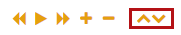
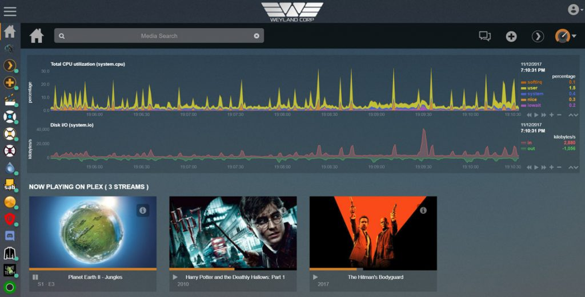
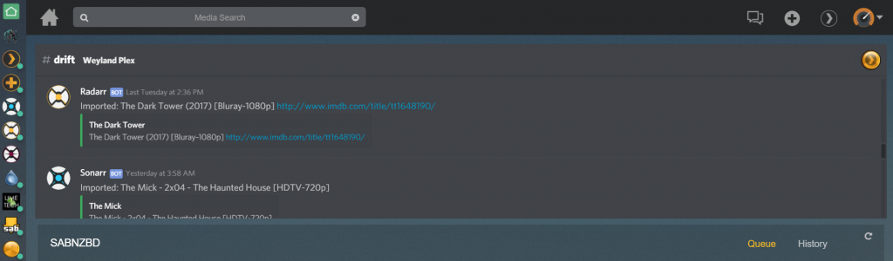
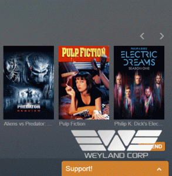
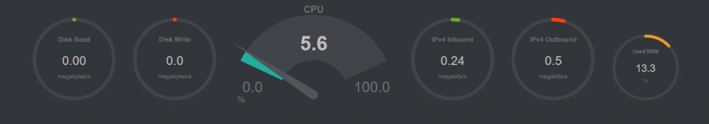

# {{ title }}

<small>Written: {{ date }}</small>

<small>Tags</small>

<p style="display:inline">
<a style="padding: .125em 1em; border-radius: 25px; margin-top:5px;" class="md-button md-button--primary" href="#">{{ tag }}</a>
</p>


<small>Category</small>

<p style="display:inline;">
<a style="padding: .125em 1em; border-radius: 25px; margin-top:5px;" class="md-button md-button--primary" href="#">{{ cat }}</a>
</p>


</img>

Spice up your homepage! A HowTo on custom Netdata pages, embedding Discord and adding customer support chat!

I'm going to integrate these applications into my Organizr homepage but this will pretty much work on any site of your choosing.

## Netdata


First I'd recommend you to check out the Netdata wiki on[custom dashboards](https://github.com/firehol/netdata/wiki/Custom-Dashboards)as it explains**alot**.

### Preparation

> Note: This guide assumes you have already reverse proxied netdata.

Before we can start we need some files from the Netdata /web folder. And since I'm using the docker I will have to get them using cli.

The files we need are:

```js
dashboard.js
bootstrap-slate-flat-3.3.7.css or bootstrap-3.3.7.css
dashboard.slate.css or dashboard.css
```

I will be using using the slate (dark) theme for this guide.

> Note-2: I've made it so that if you don't want to mess with the js or css files, you can use my Netdata theme and subfilter that with nginx. Scroll down to the [**theme.park**](https://github.com/gilbN/theme.park) part!

The CSS files are located in the **/css** folder and the JS file is in the /web folder.

1. Open a terminal and exec into the docker container with this command: **`docker exec -it Netdata bash`** Goto this location:**`cd usr/share/netdata/web/`**
2. Copy the files to your appdata config path: (Host path 1) **`cp dashboard.js dashboard.slate.css /etc/netdata/override`**
3. Change directory with the cd command `cd css/` Copy the bootstrap.css file. **`cp bootstrap-slate-flat-3.3.7.css /etc/netdata/override`**

Tip: Use the **`ls`** command to list all files in a specific directory.

#### Editing the files

1. Copy the files to a new **subdirectory** in your **nginx root folder** (e.g appdata/letsencrypt/www/customnetdata)
2. Create a new folder called css (e.g customnetdata/css)

Copy bootstrap-slate-flat-3.3.7.css and dashboard.slate.css to the css folder I'm using the dark theme (slate) css but using the regular works just fine. Just remember to edit the your custom html to use the white theme.

3. In the dashboard.js file, scroll down to**`NETDATA.themes`**and change it so it points to the files you have added in the css folder. Add css/

Before

```js
slate: {
bootstrap_css: NETDATA.serverDefault + 'css/bootstrap-slate-flat-3.3.7.css?v20161229-1',
dashboard_css: NETDATA.serverDefault + 'dashboard.slate.css?v20170725-1',
```

After

```js
slate: {
bootstrap_css: 'css/bootstrap-slate-flat-3.3.7.css?v20161229-1',
dashboard_css: 'css/dashboard.slate.css?v20170725-1',
```

### Using the **[theme.park](https://github.com/gilbN/theme.park)** theme

If you don't want to edit css or js files you can instead only copy the **html** code at the bottom and the make the necessary modifications to that file. In the html code, scroll down to this line:

```html
<script type="text/javascript" src="dashboard.js"></script>
```

And add your Netdata domain, like so:

```html
<script type="text/javascript" src="https://YOUR-DOMAIN.COM/netdata/dashboard.js"></script>
```

By doing this you can instead [subfilter](http://nginx.org/en/docs/http/ngx_http_sub_module.html) the CSS changes using nginx and my [theme repository on github!](https://github.com/gilbN/theme.park) (read more at the **nginx part**) After that follow along the rest of the HTML instructions below.

**NOTE:** If you get an error thatlib/jquery-2.2.4.min.js cant be found you can try and edit line [136] in dashboard.js that says **`NETDATA.serverStatic = NETDATA.serverDefault;`** to **`NETDATA.serverStatic = "https://yourdomain.com/netdata/";`**

#### Creating the HTML

Create your custom HTML. You can use the one I have added below and work off that. In this guide I have named it **`custom.html`**

In my example I have added a total CPU utilization dygraph and a disk I/O read-write dygraph. If you want a diffrent graph type change the **`data-chart-library`** See the[Netdata wiki](https://github.com/firehol/netdata/wiki/Custom-Dashboards)

To make it work externally you need to add your external Netdata address in the html! **(Netdata needs to be reverse proxied)** If you add your local ip address you will get an error when trying to load it through HTTPS.

```js
// Set the default netdata server.
// on charts without a 'data-host', this one will be used.
// the default is the server that dashboard.js is downloaded from.

var netdataServer = 'https://YOURNETDATADOMAIN.COM/';
```

e.g **`https://yourdomain.com/netdata/`**

> Note: The trailing slash on https://domain.com/netdata/ is very important. If you dont add it you will get Strict MIME errors in your browser console, and it won't load properly.

##### Custom HTML for total CPU utilization and Disk I/O

```html
<!DOCTYPE html>
<html lang="en">
<head>
<meta http-equiv="Content-Type" content="text/html; charset=utf-8">
<meta charset="utf-8">
<meta http-equiv="X-UA-Compatible" content="IE=edge,chrome=1">
<meta name="viewport" content="width=device-width, initial-scale=1">
<meta name="apple-mobile-web-app-capable" content="yes">
<meta name="apple-mobile-web-app-status-bar-style" content="black-translucent">
</head>
<body>
<center>
<ul>
</ul>
<div style="width: 100%; display: inline-block;">
<div data-netdata="system.cpu"
data-chart-library="dygraph"
data-width="100%"
data-height="140"
data-after="-300"
data-dt-element-name="time203"
></div> 
<div style="width: 100%; display: inline-block;">
<div data-netdata="system.io"
data-chart-library="dygraph"
data-width="100%"
data-height="120"
data-after="-300"
data-dt-element-name="time203"
data-colors="#FF5555 #44c442"
></div> 
</center> 
</body>

<script>
// this section has to appear before loading dashboard.js

// Select a theme.
// uncomment on of the two themes:

// var netdataTheme = 'default'; // this is white
var netdataTheme = 'slate'; // this is dark

// Set the default netdata server.
// on charts without a 'data-host', this one will be used.
// the default is the server that dashboard.js is downloaded from.

var netdataServer = 'https://YOURNETDATADOMAIN.COM/';
</script>

<!-- <script type="text/javascript" src="/dashboard.js"></script> -->
<script type="text/javascript" src="dashboard.js?v20170724-7"></script>

<script>
// Set options for TV operation
// This has to be done, after dashboard.js is loaded

// destroy charts not shown (lowers memory on the browser)
// NETDATA.options.current.destroy_on_hide = false;

// set this to false, to always show all dimensions
//NETDATA.options.current.eliminate_zero_dimensions = true;

// lower the pressure on this browser
NETDATA.options.current.concurrent_refreshes = false;

// if the tv browser is too slow (a pi?)
// set this to false
//NETDATA.options.current.parallel_refresher = true;

// always update the charts, even if focus is lost

NETDATA.options.current.stop_updates_when_focus_is_lost = false;

// Since you may render charts from many servers and any of them may
// become offline for some time, the charts will break.
// This will reload the page every RELOAD_EVERY minutes

var RELOAD_EVERY = 1;
setTimeout(function(){
location.reload();
}, RELOAD_EVERY * 60 * 1000);

</script>

</html>
```

### Nginx

In your nginx config you can add this in your main server block to create a sub-directory.

```nginx
# CUSTOM NETDATA
location /customnetdata {
#auth_request /auth-user;
root /config/www/;
index custom.html;
}
```

Below is the location block you need to use for the **[theme.park](https://github.com/gilbN/theme.park)** theme.

```nginx
# CUSTOM NETDATA USING THEME.PARK CSS
location /customnetdata {
#auth_request /auth-user;
root /config/www/;
index custom.html;
proxy_set_header Accept-Encoding "";
sub_filter
'</head>'
'<link rel="stylesheet" type="text/css" href="https://gilbn.github.io/theme.park/CSS/themes/netdata/organizr-dashboard.css">  
</head>';
sub_filter_once on; 
}
```

By using **`https://gilbn.github.io/theme.park/CSS/themes/netdata/organizr-dashboard.css`** it will match any theme Organizr is using as the background is transparent.

### Adding it to your Organizr homepage

Adding it to your Org homepage is quite simple. Just add the code below and edit it to match your domain.

Go to Settings --> Edit Homepage --> Custom HTML

If you have added more graphs you'll need to change the height.

```html
<div style="overflow:hidden;height:282px;width:100%;position: relative;"> 
<embed style="height:calc(100%);width:calc(100%)" src='https://yourdomain.com/customnetdata/custom.html' />
</div>
<ul>
</ul>
```

### Customizing colors

- For the blur theme, scroll down

#### bootstrap-slate-flat-3.3.7.css

Set the background-color to what you want. I set it to transparent so if I change my Org theme it will follow that.

```css
body {
font-family: "Helvetica Neue", Helvetica, Arial, sans-serif;
font-size: 14px;
line-height: 1.42857143;
color: #c8c8c8;
background-color: transparent;
}
```

##### dashboard.slate.css

Next is changing the **`.netdata-legend-value`** The background-color is the legend percent bacground color.

```css
.netdata-legend-value {
/*margin-left: 14px;*/
position: absolute;
right: 10px;
float: right;
text-align: right;
font-size: 11px; /* legend: dimension value size */
font-weight: bold;
vertical-align: bottom;
background-color: transparent;
margin-top: 0px;
z-index: 10;
padding: 0px;
padding-left: 15px;
cursor: pointer;
/* -webkit-font-smoothing: none; */
}
```

**`background-color: transparent;`**

**`color: #E5A00D;`**I chose orange to match my Organizr theme.

```css
.netdata-legend-resize-handler {
display: block;
position: absolute;
bottom: 0px;
right: 0px;
height: 15px;
width: 30px;
background-color: transparent;
font-size: 12px;
vertical-align: middle;
line-height: 15px;
cursor: ns-resize;
color: #E5A00D;
text-align: center;
overflow: hidden;
z-index: 20;
padding: 0px;
margin: 0px;
}
```

It's the same for the legend tool box, set it to transparent or what ever you like.

[](images/chart-tool-box-buttons.png)

```css
.netdata-legend-toolbox {
display: block;
position: absolute;
bottom: 0px;
right: 30px;
height: 15px;
width: 110px;
background-color: transparent;
font-size: 12px;
vertical-align: middle;
line-height: 15px;
color: #E5A00D;
text-align: center;
overflow: hidden;
z-index: 20;
padding: 0px;
margin: 0px;
}
```

Repeat the steps. Set the background to transparent or what ever you like. Set`color`to the color you want the buttons to be.

[](images/chart-resize-buttons.png)

```css
.netdata-legend-toolbox-button {
display: inline-block;
position: relative;
height: 15px;
width: 18px;
background-color: transparent;
font-size: 12px;
vertical-align: middle;
line-height: 15px;
color: #E5A00D;
text-align: center;
overflow: hidden;
z-index: 21;
padding: 0px;
margin: 0px;
cursor: pointer;
}
```

To edit the text color change the html,body

This will **not** change the graph text color

```css
html,
body {
/*font-family: Calibri,"Segoe UI","Helvetica Neue",Helvetica,Arial,sans-serif;*/
font-family: "Helvetica Neue", Helvetica, Arial, sans-serif;
font-style: normal;
font-variant: normal;
color: #E5A00D;
}
```

The graph text color is changed with

```css
.dygraph-axis-label {
color: #6c7075;
}
```

##### custom.html

Changing the data chart colors is done in the custom HTML.

```html
<div data-netdata="unique.id"
data-colors="#AABBCC #DDEEFF ..."
></div>
```

##### dashboard.js

If you want to change the grid and axis color you can do that in the NETDATA.themes section in the dashboard.js file.

```js
grid: '#283236',
axis: '#283236',
```

### Blur theme

[](images/blurweb-1.jpg)

If you want to make your custom Netdata html match the[layer#Cake blur-theme](https://github.com/leram84/layer.Cake/)you can do this:

In **`dashboard.slate.css`** change this:

Change the body text color to #FFFFFF

```css
html,
body {
/*font-family: Calibri,"Segoe UI","Helvetica Neue",Helvetica,Arial,sans-serif;*/
font-family: "Helvetica Neue", Helvetica, Arial, sans-serif;
font-style: normal;
font-variant: normal;
color: #FFFFFF;
}
```

And set the other color options in the examples above to **`(0, 0%, 100%, .45)`**

For the grid and axis color set it to transparent in **`dashboard.js`**

```js
grid: 'transparent',
axis: 'transparent',
```

In the **`bootstrap-slate-flat-3.3.7.css`** Set the background color of the graph body to **`rgba(0, 0, 0, .15);`**

```css
body {
font-family: "Helvetica Neue", Helvetica, Arial, sans-serif;
font-size: 14px;
line-height: 1.42857143;
color: #c8c8c8;
background-color: rgba(0, 0, 0, .15);
}
```

* * *

## Discord Widgetbot

[](images/chrome_2017-10-19_22-09-55.png)

First you'll need to create your own Discord Server. After you've done that head over to[https://widgetbot.voakie.com/](https://widgetbot.voakie.com/)an sign in with your Discord credentials.

### Setup

1. Connect the WidgetBot with your user and choose your server in the "Configurator"
2. Selct the channel you want to embed.
3. If you want to change the colors of the widget you need to sign up to the patreon here:[https://www.patreon.com/widgetbot](https://www.patreon.com/widgetbot)

### Organizr html config

Add this in the homepage HTML and edit the values to your liking.

```html
<div style="overflow:hidden;height:300px"> 
<embed style="height:calc(100% + 115px)" width='100%' src='URL TO YOUR WIDGET' />
</div>
<ul>
</ul>
```

## Custom chat with Tawk.to

Go to[https://www.tawk.to/](https://www.tawk.to/)

Create an account and add the widget code to the custom HTML. If you want the chat box to be on every page add the code to the custom CSS.

You can also change the colors in the Widget Appearance settings!

[](images/tawk.gif)

## Bonus HTML for system overview

[](images/chrome_2017-10-19_22-27-38.png)

```html
<!DOCTYPE html>
<html lang="en">
<head>
<meta http-equiv="Content-Type" content="text/html; charset=utf-8">
<meta charset="utf-8">
<meta http-equiv="X-UA-Compatible" content="IE=edge,chrome=1">
<meta name="viewport" content="width=device-width, initial-scale=1">
<meta name="apple-mobile-web-app-capable" content="yes">
<meta name="apple-mobile-web-app-status-bar-style" content="black-translucent">
</head>
<body>
<center>
<ul>
</ul>
<div style="display: inline-block; position: relative;">
<div data-netdata="system.io"
data-dimensions="in"'
data-chart-library="easypiechart"
data-title="Disk Read"'
data-width="200"
data-height="200"
data-after="-300"
data-points="300"
data-dt-element-name="time701"
></div>
</div> 

<div style="display: inline-block; position: relative;">
<div data-netdata="system.io"
data-dimensions="out"'
data-chart-library="easypiechart"
data-title="Disk Write"'
data-width="200"
data-height="200"
data-after="-300"
data-points="300"
data-dt-element-name="time701"
></div>
</div> 

<div style="display: inline-block; position: relative;">
<div data-netdata="system.cpu"
data-chart-library="gauge"
data-title="CPU"
data-units="%"
data-gauge-max-value="100"
data-width="400"
data-height="200"
data-after="-300"
data-points="300"
data-colors="#22AA99"
data-dt-element-name="time701"
></div>
</div>
<div style="display: inline-block; position: relative;">
<div data-netdata="system.net"
data-dimensions="received"
data-chart-library="easypiechart"
data-title="IPv4 Inbound"
data-width="200"
data-height="200"
data-after="-300"
data-points="300"
data-dt-element-name="time701"
></div>
</div>
<div style="display: inline-block; position: relative;">
<div data-netdata="system.net"
data-dimensions="sent"
data-chart-library="easypiechart"
data-title="IPv4 Outbound"
data-width="200"
data-height="200"
data-after="-300"
data-points="300"
data-dt-element-name="time701"
></div>
</div>
<div style="display: inline-block; position: relative;">
<div data-netdata="system.ram"
data-dimensions="used|buffers|active|wired"
data-append-options="percentage"
data-chart-library="easypiechart"
data-title="Used RAM"
data-units="%"
data-easypiechart-max-value="100"
data-colors="#EE9911"
data-width="170"
data-height="170"
data-after="-300"
data-points="300"
data-dt-element-name="time701"
></div>
</div>
</center> 
</body>

<script>
// this section has to appear before loading dashboard.js

// Select a theme.
// uncomment on of the two themes:

// var netdataTheme = 'default'; // this is white
var netdataTheme = 'slate'; // this is dark

// Set the default netdata server.
// on charts without a 'data-host', this one will be used.
// the default is the server that dashboard.js is downloaded from.

var netdataServer = 'https://YOURNETDATADOMAIN.COM/';
</script>

<!-- <script type="text/javascript" src="http://my.server:19999/dashboard.js"></script> -->
<script type="text/javascript" src="dashboard.js?v20170105-7"></script>

<script>
// Set options for TV operation
// This has to be done, after dashboard.js is loaded

// destroy charts not shown (lowers memory on the browser)
NETDATA.options.current.destroy_on_hide = true;

// set this to false, to always show all dimensions
//NETDATA.options.current.eliminate_zero_dimensions = true;

// lower the pressure on this browser
//NETDATA.options.current.concurrent_refreshes = false;

// if the tv browser is too slow (a pi?)
// set this to false
//NETDATA.options.current.parallel_refresher = true;

// always update the charts, even if focus is lost

NETDATA.options.current.stop_updates_when_focus_is_lost = false;

// Since you may render charts from many servers and any of them may
// become offline for some time, the charts will break.
// This will reload the page every RELOAD_EVERY minutes

var RELOAD_EVERY = 1;
setTimeout(function(){
location.reload();
}, RELOAD_EVERY * 60 * 1000);

</script>

</html>
```
